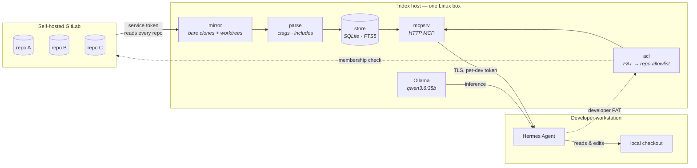

# Argus

**A private, self-hosted code index that lets a local LLM answer questions across all your repositories at once — without any code leaving your network.**

Argus mirrors every repository from your self-hosted GitLab, extracts a symbol and dependency graph from them, and serves access-controlled code retrieval to [Hermes Agent](https://github.com/NousResearch/hermes-agent) over MCP. Each developer sees exactly the repos GitLab says they can see — no second permissions system to maintain.

Built for a specific, awkward situation: **millions of lines of C/C++ spread across many repositories that together build one product**, where the question developers actually need answered is *"which repo do I change for this, and what breaks if I do?"*

---

## Why not just use RAG?

The obvious approach — chunk every file, embed everything, throw it in a vector database — performs badly on large C/C++ codebases, and it fails in a way that's easy to miss until you've already built it.

Header files are enormous, repetitive, and semantically near-identical to one another. Embedding them floods the vector space with near-duplicates that crowd out real answers. Meanwhile the questions developers actually ask — *where is `Parse` defined*, *who calls this*, *what breaks if I change this struct* — are **exact lookups**, and embeddings answer those worse than a symbol table does. Ask a pure-RAG system about `Init()` in a codebase with forty of them and it will confidently return the wrong one.

Argus inverts the usual priority:

| Layer | Answers | Cost |
|---|---|---|
| **Symbol graph** (ctags + `#include` edges) | Exact definitions, references, cross-repo ownership | Cheap, updates in seconds |
| **Lexical** (SQLite FTS5 + ripgrep) | Exact strings and regex over millions of lines | Cheap, instant |
| **Semantic** (embeddings) | Vague conceptual queries only | Expensive — applied *selectively* |

Embeddings are the garnish, not the meal. They're computed for **public symbol signatures, file summaries, and docs** — never function bodies. A C++ function body embeds mostly to "generic C++ control flow"; its *signature plus doc comment plus path* is what carries the intent someone is searching for. That's ~70–90k vectors instead of ~600k, and a full rebuild in under an hour instead of overnight.

And in C/C++, the `#include` graph **is** the cross-repo dependency graph. Recovering it needs no build system, no `compile_commands.json`, and no compiler — just parsing. That's what lets Argus answer "which repo owns this?" across an entire product.

---

## Architecture



**Two tokens, and their separation is the entire security model.** A privileged *service token* mirrors every repository, so the index is deliberately complete. Each developer's *own* GitLab token is exchanged at query time for their project membership, and every query is filtered to that allowlist **in SQL, before results leave the process** — never by asking the model nicely.

That distinction matters more than it looks. Telling an LLM "only answer about repos X and Y" is not access control; it's a suggestion, and a comment inside indexed source can override it. Revoke someone in GitLab and their index access dies with the cache TTL.

The enforcement is structural, not conventional:

```python
# Every public function in store/queries.py — no exceptions.
def find_symbol(allowed_repo_ids, conn, name, kind=None, limit=50): ...
#              ^^^^^^^^^^^^^^^^^ first positional, no default
```

A reflection test walks the module and fails on any function that doesn't take it first with no default. It fails on code that doesn't exist yet — which is the point. Security bugs of this class almost never come from someone deliberately bypassing a check; they come from a new code path six months later that simply never called it. Encoding the requirement in the signature turns a runtime vulnerability into an import-time error.

---

## What Hermes sees

Tools are named after the *questions developers ask*, not after retrieval mechanisms. A 35B local model picks the right tool far more reliably when the name matches the intent — tool design is prompt engineering for smaller models.

**Shipped — your private code, access-controlled:**

| Tool | Answers |
|---|---|
| `find_symbol` | Exact definitions across every repo |
| `find_references` | Every mention, product-wide, including cross-repo |
| `search_code` | Fast lexical search over millions of lines |
| `get_file` | Access-checked content fetch |
| `index_status` | Per-repo freshness, so the agent can qualify stale answers |
| `which_repo` | *"Which repo do I change for X?"* — from a description, a symbol, a stack trace, or a diff |
| `repo_map` | Which repos a given repo depends on, and which depend on it, from resolved `#include` edges |

**Shipped — public documentation, no access control (there is nothing to gate):**

| Tool | Answers |
|---|---|
| `docs_lookup` | Exact API name → the page and anchor that *define* it |
| `docs_search` | Conceptual questions against Python and React docs |

**Planned:** `semantic_search` (embeddings over your own code).

`index_status` looks like a throwaway and isn't: it's what stops an agent confidently answering from a three-week-stale index. It can say *"this repo was last indexed 4 hours ago"* instead of silently guessing.

---

## Knowledge packs

Your developers don't only ask about your code. They ask what `useState` returns and how `os.path.join` treats an absolute segment — and answering that from a model's memory is how you get confident, outdated, unciteable answers.

A **knowledge pack** is one SQLite file holding a public documentation corpus: prose, API symbols, and embeddings. Build it once, share it, and nobody else has to regenerate it.

```bash
argus pack install https://example.org/python-3.13.arguspack --sha256 <digest>
argus pack list
argus pack info python          # licence and attribution, in full
```

Two are built and measured:

| | Documents | Chunks | Symbols | Size |
|---|---|---|---|---|
| Python 3.13 | 516 | 13,164 | 18,027 | 28.5 MB |
| React (react.dev) | 222 | 4,755 | 125 | 9.1 MB |

Three properties make them worth the format:

**Lookups are exact, not approximate.** Symbols come from the upstream project's own index — Sphinx's `objects.inv` for Python, react.dev's pinned MDX anchors — so `docs_lookup("os.path.join")` resolves to the definition, not to whichever paragraph mentions the name.

**Every result is attributable.** `source`, `url`, `license` and `attribution` ride along on every hit, and the tool descriptions tell the model to cite them. `argus pack info` prints the licence in full — that output is how you meet the redistribution obligation.

**They're small enough to move.** Embeddings are stored binary-quantized (96 bytes/chunk) for a coarse pass, with int8 (768 bytes) for rescoring. float32 would be 3072. At a million chunks that's the difference between a 96 MB scan and a 3 GB one.

Measured recall@10 against an exact float32 baseline: **0.946**. Full numbers, including the misses, in [`docs/pack-measurements.md`](docs/pack-measurements.md). Usage in [`docs/knowledge-packs.md`](docs/knowledge-packs.md).

Packs are a *separate corpus*. Nothing in the pack query path can reach the private index — that's asserted structurally by a test, not left to convention.

---

## Status

Argus ships in phases, each ending somewhere genuinely usable.

| Phase | Scope | State |
|---|---|---|
| **1 — Indexer** | Mirroring, change detection, symbol + include extraction, SQLite store, access-gated queries, CLI | ✅ **Complete** |
| **2 — Multi-user retrieval** | ACL module, HTTP MCP server, 5 code tools, container, TLS | ✅ **Complete** |
| **5 — Knowledge packs** | Portable public documentation packs, 2 doc tools, `argus pack` CLI | ✅ **Complete** |
| **3 — Cross-repo intelligence** | Include resolution, `repo_map`, `which_repo` | ✅ **Complete** |
| **4 — Semantic layer** | Selective embeddings over private code, `semantic_search` | Planned |

**521 tests**, passing locally and in the container, 0 skipped.

Phase 2 delivered most of the value — exact symbol lookup across the whole product, with real GitLab-derived permissions, before a single embedding existed. Phase 5 then added a second, entirely separate corpus: public documentation, which needs no access control and can be shared as a file.

Phase 4 is deliberately last. It is the most expensive to build, the most likely to need iteration, and phases 1–3 stand on their own without it.

---

## Getting started

### Requirements

- Python 3.11+
- git
- [Universal Ctags](https://github.com/universal-ctags/ctags) — **not** Exuberant Ctags, which has no JSON output
  - Linux: `sudo apt install universal-ctags`
  - Windows: `winget install UniversalCtags.Ctags`
- A GitLab personal access token with `read_api` and `read_repository`
- [Ollama](https://ollama.com) with `nomic-embed-text` pulled — only for `docs_search` and for *building* packs. Everything else, including `docs_lookup`, works without it.

Argus refuses to start if ctags is missing or is the wrong implementation. Without that check you'd get a complete-looking index with no symbol layer at all — and no error to tell you.

Expect the embedder, not the index, to dominate `docs_search` latency: measured 2,254 ms to embed a query on CPU Ollama against 89 ms for the search itself.

### Install

Docker is the recommended path, because it pins ctags — see below for why that matters.

```bash
docker compose build
```

Or natively:

```bash
pip install -e ".[dev]"
```

### Configure

```bash
cp config.example.yaml config.yaml
```

Set the token in the environment — it's read in preference to the file, so it never has to live in YAML:

```bash
export ARGUS_GITLAB_TOKEN=glpat-xxxxxxxxxxxx
```

```yaml
gitlab:
  url: https://gitlab.internal

index:
  data_dir: /var/lib/argus
  db_path: /var/lib/argus/index.db
  max_file_bytes: 1048576
  repo_time_budget_seconds: 600
  exclude_dirs: [third_party, vendor, node_modules, build, out, x64, Debug, Release]

# Optional. Defaults to <data_dir>/packs.
packs:
  dir: /var/lib/argus/packs
```

### Run

```bash
argus index --config config.yaml
```

Index a single repository:

```bash
argus index --config config.yaml --repo group/one-repo
```

Check per-repo freshness:

```bash
argus status --config config.yaml
```

The first index takes hours on a large estate. After that, runs are incremental: Argus diffs the last-indexed commit against the new head and touches only what changed.

### Running in Docker

```bash
export ARGUS_GITLAB_TOKEN=glpat-xxxxxxxxxxxx
```

```bash
docker compose run --rm indexer index --config /etc/argus/config.yaml
```

```bash
docker compose run --rm indexer status --config /etc/argus/config.yaml
```

The indexer is a batch job, not a daemon, so nothing starts on its own — `docker compose up` would be the wrong gesture. Mirrors, worktrees and the index live in the `argus-data` volume; your `config.yaml` is mounted read-only. Set `index.data_dir` and `index.db_path` to `/var/lib/argus` in that file.

**Why the image pins ctags.** Argus depends on universal-ctags behaviour that varies by version: the C/C++ `prototype` kind ships *disabled by default* (without `--kinds-c=+p` the index silently loses most of a C/C++ public API), and C++ anonymous namespaces surface as generated identifiers like `__anond398a7c10111` rather than the literal `"anonymous"`. A host with a different ctags changes what gets indexed and what counts as a public symbol, with no error.

The Dockerfile's `test` stage runs the **entire test suite against the pinned toolchain during the build**, so a ctags that behaves differently fails the build instead of producing an image that indexes incorrectly and reports success. The image currently pins Universal Ctags 5.9.0 (Debian bookworm) and all 127 tests pass against it.

---

## Design notes

A few decisions that aren't obvious from the code:

**Storage is one SQLite file.** At 2–5 developers there's no justification for operating Qdrant or Postgres. One file gives atomic writes, trivial backup, and zero daemon management. Regex search shells out to ripgrep against the worktrees rather than maintaining a trigram index — faster than anything worth building, and one less subsystem to keep consistent.

**`last_indexed_sha` advances only after a repo's entire changed set commits.** That single rule is the whole crash-recovery story: a run that dies partway replays the same diff next time, and every write is idempotent. It's also why a ctags failure blocks the advance — marking files "indexed" with zero symbols would lose them permanently, since they'd never appear in a future diff.

**Tool error text is prompt text.** When something breaks, the string returned goes straight into an LLM's context and determines what it does next. `"Argus unavailable — fall back to ripgrep in the local checkout and say the answer is repo-local only"` produces a far better outcome than a 503. You're programming the fallback path in English.

**Renames are delete + add.** Rename tracking buys nothing for an index that stores per-path rows.

**Every path-producing git command passes `-z`.** Without it git applies `core.quotePath` and returns non-ASCII paths C-escaped and quoted, so `файл.c` gets indexed as the literal `"\321\204\320\260..."`. This cost a real bug before it was caught.

---

## Development

```bash
pytest -v
```

The suite uses **no network and no mocks of the tools under test** — it builds real git repositories in temp directories, runs the real ctags binary, and exercises real SQLite. Tests that mock the thing they're testing prove nothing.

The design spec and the full implementation plan live in [`docs/superpowers/`](docs/superpowers/), including the reasoning behind each architectural choice and the mid-flight corrections where implementation proved the plan wrong.

---

## License

See [LICENSE](LICENSE).
