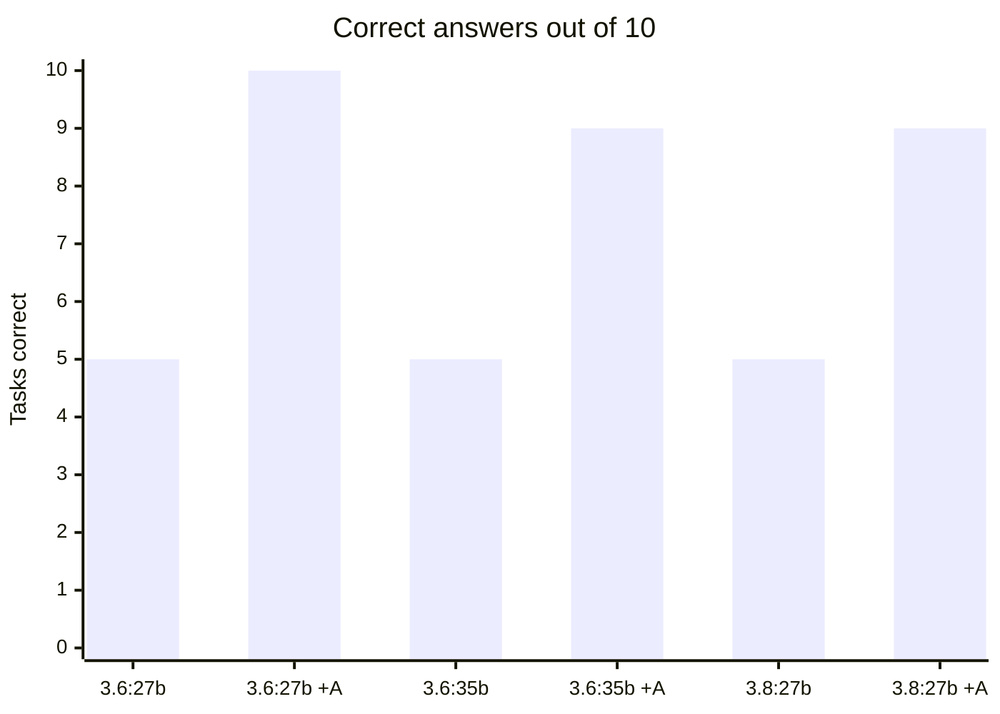
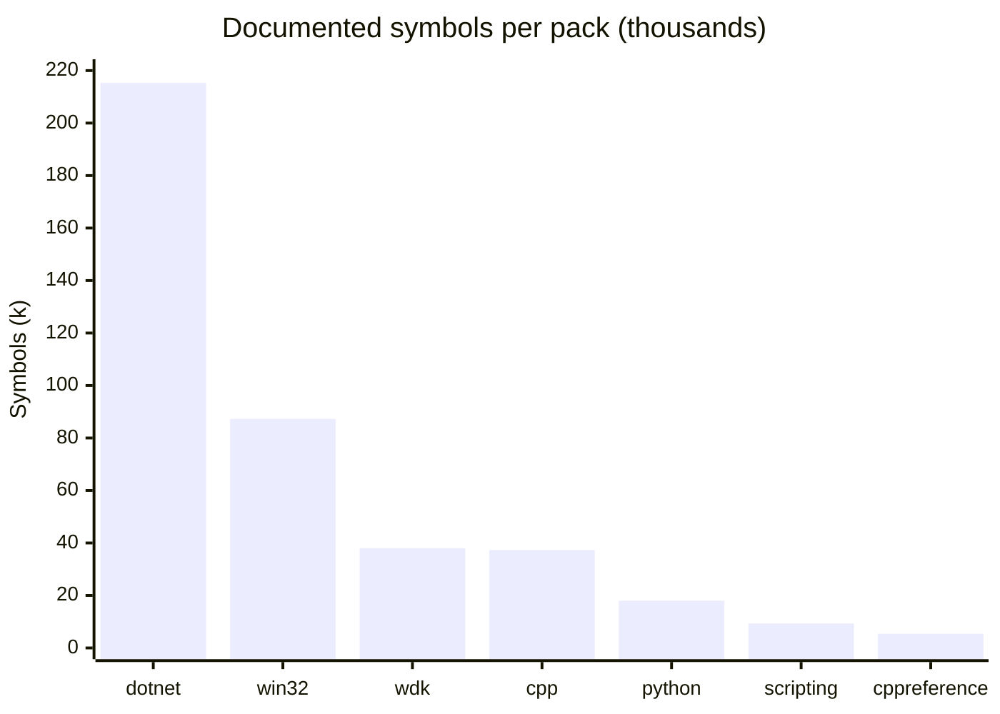
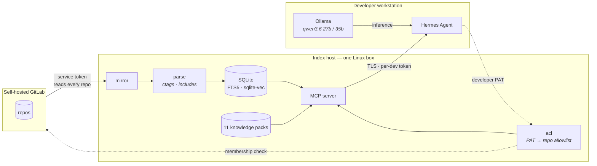

# Argus

**Your local LLM already knows how to code. It does not know your codebase, and it invents API facts with total confidence. Argus fixes both — on your own hardware, with nothing leaving your network.**

Argus is a self-hosted code index and documentation server for [Hermes Agent](https://github.com/NousResearch/hermes-agent) + [Ollama](https://ollama.com). It mirrors every repository from your GitLab, extracts a symbol and dependency graph, serves twelve documentation packs, and enforces each developer's real GitLab permissions in SQL.

---

## The measurement that matters

Ten task families — test development, code review, performance, coding style, SDK, WDK, win32, scripting, security review, code safety — one question each, graded by substring match on facts verified against the corpus before any model ran.



| model | alone | with Argus | change |
|---|---|---|---|
| `qwen3.6:27b` (dense, 27.8B) | 5 / 10 | **10 / 10** | **+100%** |
| `qwen3.6:35b` (MoE, 36.0B) | 5 / 10 | **9 / 10** | **+80%** |
| `qwen3.8:27b` (dense, 27.3B) | 5 / 9 | **9 / 10** | **+80%** |

**All three models failed the same five tasks alone** — not similar scores, the *same five*, task for task. An 8-billion-parameter gap, a different architecture, and a newer generation all changed nothing. Full three-way breakdown in [docs/model-comparison.md](docs/model-comparison.md).

`qwen3.6:27b` is the reference model here, chosen on behaviour rather than size. It is the *smallest* of the three, scores identically closed book, and pulls ahead only once tools exist: **26 tool calls to 35b's 19**, winning the one task that separated them by checking instead of recalling. 35b answered that one in 2.2 s with **zero tool calls** — confidently, and wrongly. For an agent, willingness to verify is worth more than parameter count. The margin is one task in ten, so the honest claim is "checks more reliably", not "better at everything".

All three handled amortized complexity and MSVC flag syntax fine. All three missed driver IRQLs and the documented header for `CreateFileW` — which is `fileapi.h`, not the `windows.h` that memory reaches for. Those are **recall** failures on facts too specialised to sit in any local model's weights.

> **Scale does not fix this. Retrieval does.**

And it gets *faster*: `35b`'s median response fell from **5.5 s to 2.4 s** with retrieval enabled. A looked-up fact is shorter to produce than a reasoned-out one.

---

## Quick start

```bash
git clone https://github.com/aliGhadyani/hermes-argus && cd hermes-argus
cp .env.example .env && $EDITOR .env      # GitLab URL + service token
./deploy/bootstrap.sh                      # build, start, index, verify
```

Then prove it works before you tell anyone about it:

```bash
python deploy/smoke_test.py --url https://argus.example/mcp --token <developer-PAT>
```

```
  [PASS] healthz                         3.1 ms  HTTP 200
  [PASS] auth rejects bad token        434.1 ms  denied
  [PASS] mcp handshake                1454.2 ms  protocol 2025-11-25
  [PASS] server instructions                     1803 chars
  [PASS] tools registered               20.3 ms  16 tools
  [PASS] packs answer                   47.3 ms  FltRegisterFilter -> APC_LEVEL
  [PASS] private index                  86.2 ms  12 repo(s) visible to this token

  7/7 checks passed
```

Full walkthrough: **[docs/production.md](docs/production.md)**.

---

## Deploying the LLM stack — read this part

`llm-stack/` is a complete self-hosted LLM service: a GPU inference engine, a chat
UI, an API gateway with a key and a budget per person, single sign-on, an admin
panel and dashboards. **The whole deployment is one `.env` file and
`docker compose up`.** There is no setup script.

### Three steps

```bash
cd llm-stack
cp env-samples/qwen3.8-flash-next.rtx3090.env .env
```

Pick the sample that matches your model and card:

| sample | model | card | first-start download | status |
|---|---|---|---|---|
| `qwen3.8-flash-next.rtx3090.env` | Qwen3.8-Flash-Next, 177B MoE | RTX 3090 24 GB + 64 GB RAM | 94 GB | measured here |
| `qwen3.8-flash-next.rtx5090.env` | Qwen3.8-Flash-Next, 177B MoE | RTX 5090 32 GB + 64 GB RAM | 94 GB | derived, not measured |
| `qwen3.8-27b.rtx3090.env` | Qwen3.8-27B, dense | RTX 3090 24 GB | 17.6 GB | measured here |
| `qwen3.8-27b.rtx5090.env` | Qwen3.8-27B, dense | RTX 5090 32 GB | 17.6 GB | derived, not measured |

Then make the secrets. No sample ships one; every empty value in the SECRETS section
has a comment saying how to make it, and this fills them all at once (the two LiteLLM
keys get the `sk-` prefix they require):

```bash
awk '/^# SECRETS/{s=1} /^# PEOPLE/{s=0} s && /^[A-Z0-9_]+=$/{c="openssl rand -hex 24"; c|getline r; close(c); if ($0 ~ /^LITELLM_/) r="sk-" r; $0=$0 r} {print}' .env > .env.new && mv .env.new .env && chmod 600 .env
```

Set `LLAMACPP_MODEL_DIR` to a directory **on NVMe** with room for the download, then:

```bash
make up
```

`make up` runs `scripts/preflight.sh` and then `docker compose up -d`. The
preflight earns its second: if this checkout has MOVED since the stack last
started, Docker keeps the containers on the **old** absolute paths and has
already created empty directories there to satisfy them, so nothing errors.
What you get instead is Authelia crash-looping on a missing config,
Alertmanager on a missing `alertmanager.yml`, the temperature exporter on a
missing `exporter.py` and Traefik exiting 127 — four unrelated-looking failures
that name files which plainly exist on disk. The preflight names the move.
`make preflight` runs it alone.

```bash
docker logs -f model-init
```

The first start downloads the model, checks every file against the SHA-256 that
Hugging Face publishes, then starts the engine. Open `https://admin.llm.localhost`
and sign in as `admin` with `AUTHELIA_ADMIN_PASSWORD` from `.env`. The browser warns
once about the self-signed certificate; accept it.

**Adding a setup** for another model or card is one file: copy the closest sample,
edit its header and its MODEL block, and check it. Step by step, with how to choose
each value: [llm-stack/env-samples/README.md](llm-stack/env-samples/README.md).

### Deploying without a network (airgap)

Same stack, same `.env`, but every image, model and embedding arrives on a disk
instead of from a registry. Build the bundle **on a machine that already runs
it**:

```bash
cd llm-stack
make airgap                                  # images + tree      (~7 GB measured)
make airgap A="--with-models --with-packs"   # + weights + docs   (~100 GB)
make airgap A="--split 4g"                   # parts for a FAT32 USB stick
```

Then, on the isolated host — no registry, no Hugging Face, no build:

```bash
unzip llm-stack-airgap-<date>.zip
cd llm-stack-airgap-<date>
cp llm-stack/.env.airgap llm-stack/.env
./fill-secrets.sh        # generates the ones that can be generated
./load.sh --up
```

Four things reach the network on a normal first start, and the bundle closes
all four rather than leaving them to be discovered on a machine that cannot fix
them:

| what | how it is handled |
|---|---|
| container images | `docker save` / `docker load`, including the three built locally, so the target never builds and never pulls |
| the GGUF weights | `--with-models`; `LLAMACPP_MODEL_DIR` is rewritten to a **relative** path, so the bundle runs from wherever it is unpacked |
| `model-init`'s Hugging Face check | `LLAMACPP_HF_FILES` is emptied. This is not tidiness: it asks the remote for the file size *before* accepting a local file, so with no network it exits 1 even when every weight is already on disk — and `llamacpp` declares it `service_completed_successfully`, so that exit 1 means the **engine never starts** |
| Ollama's embedding model | included, and restored into its volume. It is a Docker **volume**, not a bind mount, so nothing in the checkout hints that it is missing — and without it `docs_search` cannot embed a query |

`--with-env` puts the live `.env` in the bundle verbatim, secrets and all. Without
it the bundle ships `.env.airgap`: the same file with **every** secret emptied —
by name as well as by position, because eight of them (among them
`ARGUS_GITLAB_TOKEN`) live outside the `# SECRETS` block. `fill-secrets.sh` on
the target fills what can be generated and names the one that cannot.

The bundle is validated before it is written: every bind mount the compose file
asks for is checked to exist inside the staged tree, so a missing placeholder
directory cannot reach a host that has no way to fetch it. `./load.sh --check`
verifies checksums, images and mounts on arrival without changing anything.

### What `docker compose up` does before anything serves

Each of these used to be a script you had to run in the right order.

| service | does, from `.env` |
|---|---|
| `tls-init` | generates the self-signed certificate for `LLM_DOMAIN` and `*.LLM_DOMAIN`, keeps it, regenerates it if the domain changes |
| `auth-init` | builds Authelia's OIDC key and clients, the admin account, and Traefik's basic-auth; refuses to start Authelia against a database encrypted with another key |
| `model-init` | downloads and verifies the model; fails with the path in the message if a file is missing |
| `prometheus-secrets` | gives Prometheus the engine's scrape token |
| `power-limits` | applies `GPU_POWER_LIMIT_W` and `CPU_POWER_LIMIT_W`, and re-applies them after a reboot |

### Before you start

| requirement | why, and what happens without it |
|---|---|
| **NVMe for the model** | The engine memory-maps the GGUF and pages it in on demand. On NVMe Qwen3.8-Flash-Next serves at ~20 tok/s; on a spinning disk it is unusable. |
| **`nvidia-container-toolkit`** | Without it every GPU service fails with `could not select device driver`. `sudo ./scripts/install-requirements.sh` installs it and Docker. |
| **Your user in the `docker` group** | And log out and back in: group membership is fixed at login. |
| **A stable mount for the checkout** | See "The reboot trap" below. |
| **For Argus: a GitLab and a read-only token** | See "Connecting tools to Argus". |
| **RAM for a MoE model** | See "RAM" below. 64 GB works for Flash-Next; more is faster. |

### Addresses

| address | what | sign-in |
|---|---|---|
| `https://admin.llm.localhost` | people, API keys, credit, the Model card, indexing | SSO; the console needs `admins` |
| `https://chat.llm.localhost` | Open WebUI, with Argus as a tool | SSO |
| `https://grafana.llm.localhost` | dashboards | SSO |
| `https://gateway.llm.localhost/v1` | OpenAI-compatible API for tools | **the person's own API key** |
| `https://argus.llm.localhost/mcp` | Argus MCP server (profile `argus`) | **the person's own GitLab token** |
| `https://metrics.llm.localhost` · `alerts.` | Prometheus, Alertmanager | SSO, `admins` only |
| `https://auth.llm.localhost` | login portal | — |

Sign in as `admin` with the password from `.env`:

```bash
grep AUTHELIA_ADMIN_PASSWORD .env
```

Replace `llm.localhost` with your `LLM_DOMAIN`. Browsers resolve `*.localhost` by
themselves; **curl, Python, Node and every SDK on another machine do not** — run
`sudo ./scripts/setup-hosts.sh` there, or add the names to that machine's hosts file.

### Connecting tools to the API

Create the person in the admin panel; it shows their API key once. Every
OpenAI-compatible tool needs the same four things:

| setting | value |
|---|---|
| base URL | `https://gateway.llm.localhost/v1` |
| API key | that person's key (never `LITELLM_MASTER_KEY`: it has no budget and bills nobody) |
| model | `MODEL_NAME` from `.env`, e.g. `Qwen3.8-Flash-Next` |
| certificate | run host tools through `llm-stack/scripts/with-ca.sh` (below) |

The certificate is self-signed, and **TLS verification happens in the client**:
nothing the stack does on its side can make a host tool accept it. So each runtime
has to be told, and each wants a different variable.

| runtime | variable | what it does with it |
|---|---|---|
| Node — DeepSeek Harness, Qwen Code | `NODE_EXTRA_CA_CERTS` | **adds** to the public roots |
| Python — `requests`, `httpx`, `urllib` | `SSL_CERT_FILE`, `REQUESTS_CA_BUNDLE` | **replaces** the trust store |
| curl | `CURL_CA_BUNDLE` | **replaces** the trust store |
| git | `GIT_SSL_CAINFO` | **replaces** the trust store |

That add/replace split is why `tls.crt` alone is not enough for the bottom three:
pointing `SSL_CERT_FILE` at it stops the tool trusting the public internet too.
`llm-stack/scripts/with-ca.sh` sets every one of them correctly — `tls.crt` where
the variable adds, `bundle.crt` (public roots **plus** the stack's) where it
replaces — and installs nothing anywhere:

```bash
cd llm-stack
./scripts/with-ca.sh curl https://gateway.llm.localhost/v1/models -H "Authorization: Bearer sk-YOURKEY"
./scripts/with-ca.sh dsh web
./scripts/with-ca.sh python3 my_client.py
```

To put them in your own shell instead of prefixing each command:

```bash
eval "$(./scripts/with-ca.sh --print)"     # same as: make ca
```

A `000`, a `certificate verify failed`, or a connection error from a host tool is
almost always this variable rather than the stack being down. Containers need
none of it: they mount the certificate and set these same variables themselves.
Go and Java tools (Grafana, Traefik, most JVM CLIs) read the **operating
system's** store and honour none of these variables — `with-ca.sh` says so on
stderr rather than appearing to do nothing.

**DeepSeek Harness (`dsh`)** is a Node process and has no per-provider CA
setting; its own docs state it neither sets nor validates one. It reads
`NODE_EXTRA_CA_CERTS` **at process start**, so setting it afterwards does
nothing — it has to be in the environment that launches it:

```bash
NODE_EXTRA_CA_CERTS="/path/to/llm-stack/config/traefik/certs/tls.crt" dsh web
```

Then add a provider with base URL `https://gateway.llm.localhost/v1` and the
person's key from the admin panel. (The wrapper form above does the same thing
without exporting anything permanent.)

```bash
curl --cacert llm-stack/config/traefik/certs/tls.crt https://gateway.llm.localhost/v1/chat/completions -H "Authorization: Bearer sk-YOURKEY" -H 'Content-Type: application/json' -d '{"model":"Qwen3.8-Flash-Next","messages":[{"role":"user","content":"hi"}],"max_tokens":300}'
```

**Qwen Code** — `~/.qwen/settings.json` (the `mcpServers` part adds Argus, below):

```json
{
  "env": {
    "LOCAL_LLM_API_KEY": "sk-YOURKEY",
    "NODE_EXTRA_CA_CERTS": "/path/to/llm-stack/config/traefik/certs/tls.crt"
  },
  "modelProviders": {
    "openai": [
      {
        "id": "Qwen3.8-Flash-Next",
        "name": "[Local] Qwen3.8-Flash-Next",
        "baseUrl": "https://gateway.llm.localhost/v1",
        "envKey": "LOCAL_LLM_API_KEY",
        "generationConfig": { "contextWindowSize": 262144 }
      }
    ]
  },
  "mcpServers": {
    "argus": {
      "httpUrl": "https://argus.llm.localhost/mcp",
      "headers": { "Authorization": "Bearer YOUR_GITLAB_PAT" }
    }
  }
}
```

Then `qwen -m Qwen3.8-Flash-Next`.

**Hermes** — see [llm-stack/docs/HERMES.md](llm-stack/docs/HERMES.md); use the model's
real name and append `tls.crt` to Hermes's own CA bundle.

**Anything else** (OpenAI SDK, IDE plugins, other agents) takes the same base URL,
key and model.

### Connecting tools to Argus

Argus is an MCP server at `https://argus.llm.localhost/mcp` (compose profile
`argus`). **Each developer authenticates with their own GitLab personal access
token** (`read_api`) as a Bearer token, and Argus shows them only the repositories
that token can read.

```bash
claude mcp add --transport http argus https://argus.llm.localhost/mcp --header "Authorization: Bearer YOUR_GITLAB_PAT"
```

Qwen Code: the `mcpServers` block above. Any other MCP client: the same URL and header.

**To make Argus work on a deployment:**

1. Add `argus` to `COMPOSE_PROFILES` in `.env`.
2. Set `ARGUS_GITLAB_URL` and `ARGUS_GITLAB_TOKEN`. The token is **read-only**:
   `read_api` and `read_repository`, for an account that is at least Reporter in every
   project you want indexed. Argus never needs admin or sudo.
3. If your GitLab's certificate is not from a public CA, set **one** of these — see
   [GitLab on a private CA](#gitlab-on-a-private-ca):
   `ARGUS_GITLAB_CA_CERT=/etc/argus/tls/gitlab-ca.pem` (drop the PEM in
   `config/argus/tls/` first), or `ARGUS_GITLAB_VERIFY=false` when no CA file
   exists anywhere.
4. `make up`, then start an index run from the admin panel's **Indexing** card.

### GitLab on a private CA

Argus reaches GitLab over **two transports that cannot see each other's TLS
configuration**: `httpx` for the API, and the `git` binary for clones. Configuring
one and not the other is the failure that costs the most time, because it reads as a
bad credential — the API enumerates every project, and the first clone then dies with
`server certificate verification failed`.

Both settings in `.env` therefore apply to both transports:

| setting | when | what it does |
|---|---|---|
| `ARGUS_GITLAB_CA_CERT` | you have the CA that signed GitLab's certificate | verifies against the public roots **plus** that CA |
| `ARGUS_GITLAB_VERIFY=false` | self-signed, and **no** CA file is available anywhere | disables verification for every request and clone to that GitLab |

Drop the PEM in `llm-stack/config/argus/tls/` and give `ARGUS_GITLAB_CA_CERT` the path
**as the container sees it** (`/etc/argus/tls/<name>`). For a standalone deployment
outside compose, point it at any path the Argus process can read.

`ARGUS_GITLAB_VERIFY=false` means anything able to answer on that hostname can read
the service token — the most privileged string in the deployment. Use the CA whenever
one exists. Setting **both** is refused at startup rather than silently resolved,
because a CA bundle is exactly what makes verification possible.

### Argus in Open WebUI

With the `argus` profile on and `ARGUS_CHAT_CLIENT_TOKEN` set (the samples list it
under SECRETS), Open WebUI registers Argus as a tool. In a chat, enable **Argus**
from the tools button beside the message box.

It answers **per person**, like the developer path. Open WebUI can send only one
shared credential, so it proves it is the chat client with `ARGUS_CHAT_CLIENT_TOKEN`
and forwards the signed-in person's email; Argus reads that person's GitLab project
memberships with the read-only service token. Two rules follow:

- **A person's chat username must equal their GitLab username.** Argus maps the
  email to the sign-in username in Authelia, then to the GitLab account with that
  username; GitLab's *public* email is the fallback. A read-only token cannot see
  private emails, so there is no other way to match. Use the GitLab username when
  you add someone in the admin panel.
- **The chat-client token only works from inside the stack.** Open WebUI calls
  `http://argus:7700` on the compose network; the same token arriving through
  Traefik is refused, so a leaked token cannot claim someone else's email.

### When someone has no access

Argus does not answer "nothing found" when the only matches are in repositories
the person cannot read. It says which repositories hold them and who maintains
each, and tells them to ask a maintainer for Reporter access — for example:

```
Nothing you have access to matches this, but it does exist in 1 repository you cannot read:
- platform/billing (3 matches) -- maintainers: @olive (Olive Owner), @max (Max Maint)
Tell the person asking that they do not have access, and that they can ask a maintainer
listed above to add them in GitLab with at least Reporter access. Argus picks the change
up within 10 minutes.
```

Only repository names and maintainers are disclosed, never a path, symbol or line.
Reading a file or repository map in an unreadable repository gives the same message.
`ARGUS_ACCESS_NOTICES=0` on the argus service restores a plain "nothing found".

### Customizing

Everything is a value in `.env`. Change it, then run `docker compose up -d`: compose
recreates exactly the containers the change affects.

| to change | set in `.env` | notes |
|---|---|---|
| **another model** (same family, other quant, other card) | the MODEL block | copy the block from the closest `env-samples/` file; how to choose each value is in [llm-stack/env-samples/README.md](llm-stack/env-samples/README.md) |
| **a model with no sample** | a new file in `env-samples/` | same guide, "Adding a new setup"; any GGUF on Hugging Face works via `LLAMACPP_HF_REPO` + `LLAMACPP_HF_FILES` |
| context window | `MODEL_CONTEXT` | on a CUDA out-of-memory at start, lower `-ub` in `LLAMACPP_EXTRA_ARGS` first |
| people served at once | `LLAMACPP_PARALLEL` | keep `--kv-unified` so they share one context pool |
| MoE layers kept in RAM | `LLAMACPP_N_CPU_MOE` | raise on out-of-memory, lower for speed |
| multi-token prediction | `LLAMACPP_MTP_DRAFT_MAX` | `2` for dense models with an MTP layer, `0` for MoE on CPU |
| domain | `LLM_DOMAIN` | certificate and single sign-on follow; check with `./scripts/domain-check.sh --old <previous>` |
| reachable from the network | `BIND_ADDRESS=0.0.0.0` | default `127.0.0.1` is this machine only |
| ports | `TRAEFIK_HTTP_PORT`, `TRAEFIK_HTTPS_PORT` | |
| which services run | `COMPOSE_PROFILES` | `argus` code index, `tracing` Langfuse, `logging` Loki, `cadvisor`, `dcgm` |
| GPU / CPU power cap | `GPU_POWER_LIMIT_W`, `CPU_POWER_LIMIT_W` | empty restores the hardware default |
| CPU threads and ceilings | `LLAMACPP_THREADS`, `LLAMACPP_CPUS`, `OLLAMA_CPUS`, `POSTGRES_CPUS` | threads = physical cores; ceilings must sum under the core count |
| engine RAM ceiling | `LLAMACPP_MEM_LIMIT` | e.g. `56g`; `0` = none |
| default credit per person | `LITELLM_DEFAULT_USER_BUDGET`, `LITELLM_BUDGET_DURATION` | per person in the admin panel |
| a different llama.cpp build | `LLAMACPP_ENGINE_URL`, `LLAMACPP_ENGINE_SHA256` | a release tarball; empty = the image's own server |
| vLLM instead of llama.cpp | `COMPOSE_PROFILES` (`vllm` instead of `llamacpp`), the `VLLM_*` values with `VLLM_SERVED_MODEL_NAME` equal to `MODEL_NAME`, `ENGINE_API_BASE=http://vllm:8000/v1` | exactly one engine profile at a time; **not re-tested since the compose-only change** — the shipped samples are llama.cpp |
| gated Hugging Face repos | `HF_TOKEN` | |

Config files, for what `.env` does not cover: alert rules in
`llm-stack/config/prometheus/rules/`, dashboards in `llm-stack/config/grafana/dashboards/`
(edit the files; UI edits are overwritten), access rules in
`llm-stack/config/authelia/configuration.template.yml`.

### Switching the model

The admin panel's **Model** card (admins only) shows what is running and, for each
sample, the exact `.env` block to paste and the command. Every model setting sits
between `# >>> MODEL` and `# <<< MODEL`; replace that block, keep your own
`LLAMACPP_MODEL_DIR`, and run `docker compose up -d`. A model not yet on disk is
downloaded first. The engine, gateway and Open WebUI all take the name from
`MODEL_NAME`, so they cannot disagree.

The panel only shows the steps. Performing them would need the Docker socket, and
a socket in a web app is root on the host for anyone who reaches it.

### Measured

On one machine: i7-13700K (16 physical cores), 61 GB RAM, RTX 3090, NVMe, with the
power limits below applied. Every number comes from a script in `llm-stack/scripts/`.

**Two people at once** — Qwen3.8-Flash-Next, 400-token answers through the gateway
(`multiuser-bench.py`, medians of 3 rounds, repeated across 4 engine restarts):

| | decode | time to first token |
|---|---|---|
| one person | **20.2 tok/s** | 0.3 s |
| two people, each | **12.1 tok/s** | 2.0 s |
| two people, combined | 24.4 tok/s (1.2× one) | |

Other scenarios from the same script: a third request on two slots queued 18 s and then
ran at full speed; secrets in two concurrent prompts never crossed (0 leaks in 3 rounds);
a repeated 14,000-token prompt answered in 0.3 s from the prefix cache, for the other
person too.

**Qwen3.8-27B on the same 3090** — 131K context in 23.8 of 24 GB VRAM. **10.3 tok/s
with MTP** (2 drafted tokens, ~70% accepted) against 6.8 without: for a dense model on
the GPU, MTP is a 50% win. Measured at the 150 W GPU cap, which it hits; raise
`GPU_POWER_LIMIT_W` for a 27B deployment.

**Qwen Code on a large codebase** — Qt Creator 4.11.2 (12,091 files), headless, scored
against answers fixed beforehand with grep (`qwen-code-realworld.py`). It found the
text editor's duplicate-selection implementation at the right line in an 8,708-line
file (247 s), and answered a question about the 222,876-line `sqlite3.c` correctly with
grep and ranged reads instead of reading it whole (255 s; 63,345 of 74,100 prompt
tokens served from the prefix cache).

**Power limits.** This board shipped with Intel's CPU power limits removed (4095 W).
Under two users the CPU held 93–97 °C, and fewer threads did not help — measured at
16, 12, 10 and 8 — because package temperature follows the hottest core, and each busy
core runs flat out. Capping power did:

| two people, 16 threads | no caps | CPU 125 W, GPU 150 W |
|---|---|---|
| peak CPU temperature | 95 °C | **86 °C** |
| samples at or above 90 °C | 17% | **0%** |
| decode, one person / each of two | 20.4 / 12.2 tok/s | 20.2 / 11.8 tok/s |

**MTP does not help Qwen3.8-Flash-Next here.** Four alternating runs, same build:
off 20.3 / 12.2 tok/s (one / each of two), on 19.9 / 11.6. Each drafted token routes to
different experts in system RAM, so verification multiplies the slow part. Mainline
llama.cpp has no MTP graph for this architecture anyway (ggml-org/llama.cpp#28243);
`LLAMACPP_ENGINE_URL` can run Unsloth's build that has one, and the stock image and
that build measured the same within noise with MTP off.

### RAM

The model uses **all** of it, just not as "used". The engine memory-maps the GGUF, so
the weights sit in the page cache, which `free` reports under `buff/cache`. With
Flash-Next on this 61 GB machine: 58 GB of page cache holds the model while
generating. Its CPU-side weights are about 76 GB, so ~20 GB of experts are paged in
from NVMe on demand — 28 MB/s of reads and ~480 major page faults per second while
decoding, against 14 when idle. More physical RAM removes that; no setting can pin
more than you have. `--mlock` or `--no-mmap` on a model larger than RAM fails to load.

### The traps

**`*.localhost` resolves in browsers but not in curl, Python or any SDK.** Run
`sudo ./scripts/setup-hosts.sh`, or every command-line call fails with a DNS error that
looks like the stack is down.

**The reboot trap.** If the checkout lives on a removable or automounted volume,
Docker's `restart: unless-stopped` starts the stack before the volume mounts and binds
empty directories. Mount it from `/etc/fstab` with `x-systemd.before=docker.service`:

```
UUID=<uuid>  /mnt/data  ntfs3  defaults,nofail,x-systemd.before=docker.service,uid=1000,gid=1000  0 0
```

**Never change `LITELLM_SALT_KEY` or `AUTHELIA_STORAGE_ENCRYPTION_KEY` after the first
start.** Both encrypt stored data. Authelia's key encrypts its session database, and
`auth-init` stops it with the command to reset that volume; LiteLLM's key encrypts
credentials it stores in its database, which become unreadable.

**A long paste stalls the other person.** A 28,500-token paste took 97 s to process,
and a short question sent 2 s later waited 95 s behind it: the engine processes one
prompt at a time. Chat-sized prompts are unaffected, and agents re-sending a
conversation hit the prefix cache (a repeated 14,000-token prompt answered in 0.3 s).

**`docker compose down -v` deletes vLLM's model cache.** llama.cpp models live in
`LLAMACPP_MODEL_DIR` on the host and are never deleted.

**Open WebUI settings come from `.env` only.** `ENABLE_PERSISTENT_CONFIG=false`, so
changes made in its admin UI do not survive a restart.

**Set `BIND_ADDRESS`.** The samples use `127.0.0.1`. `0.0.0.0` serves everything to
your network.

**`-t` must be the physical core count, never logical.** On the 13700K (16 physical,
24 logical): 24 threads 10.2 tok/s, **16 threads 21.7**, 8 threads 17.9. That is
`LLAMACPP_THREADS`.

**On a startup CUDA OOM, lower `-ub` before the context.** The compute buffer scales
with context × ubatch and appears in no weights-plus-KV calculation; at 256K context
`-ub 4096` asked for 15 GB in one allocation, `-ub 1024` needed 3.7 GB.

**Empty replies.** These models return their reasoning in a separate
`reasoning_content` field. With a small `max_tokens` the whole budget goes to
reasoning and the reply is empty. Give it 300+ tokens.

**Low GPU utilisation with Flash-Next.** Expected: the experts run on the CPU, and the
card idles between attention layers.

**Traefik returns 404 for a running service.** It does not route containers whose
healthcheck is failing; `docker compose ps` shows which.

### Checking it

```bash
python3 scripts/acceptance.py
```

```bash
python3 scripts/functional-test.py
```

```bash
./scripts/domain-check.sh
```

`acceptance.py` checks wiring, and that `.env` and every sample resolve completely.
`functional-test.py` does what people do, for real: creates a person in the panel,
signs them in, uses their key, proves a credit limit binds and a rotated key dies,
signs into Grafana and Open WebUI with the right roles, and confirms a chat is billed
to whoever typed it — 43 checks. `domain-check.sh` proves the running stack answers
for `LLM_DOMAIN`. `audit-auth.sh`, `multiuser-bench.py` and `qwen-code-realworld.py`
go deeper on login, concurrency and agent work.

### If you enable pgvector

Three settings, none optional, each of which silently degrades the index:

- **`hnsw.ef_search`** defaults to 40 and `LIMIT k` does not raise it. Left alone,
  recall pins at 61% and does not move from k=128 to k=2048.
- **`hnsw.iterative_scan`** — without it a filtered search examines `ef_search`
  nodes and only *then* discards what the ACL rejects.
- **`SET`, not `SET LOCAL`** — autocommit gives every statement its own
  transaction, so `LOCAL` expires before the query that needed it.

Argus's semantic layer also needs an embedding provider. Ollama is in the compose
file under the `embed` profile; without it there is nowhere for vectors to come
from, whichever database stores them.


## What your agent gets

**Your private code**, access-controlled per developer:

| Tool | Answers |
|---|---|
| `find_symbol` | Exact definitions across every repo |
| `find_references` | Every mention, product-wide, cross-repo |
| `search_code` | Lexical search over millions of lines |
| `semantic_search` | *"Where do we handle retry backoff for uploads?"* — when the question has no identifier in it |
| `which_repo` | *"Which repo do I change for X?"* — from a description, a symbol, a stack trace, or a diff |
| `repo_map` · `impact_of` | *"What breaks if I change this?"* — from resolved `#include` edges |
| `code_contracts` | Every in-house symbol a file references, with its definition |
| `get_file` · `index_status` | Access-checked fetch; per-repo freshness |

**Public documentation**, no access control because there is nothing to gate:

| Tool | Answers |
|---|---|
| `docs_lookup` | Exact API name → the page that *defines* it |
| `docs_find` | *"Which cmdlet writes objects to CSV?"* — by description |
| `docs_search` · `docs_get` | Concepts, then the whole page |
| `docs_contracts` | Paste a file → header, library, DLL and IRQL of every API it calls |
| `docs_verify` | Check a draft you already wrote; reports only contradictions |

---

## Twelve knowledge packs, 1.80 GB, zero unresolved symbols



| pack | Documents | Chunks | Symbols | Size |
|---|---|---|---|---|
| `win32` — Windows SDK + samples | 71,663 | 530,559 | 87,297 | 786.2 MB |
| `wdk` — driver DDI + samples | 28,176 | 245,727 | 38,041 | 358.6 MB |
| `cpp` — MSVC, CRT, STL | 9,746 | 123,212 | 37,305 | 174.7 MB |
| `cppreference` — C++ standard library | 6,640 | 68,891 | 5,406 | 124.9 MB |
| `dotnet` — .NET BCL + MS NuGet packages | 11,013 | 140,661 | **215,269** | 236.4 MB |
| `scripting` — PowerShell, cmd, Unix | 9,302 | 46,027 | 9,302 | 70.2 MB |
| `python` — 3.13 | 516 | 13,164 | 18,027 | 28.5 MB |
| `debugger` — WinDbg + how-to | 2,138 | 14,259 | 1,511 | 24.8 MB |
| `sqlite` — SQL, pragmas, FTS5 | 837 | 8,987 | 36 | 18.3 MB |
| `react` — react.dev | 222 | 4,755 | 125 | 9.1 MB |
| `algorithms` — TheAlgorithms/C++ | 371 | 2,001 | 370 | 4.3 MB |
| `system-design` — the Primer | 9 | 442 | 8 | 1.3 MB |
| **total** | **139,895** | **1,180,766** | **394,545** | **1.80 GB** |

A pack is **one SQLite file** — prose, API symbols and embeddings. Build once, publish, install everywhere:

```bash
argus pack install https://your-host/wdk.arguspack --sha256 <digest>
```

A digest mismatch is refused and leaves **zero files behind**. All twelve answer correctly through the real `hermes -z` CLI — the whole chain, not a reimplementation.

---

## Why not just embed everything?

The obvious approach — chunk every file, embed it all, throw it in a vector DB — fails on large C/C++ codebases in a way that is easy to miss until you have already built it.

Headers are enormous, repetitive, and semantically near-identical. Embedding them floods the space with near-duplicates that crowd out real answers. Meanwhile the questions developers actually ask — *where is `Parse` defined*, *who calls this*, *what breaks if I change this struct* — are **exact lookups**, which a symbol table answers better than any embedding. Ask a pure-RAG system about `Init()` in a codebase with forty of them and it will confidently return the wrong one.

Argus inverts the priority:

| Layer | Answers | Cost |
|---|---|---|
| **Symbol graph** (ctags + `#include`) | Exact definitions, references, ownership | Cheap, seconds |
| **Lexical** (FTS5) | Exact strings over millions of lines | Cheap, instant |
| **Semantic** (embeddings) | Vague conceptual queries only | Expensive — applied *selectively* |

Queries to the lexical layer are **prose, not FTS5 expressions.** Every term is quoted as a phrase before it reaches FTS5, so `what is a mutex?` and `std::atomic_exchange` both work — a question mark and a `:` used to be syntax errors. The trade is that FTS5 operators (`AND`, `star*`, `NEAR`) are searched for as literal words. That is the right default for a tool whose caller is a language model.

Embeddings cover **public symbol signatures, scope and path — never function bodies.** A C++ body embeds mostly to "generic control flow"; its signature plus its path is what carries intent. That is ~70–90k vectors instead of ~600k.

And in C/C++ the `#include` graph **is** the cross-repo dependency graph — recoverable with no build system, no `compile_commands.json`, and no compiler.

---

## Architecture



**Two tokens, and their separation is the entire security model.** A privileged *service token* mirrors every repository, so the index is complete. Each developer's *own* token is exchanged at query time for their project membership, and every query is filtered to that allowlist **in SQL, before results leave the process** — never by asking the model nicely.

Telling an LLM "only answer about repos X and Y" is not access control; it is a suggestion, and a comment inside indexed source can override it.

The enforcement is structural:

```python
# Every public function in store/queries.py — no exceptions.
def find_symbol(allowed_repo_ids, conn, name, kind=None, limit=50): ...
#              ^^^^^^^^^^^^^^^^^ first positional, no default
```

A reflection test walks the module and fails on any function that does not take it first with no default. **It fails on code that does not exist yet** — which is the point. Security bugs of this class come from a new code path six months later that simply never called the check. Encoding it in the signature turns a runtime vulnerability into an import-time error.

---

## Measured

Everything here is measured on real corpora, not estimated. Full detail in [docs/pack-measurements.md](docs/pack-measurements.md), [docs/index-measurements.md](docs/index-measurements.md), [docs/kpis.md](docs/kpis.md).

### Latency

| | |
|---|---|
| `docs_lookup` | **2.1 ms** median |
| `which_repo` p95 (10,212 files) | **1.92 ms** |
| `docs_search`, 17.9k chunks | **88.6 ms** |
| `docs_search`, 364.8k chunks | **460 ms** |
| **query embedding (CPU Ollama)** | **2,254 ms** |

5.2× cost for 20.4× the corpus — sublinear. **The embedder sets the latency users feel, not the index.** A GPU is the single biggest improvement available.

### Scale

| | 1,026 files | 10,212 files |
|---|---|---|
| `which_repo` p95 | 1.58 ms | **1.92 ms** |
| ambiguous include rate | 1.28% | **0.09%** |
| MB per 1k files | 28.4 | 21.9 |

Suffix matching gets *better* with scale. `which_repo` stayed flat only because an indexed `basename` column replaced a full scan — before that, p95 was 15.5 ms and rising linearly.

### Engineering

| | |
|---|---|
| tests | **741 passing**, 0 skipped |
| hollow tests found by targeted revert | **9** |
| bugs whose failure mode was a *plausible success* | **6** |

A *hollow test* passes while the behaviour it names is broken. Each was caught by breaking the code deliberately and confirming the test noticed.

The six worst bugs shared one signature: **they produced a plausible success rather than an error.** A client logged "registered 19 tools" and the agent never saw them. A clone succeeded and the build blamed the path it had just written. A YAML parser returned a dict and silently omitted a key — which would have shipped a pack with zero symbols that built, installed and listed without complaint. None is caught by "does it crash"; each needs a check on the *content* of the success.

That discipline extends to the benchmarks. The model comparison above found **three defects in its own harness** before its numbers were trusted — a 401 that read as 0/10, a grading rule that fired on a correct answer, and a re-grade that manufactured a failure from a truncated record. All three are written up rather than quietly fixed, because each would have published as a finding.

---

## Status

| Phase | | |
|---|---|---|
| 1 — Indexer | ctags, includes, SQLite | ✅ |
| 2 — MCP server | ACL, 8 private tools | ✅ |
| 3 — Cross-repo | include resolution, `repo_map`, `which_repo` | ✅ |
| 4 — Semantic layer | selective embeddings, `semantic_search` | ✅ |
| 5 — Knowledge packs | 11 packs, 6 doc tools, `argus pack` | ✅ |

**877 tests**, passing locally, 0 skipped.

- **[llm-stack/docs/ARCHITECTURE.md](llm-stack/docs/ARCHITECTURE.md)** — every service in the stack, how a request flows through them, and what each failure looks like
- **[llm-stack/docs/CONFIGURATION.md](llm-stack/docs/CONFIGURATION.md)** — every `.env` variable and every file under `config/`
- **[docs/production.md](docs/production.md)** — deploy, verify, operate
- **[docs/deployment.md](docs/deployment.md)** — wiring Hermes, and the failure modes
- **[docs/knowledge-packs.md](docs/knowledge-packs.md)** — building and publishing packs
- **[docs/pgvector-backend.md](docs/pgvector-backend.md)** — the optional Postgres backend for symbol embeddings, and what it measures
- **[evals/](evals/)** — every benchmark in this README, reproducible

---

## Licence

Argus is **GPL v3** — see [LICENSE](LICENSE).

Knowledge packs carry their own upstream licences, which are *not* GPL and vary per pack: CC-BY-4.0 for the Microsoft documentation, CC-BY-SA-3.0 for cppreference, PSF-2.0 for Python, MIT for the algorithms corpus, public domain for SQLite. `argus pack info <name>` prints each in full, and that output is how you meet the redistribution obligation.
