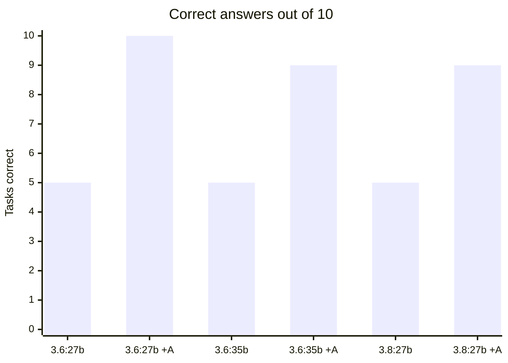
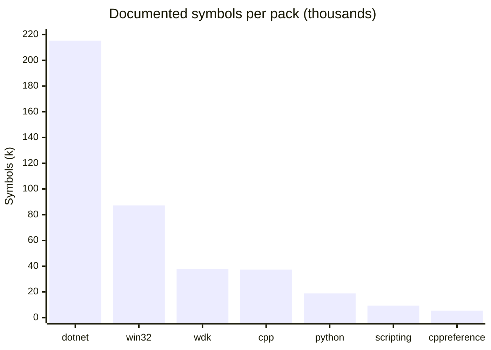

# Argus

**Your local LLM already knows how to code. It does not know your codebase, and it invents API facts with total confidence. Argus fixes both — on your own hardware, with nothing leaving your network.**

One deployment, three parts:

- **the app** — a .NET backend ([`dotnet/`](dotnet/)) serving a React frontend ([`frontend/`](frontend/)): sign-in, a chat that searches your code and documentation as it answers, administration of people, budgets, the code index and knowledge packs, and MCP for editors and agents;
- **the models** — llama.cpp serving your chat model on the GPU and the embedding model on the CPU;
- **the gateway** — LiteLLM, one OpenAI-compatible endpoint with a key and a budget per person.

```bash
cd stack
cp env-samples/qwen3.8-flash-next.rtx5090.env .env      # or qwen3.8-27b.rtx5090.env
awk '/^# SECRETS/{s=1} /^# APP/{s=0} s && /^[A-Z0-9_]+=$/{c="openssl rand -hex 24"; c|getline r; close(c); if ($0 ~ /^LITELLM_/) r="sk-" r; $0=$0 r} {print}' .env > .env.new && mv .env.new .env && chmod 600 .env
# set ARGUS_ADMIN_EMAIL, LLAMACPP_MODEL_DIR (on NVMe), and ARGUS_GITLAB_URL / ARGUS_GITLAB_TOKEN
make up && make health && make smoke
```

Open **http://localhost:8080** and sign in as `admin` with `ARGUS_ADMIN_PASSWORD` from `.env`.

---

## The measurement that matters

Ten task families — test development, code review, performance, coding style, SDK, WDK, win32, scripting, security review, code safety — one question each, graded by substring match on facts verified against the corpus before any model ran.



| model | alone | with Argus | change |
|---|---|---|---|
| `qwen3.6:27b` (dense, 27.8B) | 5 / 10 | **10 / 10** | **+100%** |
| `qwen3.6:35b` (MoE, 36.0B) | 5 / 10 | **9 / 10** | **+80%** |
| `qwen3.8:27b` (dense, 27.3B) | 5 / 9 | **9 / 10** | **+80%** |

**All three models failed the same five tasks alone** — not similar scores, the *same five*, task for task. An 8-billion-parameter gap, a different architecture, and a newer generation all changed nothing. Full three-way breakdown in [docs/measurements/model-comparison.md](docs/measurements/model-comparison.md).

`qwen3.6:27b` is the reference model here, chosen on behaviour rather than size. It is the *smallest* of the three, scores identically closed book, and pulls ahead only once tools exist: **26 tool calls to 35b's 19**, winning the one task that separated them by checking instead of recalling. 35b answered that one in 2.2 s with **zero tool calls** — confidently, and wrongly. For an agent, willingness to verify is worth more than parameter count. The margin is one task in ten, so the honest claim is "checks more reliably", not "better at everything".

All three handled amortized complexity and MSVC flag syntax fine. All three missed driver IRQLs and the documented header for `CreateFileW` — which is `fileapi.h`, not the `windows.h` that memory reaches for. Those are **recall** failures on facts too specialised to sit in any local model's weights.

> **Scale does not fix this. Retrieval does.**

And it gets *faster*: `35b`'s median response fell from **5.5 s to 2.4 s** with retrieval enabled. A looked-up fact is shorter to produce than a reasoned-out one.

---

## What people get

**In the browser:** a chat whose answers show the model's reasoning and every
code-index lookup it made, as it makes them — and a Settings page for their own
keys: a **code index key** for editors and agents over MCP, and a **model key**
for the OpenAI-compatible gateway. Chat and API use count against one budget.

**Administrators** add people (the password is generated and shown once), set
budgets and roles, link GitLab accounts, start and watch index runs, search what
the index holds, and install or update knowledge packs.

**What anyone may see in the code is decided by GitLab**: each person gets
exactly the repositories their GitLab membership grants, in the chat and over
MCP alike. A refusal says which repository holds a match and whom to ask.

### The tools

**Your private code**, access-controlled per developer — 11 tools:

| Tool | Answers |
|---|---|
| `find_symbol` | Exact definitions across every repo |
| `find_references` | Every mention, product-wide, cross-repo |
| `search_code` | Lexical search over millions of lines |
| `semantic_search` | *"Where do we handle retry backoff for uploads?"* — when the question has no identifier in it |
| `which_repo` | *"Which repo do I change for X?"* — from a description, a symbol, a stack trace, or a diff |
| `repo_map` · `impact_of` | *"What breaks if I change this?"* — from resolved `#include` edges |
| `code_contracts` | Every in-house symbol a file references, with its definition |
| `get_file` · `index_status` | Access-checked fetch; per-repo freshness, one row per branch |
| `overview` | *"What is this repository?"* — its README, its layout, its key symbols. The one to call first in a codebase you have never seen |

**Public documentation**, no access control because there is nothing to gate — 6 tools:

| Tool | Answers |
|---|---|
| `docs_lookup` | Exact API name → the page that *defines* it |
| `docs_find` | *"Which cmdlet writes objects to CSV?"* — by description |
| `docs_search` · `docs_get` | Concepts, then the whole page |
| `docs_contracts` | Paste a file → header, library, DLL and IRQL of every API it calls |
| `docs_verify` | Check a draft you already wrote; reports only contradictions |

All 17 are available to the chat model in the app and to any MCP client at `/mcp`.

## Eleven knowledge packs, 1.87 GB, zero unresolved symbols



| pack | Documents | Chunks | Symbols | Size | Licence |
|---|---|---|---|---|---|
| [`win32`](https://huggingface.co/buckets/Binchitects/argus-packs/resolve/win32.arguspack) — Windows SDK API reference | 65,906 | 478,788 | 118,242 | 726.1 MB | CC-BY-4.0 |
| `wdk` — driver DDI reference | 25,903 | 205,848 | 37,938 | 292.5 MB | CC-BY-4.0 |
| `dotnet` — .NET BCL + MS NuGet packages | 11,013 | 140,661 | **215,269** | 236.4 MB | CC-BY-4.0 |
| `cpp` — MSVC, CRT, STL | 9,746 | 123,212 | 37,325 | 180.0 MB | CC-BY-4.0 |
| `win32-samples` — Microsoft desktop samples | 5,801 | 67,714 | 139 | 136.2 MB | MIT |
| `cppreference` — C++ standard library | 6,640 | 68,891 | 5,406 | 125.6 MB | CC-BY-SA-3.0 |
| `wdk-samples` — Microsoft driver samples | 2,273 | 39,879 | 104 | 76.8 MB | MS-PL |
| `scripting` — PowerShell, cmd, Unix | 9,310 | 46,052 | 9,310 | 70.9 MB | CC-BY-4.0 |
| `python` — 3.13 | 540 | 13,751 | 18,778 | 31.8 MB | PSF-2.0 |
| `debugger` — WinDbg + how-to | 2,138 | 14,259 | 1,511 | 25.0 MB | CC-BY-4.0 |
| `sqlite` — SQL, pragmas, FTS5 | 837 | 8,987 | 36 | 18.4 MB | public domain |
| **total** | **140,107** | **1,208,042** | **444,058** | **1.87 GB** | |

### Downloading a pack

The Windows packs are published to a public Hugging Face bucket —
**[`Binchitects/argus-packs`](https://huggingface.co/buckets/Binchitects/argus-packs)**.
Install one straight from it, with the digest so a truncated download is
refused rather than installed:

```bash
docker exec argus argus pack install \
  --config /etc/argus/config.yaml \
  https://huggingface.co/buckets/Binchitects/argus-packs/resolve/win32.arguspack \
  --sha256 9d81767392f46b4239efd18aaed41de8043167b68a2150743a023d6bb25988d8
```

| pack | published | size | sha256 |
|---|---|---|---|
| [`win32`](https://huggingface.co/buckets/Binchitects/argus-packs/resolve/win32.arguspack) | ✅ | 761,376,768 B | `9d81767392f46b4239efd18aaed41de8043167b68a2150743a023d6bb25988d8` |
| [`wdk`](https://huggingface.co/buckets/Binchitects/argus-packs/resolve/wdk.arguspack) | ✅ | 306,757,632 B | `691c20c8df242fe4b06f2683afe84456c66e3dd2537ec0c8ffdf336f9ebdbf4d` |
| [`win32-samples`](https://huggingface.co/buckets/Binchitects/argus-packs/resolve/win32-samples.arguspack) | ✅ | 142,811,136 B | `e7a80a83d0d918fefdea1725707ce1076afbc39cd06130a766274b8741ba0b17` |
| [`wdk-samples`](https://huggingface.co/buckets/Binchitects/argus-packs/resolve/wdk-samples.arguspack) | ✅ | 80,523,264 B | `786c4a8b38091715cb1c4ec22c87ab1f7784d6c01fe60c7a9cfeca6d3ef063c1` |

---

## Documentation

| | |
|---|---|
| [stack/README.md](stack/README.md) | deploying and operating the stack |
| [docs/ARCHITECTURE.md](docs/ARCHITECTURE.md) | the services, identity, a chat turn, where state lives |
| [docs/CONFIGURATION.md](docs/CONFIGURATION.md) | every setting in `.env` |
| [docs/OPERATIONS.md](docs/OPERATIONS.md) | people, keys, budgets, backup and restore, updates, troubleshooting |
| [docs/DEVELOPMENT.md](docs/DEVELOPMENT.md) | building, the test suites, conventions |
| [clients/](clients/) | connecting Claude Code, Qwen Code, Continue, DeepSeek Harness and other MCP clients |
| [docs/code-index/](docs/code-index/) | branches and knowledge packs in depth |
| [docs/measurements/](docs/measurements/) | retrieval quality, pack coverage, model throughput and memory, as measured |

## Licence

Argus is **GPL v3** — see [LICENSE](LICENSE).

Knowledge packs carry their own upstream licences, which are *not* GPL and vary per pack: CC-BY-4.0 for the Microsoft documentation, CC-BY-SA-3.0 for cppreference, PSF-2.0 for Python, public domain for SQLite. `argus pack info <name>` prints each in full, and that output is how you meet the redistribution obligation.
