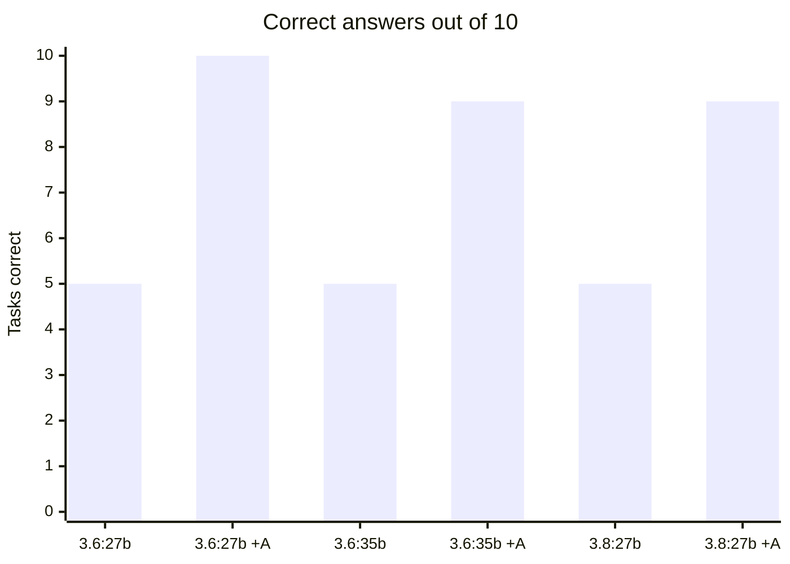
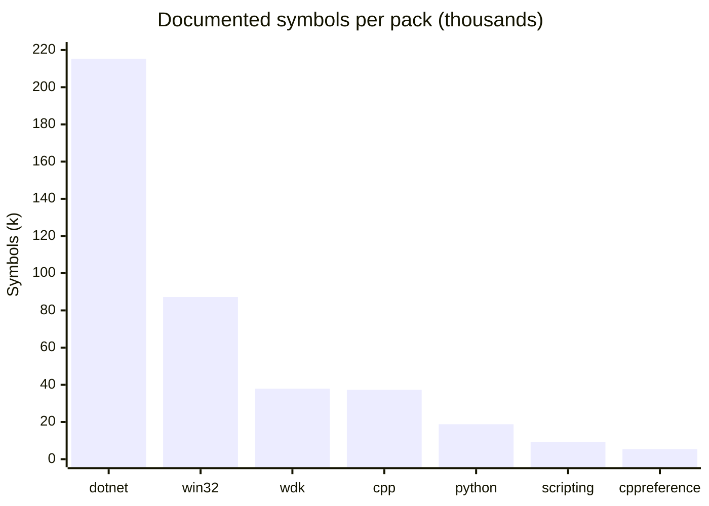
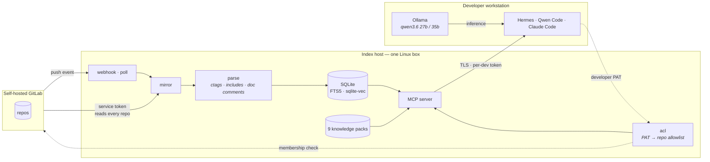

# Argus

**Your local LLM already knows how to code. It does not know your codebase, and it invents API facts with total confidence. Argus fixes both — on your own hardware, with nothing leaving your network.**

There are **two things in this repository**, and either works without the other:

- **The stack** ([`stack/`](stack/)) — a complete self-hosted LLM service: a GPU engine, a chat UI, an API gateway with a key and a budget per person, single sign-on, an admin console, dashboards and alerts. Argus is part of it.
- **Argus** ([`src/argus/`](src/)) — the code index and documentation server. It mirrors your GitLab, extracts a symbol and dependency graph, serves knowledge packs, and enforces each developer's real GitLab permissions **in SQL**. It also runs standalone, without any of the stack.

---

## The measurement that matters

Ten task families — test development, code review, performance, coding style, SDK, WDK, win32, scripting, security review, code safety — one question each, graded by substring match on facts verified against the corpus before any model ran.



| model | alone | with Argus | change |
|---|---|---|---|
| `qwen3.6:27b` (dense, 27.8B) | 5 / 10 | **10 / 10** | **+100%** |
| `qwen3.6:35b` (MoE, 36.0B) | 5 / 10 | **9 / 10** | **+80%** |
| `qwen3.8:27b` (dense, 27.3B) | 5 / 9 | **9 / 10** | **+80%** |

**All three models failed the same five tasks alone** — not similar scores, the *same five*, task for task. An 8-billion-parameter gap, a different architecture, and a newer generation all changed nothing. Full three-way breakdown in [docs/argus/model-comparison.md](docs/argus/model-comparison.md).

`qwen3.6:27b` is the reference model here, chosen on behaviour rather than size. It is the *smallest* of the three, scores identically closed book, and pulls ahead only once tools exist: **26 tool calls to 35b's 19**, winning the one task that separated them by checking instead of recalling. 35b answered that one in 2.2 s with **zero tool calls** — confidently, and wrongly. For an agent, willingness to verify is worth more than parameter count. The margin is one task in ten, so the honest claim is "checks more reliably", not "better at everything".

All three handled amortized complexity and MSVC flag syntax fine. All three missed driver IRQLs and the documented header for `CreateFileW` — which is `fileapi.h`, not the `windows.h` that memory reaches for. Those are **recall** failures on facts too specialised to sit in any local model's weights.

> **Scale does not fix this. Retrieval does.**

And it gets *faster*: `35b`'s median response fell from **5.5 s to 2.4 s** with retrieval enabled. A looked-up fact is shorter to produce than a reasoned-out one.

---

## Quick start

```bash
git clone https://github.com/Binchitects/argus && cd argus

cd stack
cp env-samples/qwen3.8-flash-next.rtx5090.env .env   # pick the one for your model and card
make up                                              # preflight, then docker compose up -d
```

`make up` builds the Argus image from this checkout, pulls the rest, and starts
the stack. Full walkthrough — the secrets, the addresses, and what to do when
something reports healthy but is not — under
[Deploying the stack](#deploying-the-stack--read-this-part) below. No network on
the target host? See [Deploying without a network](#deploying-without-a-network-airgap).

Prove it before you tell anyone about it — this talks to the MCP endpoint over
the real auth path, not to `/healthz`, which bypasses authentication and answers
200 whether or not the server can serve anything:

```bash
python scripts/smoke_test.py --url https://argus.llm.localhost/mcp --token <developer-PAT>
```

```
  [PASS] healthz                         3.1 ms  HTTP 200
  [PASS] auth rejects bad token        434.1 ms  denied
  [PASS] mcp handshake                1454.2 ms  protocol 2025-11-25
  [PASS] server instructions                     1803 chars
  [PASS] tools registered               20.3 ms  17 tools
  [PASS] packs answer                   47.3 ms  FltRegisterFilter -> APC_LEVEL
  [PASS] private index                  86.2 ms  12 repo(s) visible to this token

  7/7 checks passed
```

### What is in here

| directory | what it is | entry point |
|---|---|---|
| [`stack/`](stack/) | **The deployment.** Compose file, per-service config, env samples, operational scripts | [`stack/README.md`](stack/README.md) |
| [`src/argus/`](src/argus/) | **The Argus package** — the MCP code index and documentation server. Installable and runnable on its own | [`docs/argus/`](docs/argus/) |
| [`packs/`](packs/) | **Eleven built knowledge packs**, 1.87 GB — prose, API symbols and embeddings in one SQLite file each. Three more are parked in `packs/disabled/` | [`docs/argus/knowledge-packs.md`](docs/argus/knowledge-packs.md) |
| [`tests/`](tests/) | The Argus suite — **1,091 tests**, no Docker required | `pytest` |
| [`docs/`](docs/) | **All documentation**, split into [`docs/stack/`](docs/stack/) and [`docs/argus/`](docs/argus/) | [`docs/`](docs/) |
| [`clients/`](clients/) | **Copy-pasteable configs** for DeepSeek Harness, Qwen Code, Claude Code, Continue and any generic MCP client, each marked with whether it was actually executed | [`clients/README.md`](clients/README.md) |
| [`scripts/`](scripts/) | Repository tooling: release, packaging, the Hermes integrations, and the test GitLab the stack's fixtures use | [`scripts/release.sh`](scripts/release.sh) |
| [`evals/`](evals/) | The measurement harness behind every number in this README | [`evals/README.md`](evals/README.md) |
| `stack/scripts/` | Operational scripts **for a running stack** — backup, health, acceptance, the airgap bundle | `cd stack && make help` |

Argus on its own, without the stack:

```bash
pip install ".[dev]"                       # from the repository root
argus index --config config.yaml
argus serve --config config.yaml
```

Full walkthrough: **[docs/argus/clients.md](docs/argus/clients.md)**.

---

# The stack

`stack/` is a complete self-hosted LLM service: a GPU inference engine, a chat
UI, an API gateway with a key and a budget per person, single sign-on, an admin
console and dashboards. **The whole deployment is one `.env` file and
`docker compose up`.** There is no setup script.

**24 services** are enabled by the default profile set, with 15 profiles to
choose from — `argus` adds the code index, `embed` adds Ollama, `tracing` adds
Langfuse, and `logging` (Loki + Promtail) is **on by default**.

## Deploying the stack — read this part

### Three steps

```bash
cd stack
cp env-samples/qwen3.8-flash-next.rtx5090.env .env
```

Pick the sample that matches your model and card:

| sample | model | card | first-start download | status |
|---|---|---|---|---|
| `qwen3.8-flash-next.rtx5090.env` | Qwen3.8-Flash-Next, 177B MoE, UD-IQ4_XS | RTX 5090 32 GB + 64 GB+ RAM | 94 GB | measured here |
| `qwen3.8-27b.rtx5090.env` | Qwen3.8-27B, dense, NVFP4 with MTP | RTX 5090 32 GB | 17.1 GB | measured here |

Then make the secrets. No sample ships one; every empty value in the SECRETS section
has a comment saying how to make it, and this fills them all at once (the two LiteLLM
keys get the `sk-` prefix they require):

```bash
awk '/^# SECRETS/{s=1} /^# PEOPLE/{s=0} s && /^[A-Z0-9_]+=$/{c="openssl rand -hex 24"; c|getline r; close(c); if ($0 ~ /^LITELLM_/) r="sk-" r; $0=$0 r} {print}' .env > .env.new && mv .env.new .env && chmod 600 .env
```

Set `LLAMACPP_MODEL_DIR` to a directory **on NVMe** with room for the download, then:

```bash
make up
```

`make up` runs `scripts/preflight.sh` and then `docker compose up -d`. The
preflight earns its second: if this checkout has MOVED since the stack last
started, Docker keeps the containers on the **old** absolute paths and has
already created empty directories there to satisfy them, so nothing errors.
What you get instead is Authelia crash-looping on a missing config,
Alertmanager on a missing `alertmanager.yml`, the temperature exporter on a
missing `exporter.py` and Traefik exiting 127 — four unrelated-looking failures
that name files which plainly exist on disk. The preflight names the move.
`make preflight` runs it alone.

```bash
docker logs -f model-init
```

The first start downloads the model, checks every file against the SHA-256 that
Hugging Face publishes, then starts the engine. Open `https://admin.llm.localhost`
and sign in as `admin` with `AUTHELIA_ADMIN_PASSWORD` from `.env`. The browser warns
once about the self-signed certificate; accept it.

**Adding a setup** for another model or card is one file: copy the closest sample,
edit its header and its MODEL block, and check it. Step by step, with how to choose
each value: [stack/env-samples/README.md](stack/env-samples/README.md).

### Deploying without a network (airgap)

Same stack, same `.env`, but every image, model and embedding arrives on a disk
instead of from a registry. Build the bundle **on a machine that already runs
it**:

```bash
cd stack
make airgap                                  # images + tree      (~7 GB measured)
make airgap A="--with-models --with-packs"   # + weights + docs   (~100 GB)
make airgap A="--split 4g"                   # parts for a FAT32 USB stick
```

Then, on the isolated host — no registry, no Hugging Face, no build:

```bash
unzip stack-airgap-<date>.zip
cd stack-airgap-<date>
cp stack/.env.airgap stack/.env
./fill-secrets.sh        # generates the ones that can be generated
./load.sh --check        # verify it all before anything starts
./load.sh --up
```

**If you used `--split`**, the parts must be **joined first**, from a directory
you can **write to**:

```bash
zip -s 0 stack-airgap-<date>.zip --out joined.zip   # writes into this directory
unzip -t joined.zip                                 # verify BEFORE trusting it
unzip joined.zip
```

Info-ZIP's `unzip` cannot read a split set at all, and the join writes into the
directory holding the parts — on a read-only mount it exits 0 having produced a
**0-byte file**, so verify with `unzip -t` rather than trusting the exit code.

Four things reach the network on a normal first start, and the bundle closes
all four rather than leaving them to be discovered on a machine that cannot fix
them:

| what | how it is handled |
|---|---|
| container images | `docker save` / `docker load`, including the three built locally, so the target never builds and never pulls |
| the GGUF weights | `--with-models`; `LLAMACPP_MODEL_DIR` is rewritten to a **relative** path, so the bundle runs from wherever it is unpacked |
| `model-init`'s Hugging Face check | `LLAMACPP_HF_FILES` is emptied. This is not tidiness: it asks the remote for the file size *before* accepting a local file, so with no network it exits 1 even when every weight is already on disk — and `llamacpp` declares it `service_completed_successfully`, so that exit 1 means the **engine never starts** |
| Ollama's embedding model | included, and restored into its volume. It is a Docker **volume**, not a bind mount, so nothing in the checkout hints that it is missing — and without it `docs_search` cannot embed a query |

**A fifth one is not a download at all: an image that is simply absent.**
The bundle carries the images for the profiles that were enabled where it was
built. Enable another profile on the target — edit `COMPOSE_PROFILES`, or drop
a different env sample over `.env` — and `docker compose up` stops on a pull
that host cannot make, *partway through*, with the other services already
running. `load.sh --check` renders the compose file against the `.env` that
will actually be used, compares the images it names with the bundle, and
refuses before anything starts:

```
  the .env asks for image(s) this bundle does not carry:
      vllm/vllm-openai:latest
error: this bundle was built for a different set of profiles.
```

`stack/.airgap/manifest.txt` records which profiles the bundle covers. Build
with `--all-profiles` if the target may enable others.

`--with-env` puts the live `.env` in the bundle verbatim, secrets and all. Without
it the bundle ships `.env.airgap`: the same file with **every** secret emptied —
by name as well as by position, because some of them (`ARGUS_GITLAB_TOKEN`,
`ARGUS_GITLAB_PASSWORD`) live outside the `# SECRETS` block. `fill-secrets.sh` on
the target fills what can be generated and names the one that cannot.

The bundle is validated before it is written: every bind mount the compose file
asks for is checked to exist inside the staged tree, so a missing placeholder
directory cannot reach a host that has no way to fetch it. `./load.sh --check`
verifies checksums, images and mounts on arrival without changing anything.

### What `docker compose up` does before anything serves

Each of these used to be a script you had to run in the right order.

| service | does, from `.env` |
|---|---|
| `tls-init` | generates the self-signed certificate for `LLM_DOMAIN` and `*.LLM_DOMAIN`, keeps it, regenerates it if the domain changes |
| `auth-init` | builds Authelia's OIDC key and clients, the admin account, and Traefik's basic-auth; refuses to start Authelia against a database encrypted with another key |
| `model-init` | downloads and verifies the model; fails with the path in the message if a file is missing |
| `prometheus-secrets` | gives Prometheus the engine's scrape token |
| `power-limits` | applies `GPU_POWER_LIMIT_W` and `CPU_POWER_LIMIT_W`, and re-applies them after a reboot |

### Before you start

| requirement | why, and what happens without it |
|---|---|
| **NVMe for the model** | The engine memory-maps the GGUF and pages it in on demand. On NVMe Qwen3.8-Flash-Next serves at ~20 tok/s; on a spinning disk it is unusable. |
| **`nvidia-container-toolkit`** | Without it every GPU service fails with `could not select device driver`. `sudo ./scripts/install-requirements.sh` installs it and Docker. |
| **Your user in the `docker` group** | And log out and back in: group membership is fixed at login. |
| **A stable mount for the checkout** | See "The reboot trap" below. |
| **For Argus: a GitLab and a read-only token** | See "Connecting tools to Argus". |
| **RAM for a MoE model** | See "RAM" below. 64 GB works for Flash-Next; more is faster. |

### Addresses

| address | what | sign-in |
|---|---|---|
| `https://admin.llm.localhost` | people, API keys, credit, the Model card, Indexing, Explore | SSO; the console needs `admins` |
| `https://chat.llm.localhost` | Open WebUI, with Argus as a tool | SSO |
| `https://grafana.llm.localhost` | dashboards | SSO |
| `https://gateway.llm.localhost/v1` | OpenAI-compatible API for tools | **the person's own API key** |
| `https://argus.llm.localhost/mcp` | Argus MCP server (profile `argus`) | **the person's own GitLab token** |
| `https://metrics.llm.localhost` · `alerts.` | Prometheus, Alertmanager | SSO, `admins` only |
| `https://auth.llm.localhost` | login portal | — |

Sign in as `admin` with the password from `.env`:

```bash
grep AUTHELIA_ADMIN_PASSWORD .env
```

Replace `llm.localhost` with your `LLM_DOMAIN`. Browsers resolve `*.localhost` by
themselves; **curl, Python, Node and every SDK on another machine do not** — run
`sudo ./scripts/setup-hosts.sh` there, or add the names to that machine's hosts file.

### Connecting tools to the API

Create the person in the admin console; it shows their API key once. Every
OpenAI-compatible tool needs the same four things:

| setting | value |
|---|---|
| base URL | `https://gateway.llm.localhost/v1` |
| API key | that person's key (never `LITELLM_MASTER_KEY`: it has no budget and bills nobody) |
| model | `MODEL_NAME` from `.env`, e.g. `Qwen3.8-Flash-Next` |
| certificate | run host tools through `stack/scripts/with-ca.sh` (below) |

The certificate is self-signed, and **TLS verification happens in the client**:
nothing the stack does on its side can make a host tool accept it. So each runtime
has to be told, and each wants a different variable.

| runtime | variable | what it does with it |
|---|---|---|
| Node — DeepSeek Harness, Qwen Code | `NODE_EXTRA_CA_CERTS` | **adds** to the public roots |
| Python — `requests`, `httpx`, `urllib` | `SSL_CERT_FILE`, `REQUESTS_CA_BUNDLE` | **replaces** the trust store |
| curl | `CURL_CA_BUNDLE` | **replaces** the trust store |
| git | `GIT_SSL_CAINFO` | **replaces** the trust store |

That add/replace split is why `tls.crt` alone is not enough for the bottom three:
pointing `SSL_CERT_FILE` at it stops the tool trusting the public internet too.
`stack/scripts/with-ca.sh` sets every one of them correctly — `tls.crt` where
the variable adds, `bundle.crt` (public roots **plus** the stack's) where it
replaces — and installs nothing anywhere:

```bash
cd stack
./scripts/with-ca.sh curl https://gateway.llm.localhost/v1/models -H "Authorization: Bearer sk-YOURKEY"
./scripts/with-ca.sh dsh web
./scripts/with-ca.sh python3 my_client.py
```

To put them in your own shell instead of prefixing each command:

```bash
eval "$(./scripts/with-ca.sh --print)"     # same as: make ca
```

A `000`, a `certificate verify failed`, or a connection error from a host tool is
almost always this variable rather than the stack being down. Containers need
none of it: they mount the certificate and set these same variables themselves.
Go and Java tools (Grafana, Traefik, most JVM CLIs) read the **operating
system's** store and honour none of these variables — `with-ca.sh` says so on
stderr rather than appearing to do nothing.

**DeepSeek Harness (`dsh`)** is a Node process and has no per-provider CA
setting; its own docs state it neither sets nor validates one. It reads
`NODE_EXTRA_CA_CERTS` **at process start**, so setting it afterwards does
nothing — it has to be in the environment that launches it:

```bash
NODE_EXTRA_CA_CERTS="/path/to/stack/config/traefik/certs/tls.crt" dsh web
```

Then add a provider with base URL `https://gateway.llm.localhost/v1` and the
person's key from the admin console. (The wrapper form above does the same thing
without exporting anything permanent.)

```bash
curl --cacert stack/config/traefik/certs/tls.crt https://gateway.llm.localhost/v1/chat/completions -H "Authorization: Bearer sk-YOURKEY" -H 'Content-Type: application/json' -d '{"model":"Qwen3.8-Flash-Next","messages":[{"role":"user","content":"hi"}],"max_tokens":300}'
```

**Qwen Code** — `~/.qwen/settings.json` (the `mcpServers` part adds Argus, below):

```json
{
  "env": {
    "LOCAL_LLM_API_KEY": "sk-YOURKEY",
    "NODE_EXTRA_CA_CERTS": "/path/to/stack/config/traefik/certs/tls.crt"
  },
  "modelProviders": {
    "openai": [
      {
        "id": "Qwen3.8-Flash-Next",
        "name": "[Local] Qwen3.8-Flash-Next",
        "baseUrl": "https://gateway.llm.localhost/v1",
        "envKey": "LOCAL_LLM_API_KEY",
        "generationConfig": { "contextWindowSize": 262144 }
      }
    ]
  },
  "mcpServers": {
    "argus": {
      "httpUrl": "https://argus.llm.localhost/mcp",
      "headers": { "Authorization": "Bearer YOUR_GITLAB_PAT" }
    }
  }
}
```

Then `qwen -m Qwen3.8-Flash-Next`.

**Hermes** — see [docs/stack/HERMES.md](docs/stack/HERMES.md); use the model's
real name and append `tls.crt` to Hermes's own CA bundle.

**Anything else** (OpenAI SDK, IDE plugins, other agents) takes the same base URL,
key and model.

### Connecting tools to Argus

Argus is an MCP server at `https://argus.llm.localhost/mcp` (compose profile
`argus`). **Each developer authenticates with their own GitLab personal access
token** (`read_api`) as a Bearer token, and Argus shows them only the repositories
that token can read.

```bash
claude mcp add --transport http argus https://argus.llm.localhost/mcp --header "Authorization: Bearer YOUR_GITLAB_PAT"
```

Qwen Code: the `mcpServers` block above. Any other MCP client: the same URL and header.

**To make Argus work on a deployment:**

1. Add `argus` to `COMPOSE_PROFILES` in `.env`.
2. Set `ARGUS_GITLAB_URL` and `ARGUS_GITLAB_TOKEN`. The token is **read-only**:
   `read_api` and `read_repository`, for an account that is at least Reporter in every
   project you want indexed. Argus never needs admin or sudo.
   If no token can be issued for the account, set `ARGUS_GITLAB_USERNAME` and
   `ARGUS_GITLAB_PASSWORD` instead: Argus signs in through GitLab's web form and mints
   its own read-only token. See
   [When no token can be issued](docs/stack/ARGUS.md#when-no-token-can-be-issued-for-the-account).
3. If your GitLab's certificate is not from a public CA, set **one** of these — see
   [GitLab on a private CA](#gitlab-on-a-private-ca):
   `ARGUS_GITLAB_CA_CERT=/etc/argus/tls/gitlab-ca.pem` (drop the PEM in
   `config/argus/tls/` first), or `ARGUS_GITLAB_VERIFY=false` when no CA file
   exists anywhere.
4. `make up`, then start an index run from the admin console's **Indexing** card.
   After that it keeps itself current — see [Keeping the index
   current](#keeping-the-index-current).

### GitLab on a private CA

Argus reaches GitLab over **two transports that cannot see each other's TLS
configuration**: `httpx` for the API, and the `git` binary for clones. Configuring
one and not the other is the failure that costs the most time, because it reads as a
bad credential — the API enumerates every project, and the first clone then dies with
`server certificate verification failed`.

Both settings in `.env` therefore apply to both transports:

| setting | when | what it does |
|---|---|---|
| `ARGUS_GITLAB_CA_CERT` | you have the CA that signed GitLab's certificate | verifies against the public roots **plus** that CA |
| `ARGUS_GITLAB_VERIFY=false` | self-signed, and **no** CA file is available anywhere | disables verification for every request and clone to that GitLab |

Drop the PEM in `stack/config/argus/tls/` and give `ARGUS_GITLAB_CA_CERT` the path
**as the container sees it** (`/etc/argus/tls/<name>`). For a standalone deployment
outside compose, point it at any path the Argus process can read.

`ARGUS_GITLAB_VERIFY=false` means anything able to answer on that hostname can read
the service token — the most privileged string in the deployment. Use the CA whenever
one exists. Setting **both** is refused at startup rather than silently resolved,
because a CA bundle is exactly what makes verification possible.

### Argus in Open WebUI

With the `argus` profile on and `ARGUS_CHAT_CLIENT_TOKEN` set (the samples list it
under SECRETS), Open WebUI registers Argus as a tool. In a chat, enable **Argus**
from the tools button beside the message box.

It answers **per person**, like the developer path. Open WebUI can send only one
shared credential, so it proves it is the chat client with `ARGUS_CHAT_CLIENT_TOKEN`
and forwards the signed-in person's email; Argus reads that person's GitLab project
memberships with the read-only service token. Two rules follow:

- **Argus matches the person by their email address.** That address is what
  Open WebUI forwards and the one identifier the whole stack agrees on, so the
  chat account and the GitLab account do **not** have to share a username. What
  the lookup can see depends on your GitLab token, and nothing in the API
  response says which case you are in:

  | service token | what `search=` can match |
  |---|---|
  | an **administrator** | the private email — any account resolves |
  | read-only *(recommended)* | only the **public** email, which is empty by default |

  So with a read-only token, either set the address as the profile's public
  email, or name the chat account after the GitLab account — that path is still
  tried, second. With an admin token, nothing needs matching.
- **The chat-client token only works from inside the stack.** Open WebUI calls
  `http://argus:7700` on the compose network; the same token arriving through
  Traefik is refused, so a leaked token cannot claim someone else's email.

### When someone has no access

Argus does not answer "nothing found" when the only matches are in repositories
the person cannot read. It says which repositories hold them and who maintains
each, and tells them to ask a maintainer for Reporter access — for example:

```
Nothing you have access to matches this, but it does exist in 1 repository you cannot read:
- platform/billing (3 matches) -- maintainers: @olive (Olive Owner), @max (Max Maint)
Tell the person asking that they do not have access, and that they can ask a maintainer
listed above to add them in GitLab with at least Reporter access. Argus picks the change
up within 10 minutes.
```

Only repository names and maintainers are disclosed, never a path, symbol or line.
Reading a file or repository map in an unreadable repository gives the same message.
`ARGUS_ACCESS_NOTICES=0` on the argus service restores a plain "nothing found".

### "Failed to connect to Argus" in Open WebUI

**Usually it is not a connection problem.** Argus answers `401`, and Open WebUI
renders any 401 as a connection failure, so the obvious next step — checking DNS,
the network, whether Argus is up — finds everything healthy and explains nothing.

The usual cause is that **the person has no GitLab account**. Argus identifies a
chat user by their email, falling back to their username, because the chat token
is one shared credential and cannot say who is asking. If neither matches a GitLab
account, Argus cannot know which repositories that person may read, so it refuses
rather than guess.

```bash
docker compose logs argus | grep denied
```

```
{"event":"denied","reason":"token_rejected","path":"/mcp",
 "detail":"No GitLab account matches admin@llm.localhost (looked up by email,
           then by username 'admin')."}
```

`detail` is the sentence the person was actually shown. Two fixes, depending on
which is true:

- **They should have GitLab access** — create the account, or make its email or
  username match their SSO identity. Add them to the projects they need at
  Reporter or above.
- **They should not** — that is the ACL working. An operator who only runs the
  stack and should not read the estate's code should not be given a GitLab
  account for Argus's sake.

To check a mapping without going through the UI, use the same path Open WebUI
does — the chat token plus the email header:

```bash
docker compose exec admin-panel python - <<'PY'
import json, urllib.request
tok = "<ARGUS_CHAT_CLIENT_TOKEN from .env>"
req = urllib.request.Request("http://argus:7700/mcp",
    data=json.dumps({"jsonrpc":"2.0","id":1,"method":"initialize","params":{
        "protocolVersion":"2025-06-18","capabilities":{},
        "clientInfo":{"name":"probe","version":"1"}}}).encode(),
    headers={"Authorization": "Bearer " + tok,
             "x-openwebui-user-email": "someone@example.com",
             "Content-Type": "application/json",
             "Accept": "application/json, text/event-stream"}, method="POST")
print(urllib.request.urlopen(req, timeout=30).status,
      urllib.request.urlopen(req, timeout=30).headers.get("mcp-session-id"))
PY
```

A `401` names the reason. Anything else means the identity resolved and the
problem is elsewhere.

### The admin console

`https://admin.llm.localhost` is the operator's view of the whole deployment, and
it needs the `admins` group. It has a sidebar: **Overview** (index freshness and
service health), **People** (search, pagination, per-person pages, API keys,
credit, CSV export), **Model** (what is running, and the exact `.env` block to
switch it), **Indexing** (start a run and watch it), **Explore**,
**Knowledge packs** (what is installed, and install / update / remove) and
**Settings** (theme).

Two guards exist because the panel got them wrong first: it will not delete the
account you are signed in as — which it did to the live administrator during
testing — and it will not delete the last admin.

**Knowledge packs** lists every pack Argus has installed with its version,
embedding model, size and licence, and offers the three things you would
otherwise ssh in for: install from a URL, update from a published index, and
remove. An **incompatible** pack is shown rather than hidden, with the reason —
it still serves `docs_lookup` and lexical search, and only semantic search
refuses it, so removing it from the list would take away a working tool and say
nothing. Install and update run as **jobs in Argus**, not as requests: a pack is
up to a gigabyte and the console's client gives up after ten seconds, so the
page polls and the log stays on screen after the job ends. Update needs
`ARGUS_PACK_INDEX_URL` set on the argus service; without it the button says so
and names the variable rather than failing.

The console deliberately does **not** list what is *available* to install. That
needs a published index, and inventing one here would be the console guessing at
somebody else's release process.

The panel **shows** the steps for switching a model rather than performing them.
Performing them would need the Docker socket, and a socket in a web app is root
on the host for anyone who reaches it.

Details, and what it deliberately leaves alone: [docs/stack/ADMIN-PANEL.md](docs/stack/ADMIN-PANEL.md).

### Tokens and cost

Every request is priced by the gateway from three values in `.env`, per 1M tokens,
the way DeepSeek bills: prompt tokens the engine had to process
(`PRICE_INPUT_PER_MTOK`), prompt tokens served from its prefix cache — a resent
conversation or system prompt — (`PRICE_CACHED_INPUT_PER_MTOK`), and generated tokens
(`PRICE_OUTPUT_PER_MTOK`). Checked against the spend log: an identical request
resent, with 84 of its 88 prompt tokens cached, cost 40% less, to the digit.

Grafana's **Usage by person** has a *Tokens and cost* section: cache-miss input,
cache-hit input, hit rate, output and cost in total, per person, and over time.
**LLM Overview** splits token throughput the same way. Credit limits in the admin
panel are in the same currency.

### Customizing

Everything is a value in `.env`. Change it, then run `docker compose up -d`: compose
recreates exactly the containers the change affects.

| to change | set in `.env` | notes |
|---|---|---|
| **another model** (same family, other quant, other card) | the MODEL block | copy the block from the closest `env-samples/` file; how to choose each value is in [stack/env-samples/README.md](stack/env-samples/README.md) |
| **a model with no sample** | a new file in `env-samples/` | same guide, "Adding a new setup"; any GGUF on Hugging Face works via `LLAMACPP_HF_REPO` + `LLAMACPP_HF_FILES` |
| context window | `MODEL_CONTEXT` | on a CUDA out-of-memory at start, lower `-ub` in `LLAMACPP_EXTRA_ARGS` first |
| people served at once | `LLAMACPP_PARALLEL` | keep `--kv-unified` so they share one context pool |
| MoE layers kept in RAM | `LLAMACPP_N_CPU_MOE` | raise on out-of-memory, lower for speed |
| multi-token prediction | `LLAMACPP_MTP_DRAFT_MAX` | `2` for dense models with an MTP layer, `0` for MoE on CPU |
| domain | `LLM_DOMAIN` | certificate and single sign-on follow; check with `./scripts/domain-check.sh --old <previous>` |
| reachable from the network | `BIND_ADDRESS=0.0.0.0` | default `127.0.0.1` is this machine only |
| ports | `TRAEFIK_HTTP_PORT`, `TRAEFIK_HTTPS_PORT` | |
| which services run | `COMPOSE_PROFILES` | `argus` code index, `embed` Ollama, `tracing` Langfuse, `cadvisor`, `dcgm`. `logging` (Loki + Promtail) is **on by default** — remove it to stop collecting logs |
| GPU / CPU power cap | `GPU_POWER_LIMIT_W`, `CPU_POWER_LIMIT_W` | empty restores the hardware default; see [Measured](#measured) for what these do and do not buy |
| CPU threads and ceilings | `LLAMACPP_THREADS`, `LLAMACPP_CPUS`, `OLLAMA_CPUS`, `POSTGRES_CPUS` | threads = physical cores; ceilings must sum under the core count |
| engine RAM ceiling | `LLAMACPP_MEM_LIMIT` | e.g. `56g`; `0` = none |
| pin the model in RAM | `LLAMACPP_MLOCK`, `LLAMACPP_PRELOAD`, `LLAMACPP_RAM_RESERVE_GB` | `auto` pins when the weights fit; see RAM |
| host swappiness | `HOST_SWAPPINESS` | empty = system default |
| prices | `PRICE_INPUT_PER_MTOK`, `PRICE_CACHED_INPUT_PER_MTOK`, `PRICE_OUTPUT_PER_MTOK` | per 1M tokens; cache hits priced separately (DeepSeek-style) |
| the admin's email | `ADMIN_EMAIL` | Authelia's admin and Open WebUI's first administrator |
| default credit per person | `LITELLM_DEFAULT_USER_BUDGET`, `LITELLM_BUDGET_DURATION` | per person in the admin console |
| a different llama.cpp build | `LLAMACPP_ENGINE_URL`, `LLAMACPP_ENGINE_SHA256` | a release tarball; empty = the image's own server |
| vLLM instead of llama.cpp | `COMPOSE_PROFILES` (`vllm` instead of `llamacpp`), the `VLLM_*` values with `VLLM_SERVED_MODEL_NAME` equal to `MODEL_NAME`, `ENGINE_API_BASE=http://vllm:8000/v1` | exactly one engine profile at a time; **not re-tested since the compose-only change** — the shipped samples are llama.cpp |
| gated Hugging Face repos | `HF_TOKEN` | |
| updating knowledge packs | `ARGUS_PACK_INDEX_URL` | the published index JSON the console's **Update** button reads. Unset = install and remove still work and Update is absent, not broken |
| backups | `BACKUP_DIR`, `BACKUP_COPY_DIR`, `BACKUP_KEEP`, `BACKUP_INCLUDE_LOGS`, `BACKUP_TIME` | `./scripts/backup.sh` takes a complete, verified backup (pg_dumpall, SQLite online copies, config with secrets); `sudo ./scripts/backup.sh --install-timer` runs it daily; `--restore --from <dir>` puts it back; `BACKUP_COPY_DIR` keeps a verified second copy on another disk |

Config files, for what `.env` does not cover: alert rules in
`stack/config/prometheus/rules/`, dashboards in `stack/config/grafana/dashboards/`
(edit the files; UI edits are overwritten), access rules in
`stack/config/authelia/configuration.template.yml`.

### Switching the model

The admin console's **Model** card (admins only) shows what is running and, for each
sample, the exact `.env` block to paste and the command. Every model setting sits
between `# >>> MODEL` and `# <<< MODEL`; replace that block, keep your own
`LLAMACPP_MODEL_DIR`, and run `docker compose up -d`. A model not yet on disk is
downloaded first. The engine, gateway and Open WebUI all take the name from
`MODEL_NAME`, so they cannot disagree.

### Measured

**RTX 5090, the shipped samples.** i7-14700K (20 physical cores), 123 GB RAM, RTX 5090
32 GB, NVMe, no power caps (the CPU peaked at 80 °C under two people). `multiuser-bench.py`,
400-token answers through the gateway, medians of 3 rounds, q8_0 KV cache, 256K context:

| | one person | two people, each | 28,500-token prompt | VRAM |
|---|---|---|---|---|
| Qwen3.8-Flash-Next UD-IQ4_XS, `N_CPU_MOE=37`, `-ub 2048` (sample) | **26.9 tok/s** | 16.1 tok/s | 48 s | 31.0 GB |
| Qwen3.8-Flash-Next UD-IQ4_XS, `N_CPU_MOE=36`, `-ub 1024` | 28.2 tok/s | 16.6 tok/s | 75 s | 28.2 GB |
| Qwen3.8-Flash-Next NVFP4 W4A16 (180 GB), `N_CPU_MOE=39` | 23.9 tok/s | 13.9 tok/s | 90 s | 29.6 GB |
| Qwen3.8-27B NVFP4, MTP 2 drafts (sample) | **112.8 tok/s** | 83.2 tok/s | 7.8 s | 28.2 GB |
| Qwen3.8-27B NVFP4, MTP 3 drafts | 107.0 tok/s | 89.3 tok/s | | |
| Qwen3.8-27B NVFP4, no MTP | 77.7 tok/s | 66.4 tok/s | | |

The NVFP4 build of Flash-Next keeps attention, shared experts and per-layer embeddings
in BF16, which makes it larger than RAM plus VRAM, so part of it is always paged from
NVMe; UD-IQ4_XS fits in memory and is faster at everything measured. For the 27B, NVFP4
runs entirely on the card and MTP with 2 drafts is the fastest for one person (~69% of
drafts accepted); 3 drafts helps two people a little and one person less.

The rest of this section is from the earlier machine, which no sample targets any more:
i7-13700K (16 physical cores), 61 GB RAM, RTX 3090, NVMe, with the
power limits below applied. Every number comes from a script in `stack/scripts/`.

**Two people at once** — Qwen3.8-Flash-Next, 400-token answers through the gateway
(`multiuser-bench.py`, medians of 3 rounds, repeated across 4 engine restarts):

| | decode | time to first token |
|---|---|---|
| one person | **20.2 tok/s** | 0.3 s |
| two people, each | **12.1 tok/s** | 2.0 s |
| two people, combined | 24.4 tok/s (1.2× one) | |

Other scenarios from the same script: a third request on two slots queued 18 s and then
ran at full speed; secrets in two concurrent prompts never crossed (0 leaks in 3 rounds);
a repeated 14,000-token prompt answered in 0.3 s from the prefix cache, for the other
person too.

**Qwen3.8-27B on the same 3090** — 131K context in 23.8 of 24 GB VRAM. **10.3 tok/s
with MTP** (2 drafted tokens, ~70% accepted) against 6.8 without: for a dense model on
the GPU, MTP is a 50% win. Measured at the 150 W GPU cap, which it hits; raise
`GPU_POWER_LIMIT_W` for a 27B deployment.

**Qwen Code on a large codebase** — Qt Creator 4.11.2 (12,091 files), headless, scored
against answers fixed beforehand with grep (`qwen-code-realworld.py`). It found the
text editor's duplicate-selection implementation at the right line in an 8,708-line
file (247 s), and answered a question about the 222,876-line `sqlite3.c` correctly with
grep and ranged reads instead of reading it whole (255 s; 63,345 of 74,100 prompt
tokens served from the prefix cache).

**Power limits.** This board shipped with Intel's CPU power limits removed (4095 W).
Under two users the CPU held 93–97 °C, and fewer threads did not help — measured at
16, 12, 10 and 8 — because package temperature follows the hottest core, and each busy
core runs flat out. Capping power did:

| two people, 16 threads | no caps | CPU 125 W, GPU 150 W |
|---|---|---|
| peak CPU temperature | 95 °C | **86 °C** |
| samples at or above 90 °C | 17% | **0%** |
| decode, one person / each of two | 20.4 / 12.2 tok/s | 20.2 / 11.8 tok/s |

**The caps are not what limits Flash-Next on the 3090, and raising them is not a
speed-up.** Measured directly: `GPU_POWER_LIMIT_W` 150 → 350 changed decode by
nothing (21.25 → 21.5 tok/s, n=4 each) — the card never drew more than 169 W peak
or 134 W average at 22–38% SM utilisation, so it is not power-limited.
`CPU_POWER_LIMIT_W` 125 → 253 bought +2% (inside the run-to-run spread) for
**+43 °C** of package temperature. Both are best left at the values in `.env`.
The same measurement rules out the other obvious levers: moving expert layers to
the GPU (`N_CPU_MOE` 42 → 40) changed nothing and spent 2.2 GB of VRAM, and
raising `-ub` to 2048 lifted prompt processing only 8.5% while costing 7% of
decode. On this hardware the engine is at its documented number — **20.9 tok/s
warm against 21.7 in the table below** — and the limit is that a 94 GB model is
running on 61 GB of RAM.

**MTP does not help Qwen3.8-Flash-Next here.** Four alternating runs, same build:
off 20.3 / 12.2 tok/s (one / each of two), on 19.9 / 11.6. Each drafted token routes to
different experts in system RAM, so verification multiplies the slow part. Mainline
llama.cpp has no MTP graph for this architecture anyway (ggml-org/llama.cpp#28243);
`LLAMACPP_ENGINE_URL` can run Unsloth's build that has one, and the stock image and
that build measured the same within noise with MTP off.

### RAM

**Pinning.** `LLAMACPP_MLOCK=auto` (the default in every sample) pins the weights in
RAM with `--mlock` whenever they live in system RAM and fit beside
`LLAMACPP_RAM_RESERVE_GB`. Pinned, nothing is ever read from disk again. The engine
log says what it decided and why, with the numbers, for example:

```
memory: pinning 52 GB of weights in RAM (--mlock); 76 GB left for the rest
memory: weights run on the GPU; nothing in RAM to pin
memory: NOT pinning -- model 87 GB exceeds RAM 61 GB minus the 8 GB reserve; ...
```

Pinning is not forced when the model is larger than RAM, because it cannot work:
the kernel would thrash or kill something to honour it. For Qwen3.8-Flash-Next that
means **96 GB+ of RAM to pin it**; the 27B runs entirely on the GPU and has nothing to
pin. `LLAMACPP_PRELOAD=auto` reads a model that fits into the page cache before
serving, at full sequential disk speed, rather than during the first requests.

**When the model is larger than RAM** (Flash-Next on 64 GB), the weights page in from
NVMe on demand. RAM is still fully used — as page cache, which `free` reports under
`buff/cache`, not `used`. Measured on a 61 GB machine under two users, the paging
fades as the cache settles, and decode speed never suffered:

| after start | NVMe reads | major page faults | decode, one / each of two |
|---|---|---|---|
| ~5 min | 24 MB/s | 524/s | 19.9 / 11.9 tok/s |
| ~12 min | 10 MB/s | 251/s | 19.9 / 11.9 tok/s |
| ~20 min | 6 MB/s | 198/s | 21.2 / 12.6 tok/s |

**Swap.** `HOST_SWAPPINESS` sets the host's `vm.swappiness` (the power-limits service
applies it and restores the original when cleared). Measured: 60 and 150 made no
difference here — the improvement above is the cache warming — so the samples leave
the system default. Idle services' memory goes to swap on its own (5.4 GB after 20
minutes), which is what gives the model the room.

### The traps

**`*.localhost` resolves in browsers but not in curl, Python or any SDK.** Run
`sudo ./scripts/setup-hosts.sh`, or every command-line call fails with a DNS error that
looks like the stack is down.

**The reboot trap.** If the checkout lives on a removable or automounted volume,
Docker's `restart: unless-stopped` starts the stack before the volume mounts and binds
empty directories. Mount it from `/etc/fstab` with `x-systemd.before=docker.service`:

```
UUID=<uuid>  /mnt/data  ntfs3  defaults,nofail,x-systemd.before=docker.service,uid=1000,gid=1000  0 0
```

**Never change `LITELLM_SALT_KEY` or `AUTHELIA_STORAGE_ENCRYPTION_KEY` after the first
start.** Both encrypt stored data. Authelia's key encrypts its session database, and
`auth-init` stops it with the command to reset that volume; LiteLLM's key encrypts
credentials it stores in its database, which become unreadable.

**A long paste stalls the other person.** A 28,500-token paste took 97 s to process,
and a short question sent 2 s later waited 95 s behind it: the engine processes one
prompt at a time. Chat-sized prompts are unaffected, and agents re-sending a
conversation hit the prefix cache (a repeated 14,000-token prompt answered in 0.3 s).

**`docker compose down -v` deletes vLLM's model cache.** llama.cpp models live in
`LLAMACPP_MODEL_DIR` on the host and are never deleted.

**Open WebUI settings come from `.env` only.** `ENABLE_PERSISTENT_CONFIG=false`, so
changes made in its admin UI do not survive a restart.

**Set `BIND_ADDRESS`.** The samples use `127.0.0.1`. `0.0.0.0` serves everything to
your network.

**`-t` must be the physical core count, never logical.** On the 13700K (16 physical,
24 logical): 24 threads 10.2 tok/s, **16 threads 21.7**, 8 threads 17.9. That is
`LLAMACPP_THREADS`.

**On a startup CUDA OOM, lower `-ub` before the context.** The compute buffer scales
with context × ubatch and appears in no weights-plus-KV calculation; at 256K context
`-ub 4096` asked for 15 GB in one allocation, `-ub 1024` needed 3.7 GB.

**Empty replies.** These models return their reasoning in a separate
`reasoning_content` field. With a small `max_tokens` the whole budget goes to
reasoning and the reply is empty. Give it 300+ tokens.

**Thinking level.** Chosen per chat from the model dropdown, because the stack
creates one Open WebUI model per level:

| picker entry | what it does |
|---|---|
| `… · Deep think` | `reasoning_effort: xhigh` — the engine's own default |
| `… · Balanced` | `reasoning_effort: medium` |
| `… · Quick` | `reasoning_effort: low` |
| `… · No thinking` | `enable_thinking: false` — answers immediately |

Measured on the same prompt: 2654 / 1251 / 0 characters of reasoning. Set
`THINKING_PRESETS` in `.env` to change the list, or leave it empty for none.

**The `Reasoning Effort` field in Open WebUI's own params panel does nothing
here** — it goes out as a top-level field, and LiteLLM drops that for a custom
`openai/` api_base. Measured identical to setting nothing at all. Use the
picker. See
[docs/stack/CONFIGURATION.md](docs/stack/CONFIGURATION.md#changing-the-thinking-level-per-chat).

**Low GPU utilisation with Flash-Next.** Expected: the experts run on the CPU, and the
card idles between attention layers.

**Traefik returns 404 for a running service.** It does not route containers whose
healthcheck is failing; `docker compose ps` shows which.

### Checking it

```bash
python3 scripts/acceptance.py
```

```bash
python3 scripts/functional-test.py
```

```bash
./scripts/domain-check.sh
```

`acceptance.py` checks wiring, and that `.env` and every sample resolve completely.
`functional-test.py` does what people do, for real: creates a person in the console,
signs them in, uses their key, proves a credit limit binds and a rotated key dies,
signs into Grafana and Open WebUI with the right roles, and confirms a chat is billed
to whoever typed it — 43 checks. `domain-check.sh` proves the running stack answers
for `LLM_DOMAIN`. `audit-auth.sh`, `multiuser-bench.py` and `qwen-code-realworld.py`
go deeper on login, concurrency and agent work.

### If you enable pgvector

Three settings, none optional, each of which silently degrades the index:

- **`hnsw.ef_search`** defaults to 40 and `LIMIT k` does not raise it. Left alone,
  recall pins at 61% and does not move from k=128 to k=2048.
- **`hnsw.iterative_scan`** — without it a filtered search examines `ef_search`
  nodes and only *then* discards what the ACL rejects.
- **`SET`, not `SET LOCAL`** — autocommit gives every statement its own
  transaction, so `LOCAL` expires before the query that needed it.

Argus's semantic layer also needs an embedding provider. Ollama is in the compose
file under the `embed` profile; without it there is nowhere for vectors to come
from, whichever database stores them. The embedder is the latency users feel, so
it is worth a GPU: measured warm, GPU embedding is **94 ms → 5 ms** median per
embed, 18×, for 849 MB of VRAM.

---

# Argus

Argus is the code index and documentation server. It mirrors your GitLab, extracts
a symbol and dependency graph, serves knowledge packs, and enforces each
developer's real GitLab permissions in SQL. It is GPL v3 and runs standalone
(`pip install ".[dev]"`) or as part of the stack.

## What your agent gets

**Your private code**, access-controlled per developer — 11 tools:

| Tool | Answers |
|---|---|
| `find_symbol` | Exact definitions across every repo |
| `find_references` | Every mention, product-wide, cross-repo |
| `search_code` | Lexical search over millions of lines |
| `semantic_search` | *"Where do we handle retry backoff for uploads?"* — when the question has no identifier in it |
| `which_repo` | *"Which repo do I change for X?"* — from a description, a symbol, a stack trace, or a diff |
| `repo_map` · `impact_of` | *"What breaks if I change this?"* — from resolved `#include` edges |
| `code_contracts` | Every in-house symbol a file references, with its definition |
| `get_file` · `index_status` | Access-checked fetch; per-repo freshness, one row per branch |
| `overview` | *"What is this repository?"* — its README, its layout, its key symbols. The one to call first in a codebase you have never seen |

**Public documentation**, no access control because there is nothing to gate — 6 tools:

| Tool | Answers |
|---|---|
| `docs_lookup` | Exact API name → the page that *defines* it |
| `docs_find` | *"Which cmdlet writes objects to CSV?"* — by description |
| `docs_search` · `docs_get` | Concepts, then the whole page |
| `docs_contracts` | Paste a file → header, library, DLL and IRQL of every API it calls |
| `docs_verify` | Check a draft you already wrote; reports only contradictions |

**17 tools in total**, and every one of them is contract-tested against a live
server — see [Checking it](#checking-it-1).

## Keeping the index current

Three things keep the index fresh, and the first two are independent:

- **A poll.** The serve process runs a periodic pass, and the engine exports
  `argus_index_age_seconds` per repository. An `ArgusIndexStale` alert fires when
  a repository goes stale, and the admin console's Overview shows the same
  numbers, so "the agent cannot find it" and "it is not in the index" stop
  looking alike.
- **A push webhook.** `POST /hook/gitlab` takes a GitLab push event and indexes
  the repository that changed, gated by its own `ARGUS_WEBHOOK_TOKEN` (unset =
  the route does not exist). A push during a pass is queued rather than dropped
  and drained one repository per pass; an overfull queue collapses into one full
  pass. Events it has no use for are acknowledged rather than refused, because
  GitLab disables a webhook that keeps failing. The poll stays on as the floor.
- **`argus index`** by hand, from the CLI or the console's Indexing card.

**Indexing is embedding now.** `argus index` embeds as it goes, so the poller and
the webhook produce code that `semantic_search` can actually see. Before that they
did not, and nothing said so.

### More than one branch

A repository often has long-lived release branches alongside the trunk — `main`
plus `v1`, `v2`, `v3`. Argus indexes the refs you name, and a developer who asks
without naming one gets trunk; naming a branch gets that branch. An unindexed
branch is refused **by name, listing the branches that are indexed**, rather than
answered from the wrong ref.

There is a trap here worth knowing, because it was silent: indexing a second
branch puts a shared header in the index once per ref, and the include resolver
used to see two identical paths, refuse to choose, and record `ambiguous` — which
emptied the cross-repo graph for the **whole estate**, 2 edges to 0, with nothing
reporting a problem. Resolution now prefers the branch the include came from, as a
preference and not a filter. The cold fixture lifecycle indexes trunk *and* a
release branch and asserts the graph survived.

Configuration and behaviour: [docs/argus/branches.md](docs/argus/branches.md).

### Reading what the code does

The doc comment above every definition is now extracted, stored, and led into the
embedded text. It was always available — `files.content` holds the whole file and
`symbols.line` locates the symbol inside it — and had never been read, which is
why a capability question could return a plausible wrong answer:

> *"what reclaims keys whose time to live has elapsed"*

Ranking on names alone returns `expire_slave_keys`. Ranking with the doc comment
returns `active_expire_cycle`, which is the answer. The mirror question flips the
same way. Symbols with no doc comment score identically either way, so this is
the comment doing the work rather than a shifted baseline.

### Checking a draft before the agent finishes

`docs_verify` was an MCP tool, and that was the problem: every client can run a
shell command when the model finishes and block on its exit code; almost none can
be made to call a *tool* at that moment. `argus verify` is the same check with an
exit code:

| exit | meaning |
|---|---|
| `0` | clean |
| **`2`** | **contradicted — blocking** |
| `6` | could not check — deliberately **not** blocking |

Everything except a contradiction fails open, because a deployment without packs
would otherwise become an agent that cannot finish a sentence.
[`clients/claude-code/verify-after.sh`](clients/claude-code/verify-after.sh) wires
it into a Claude Code `Stop` hook.

## Eleven knowledge packs, 1.87 GB, zero unresolved symbols



| pack | Documents | Chunks | Symbols | Size | Licence |
|---|---|---|---|---|---|
| [`win32`](https://huggingface.co/buckets/Binchitects/argus-packs/resolve/win32.arguspack) — Windows SDK API reference | 65,906 | 478,788 | 118,242 | 726.1 MB | CC-BY-4.0 |
| `wdk` — driver DDI reference | 25,903 | 205,848 | 37,938 | 292.5 MB | CC-BY-4.0 |
| `dotnet` — .NET BCL + MS NuGet packages | 11,013 | 140,661 | **215,269** | 236.4 MB | CC-BY-4.0 |
| `cpp` — MSVC, CRT, STL | 9,746 | 123,212 | 37,325 | 180.0 MB | CC-BY-4.0 |
| `win32-samples` — Microsoft desktop samples | 5,801 | 67,714 | 139 | 136.2 MB | MIT |
| `cppreference` — C++ standard library | 6,640 | 68,891 | 5,406 | 125.6 MB | CC-BY-SA-3.0 |
| `wdk-samples` — Microsoft driver samples | 2,273 | 39,879 | 104 | 76.8 MB | MS-PL |
| `scripting` — PowerShell, cmd, Unix | 9,310 | 46,052 | 9,310 | 70.9 MB | CC-BY-4.0 |
| `python` — 3.13 | 540 | 13,751 | 18,778 | 31.8 MB | PSF-2.0 |
| `debugger` — WinDbg + how-to | 2,138 | 14,259 | 1,511 | 25.0 MB | CC-BY-4.0 |
| `sqlite` — SQL, pragmas, FTS5 | 837 | 8,987 | 36 | 18.4 MB | public domain |
| **total** | **140,107** | **1,208,042** | **444,058** | **1.87 GB** | |

### Downloading a pack

The Windows packs are published to a public Hugging Face bucket —
**[`Binchitects/argus-packs`](https://huggingface.co/buckets/Binchitects/argus-packs)**.
Install one straight from it, with the digest so a truncated download is
refused rather than installed:

```bash
argus pack install \
  https://huggingface.co/buckets/Binchitects/argus-packs/resolve/win32.arguspack \
  --sha256 9d81767392f46b4239efd18aaed41de8043167b68a2150743a023d6bb25988d8
```

| pack | published | size | sha256 |
|---|---|---|---|
| [`win32`](https://huggingface.co/buckets/Binchitects/argus-packs/resolve/win32.arguspack) | ✅ | 761,376,768 B | `9d81767392f46b4239efd18aaed41de8043167b68a2150743a023d6bb25988d8` |
| [`wdk`](https://huggingface.co/buckets/Binchitects/argus-packs/resolve/wdk.arguspack) | ✅ | 306,757,632 B | `691c20c8df242fe4b06f2683afe84456c66e3dd2537ec0c8ffdf336f9ebdbf4d` |
| [`win32-samples`](https://huggingface.co/buckets/Binchitects/argus-packs/resolve/win32-samples.arguspack) | ✅ | 142,811,136 B | `e7a80a83d0d918fefdea1725707ce1076afbc39cd06130a766274b8741ba0b17` |
| [`wdk-samples`](https://huggingface.co/buckets/Binchitects/argus-packs/resolve/wdk-samples.arguspack) | ✅ | 80,523,264 B | `786c4a8b38091715cb1c4ec22c87ab1f7784d6c01fe60c7a9cfeca6d3ef063c1` |

The other seven are built and served locally but **not published yet** — there
is no link for them, and the table above is the whole published set rather than
a subset of a larger one. A bucket is not versioned, so re-uploading a pack
replaces it in place with no history to roll back to.

The same digest list, generated from the built files rather than typed, is in
[`packs/README.md`](packs/README.md) — copy that one if you are publishing a
mirror.

The two `-samples` packs are the other half of a question the reference half
answers badly. `win32` and `wdk` say what an API *does*; the samples say what
calling it looks like in a working program. They are separate files rather
than folded into the references so that a deployment can install either half.

**Scope a search to reach them.** Unscoped, a query like *"sample that creates
a device object"* returns reference pages — the reference matches the question's
wording better than code does. With `lang="wdk-samples"` the same query returns
`general/SimpleMediaSource - Device.c`, `bluetooth/bthecho` and `usb/umdf2_fx2`,
which is what was asked for. The tool description names the installed sources
for exactly this reason.

### Which Windows an API needs

Both Microsoft packs carry the OS each API arrived in, taken from the front
matter Microsoft ships on every one of their pages, and it leads the contract
that `docs_lookup` and `docs_search` return:

```
Minimum client: Windows XP [desktop apps only]
Minimum server: Windows Server 2003 [desktop apps only]
Header: fileapi.h
Library: Kernel32.lib
DLL: Kernel32.dll
```

**97,175 of the win32 pack's 118,242 symbols** carry one, running from Windows
2000 Professional to Windows 11 24H2 and Server 2025:

| the oldest OS it runs on | symbols |
|---|---|
| Windows 2000 | 22,463 |
| Windows XP | 20,461 |
| Windows Vista | 25,890 |
| Windows 7 | 9,215 |
| Windows 8 | 7,362 |
| Windows 10 | 4,602 |
| Windows 11 | 271 |
| none supported | 6,911 |

**Measured, not asserted.** A grounded question set —
[`evals/questions-windows-versions.json`](evals/questions-windows-versions.json),
52 questions whose answers are read out of Microsoft's own front matter — goes
from **7/52 to 51/52** against a rebuild of the same pages. The
`control-header` arm, which never needed the version field, is 6/6 in *both*
arms, so the added line cost the existing answers nothing. Reproduce with
`python evals/run_windows_versions.py --ablate <sdk-api checkout>`.

The six question types are chosen to be wrong-answerable rather than merely
hard: the sequel traps alone catch `CreateFile3` (Windows 11 24H2) against
`ICEnroll2` (Windows XP), where the number in the name says the opposite of
the floor in both directions.

That run also found a defect the version work did not cause but did expose.
**45% of the reference is COM methods**, titled `IFoo::Bar (header.h)` — a
qualified name with no kind word after it, which the title regex required. The
UID spells the same entity with a dot, so only the dot form was ever indexed
and `docs_lookup("IFoo::Bar")` answered *nothing* — 29,557 symbols unreachable
by the name Microsoft documents and every compiler error quotes. Silence is
the worst shape a miss can take here, because the server's instructions read
it as "undocumented" and forbid answering from memory. The documented spelling
is now indexed alongside the UID's, which is why the pack went from 87,206
symbols to 118,242.

This is the one requirement a header name cannot imply. `fileapi.h` says where
a function is declared, not whether the machine it has to run on exports it —
and that is usually the first thing worth knowing about a Windows API. It was
in the source all along; the adapter parsed those keys and dropped them, so
every pack built before this knew an API's `.lib` and not its floor. Asked
`docs_search` for *"minimum supported client Windows 11"*, the pack now answers
with `wldp.h`, `windows.graphics.display.interop.h` and `appxpackaging.h`.

The driver pack gets the same treatment **18,880 of 37,938 symbols (50%)**,
skewed the other way — drivers target current Windows, so Windows 10 is its
commonest floor at 4,585 and Windows 11 at 1,713. It also carries the two
framework versions, which are the version axis that actually matters to a WDF
driver: **1,770 symbols state a KMDF or UMDF release and no OS at all**, which
is the only floor pages like `WdfDriverCreate` give you. The remaining pages
have no version metadata upstream — 12,779 of them are ordinary function,
struct and enum pages Microsoft never filled the fields in for.

Three more are built and parked in `packs/disabled/` (`algorithms`, `react`,
`system-design`) — small corpora that were not worth the shelf space. Every pack
reports **0 unresolved symbols**, which is the cheapest quality signal in the
build: a pack that builds, installs and lists without complaint can still contain
nothing.

A pack is **one SQLite file** — prose, API symbols and embeddings. Build once,
publish, install everywhere:

```bash
argus pack install https://your-host/wdk.arguspack --sha256 <digest>
```

A digest mismatch is refused and leaves **zero files behind**. All of them answer
correctly through the real `hermes -z` CLI — the whole chain, not a
reimplementation.

**Installing them is a separate step from having them.** A fresh deployment has
no packs, so the six `docs_*` tools have nothing to answer from until you install
some; the contract suite reports exactly that as `NOT COVERED` rather than
counting it as passing.

## Why not just embed everything?

The obvious approach — chunk every file, embed it all, throw it in a vector DB — fails on large C/C++ codebases in a way that is easy to miss until you have already built it.

Headers are enormous, repetitive, and semantically near-identical. Embedding them floods the space with near-duplicates that crowd out real answers. Meanwhile the questions developers actually ask — *where is `Parse` defined*, *who calls this*, *what breaks if I change this struct* — are **exact lookups**, which a symbol table answers better than any embedding. Ask a pure-RAG system about `Init()` in a codebase with forty of them and it will confidently return the wrong one.

Argus inverts the priority:

| Layer | Answers | Cost |
|---|---|---|
| **Symbol graph** (ctags + `#include`) | Exact definitions, references, ownership | Cheap, seconds |
| **Lexical** (FTS5) | Exact strings over millions of lines | Cheap, instant |
| **Semantic** (embeddings) | Vague conceptual queries only | Expensive — applied *selectively* |

Queries to the lexical layer are **prose, not FTS5 expressions.** Every term is quoted as a phrase before it reaches FTS5, so `what is a mutex?` and `std::atomic_exchange` both work — a question mark and a `:` used to be syntax errors. The trade is that FTS5 operators (`AND`, `star*`, `NEAR`) are searched for as literal words. That is the right default for a tool whose caller is a language model.

Embeddings cover **public symbol signatures, scope, path and doc comment — never function bodies.** A C++ body embeds mostly to "generic control flow"; its signature plus its path is what carries intent. That is ~70–90k vectors instead of ~600k.

And in C/C++ the `#include` graph **is** the cross-repo dependency graph — recoverable with no build system, no `compile_commands.json`, and no compiler.

## Architecture



**Two tokens, and their separation is the entire security model.** A privileged *service token* mirrors every repository, so the index is complete. Each developer's *own* token is exchanged at query time for their project membership, and every query is filtered to that allowlist **in SQL, before results leave the process** — never by asking the model nicely.

Telling an LLM "only answer about repos X and Y" is not access control; it is a suggestion, and a comment inside indexed source can override it.

The enforcement is structural:

```python
# Every public function in store/queries.py — no exceptions.
def find_symbol(allowed_repo_ids, conn, name, kind=None, limit=50): ...
#              ^^^^^^^^^^^^^^^^^ first positional, no default
```

A reflection test walks the module and fails on any function that does not take it first with no default. **It fails on code that does not exist yet** — which is the point. Security bugs of this class come from a new code path six months later that simply never called the check. Encoding it in the signature turns a runtime vulnerability into an import-time error.

The index-explorer queries are the deliberate exception: they are unfiltered by
design, so they live in `store/explore.py` apart from the access-scoped ones, with
a test asserting no MCP tool module imports them.

## Measured

Everything here is measured on real corpora, not estimated. Full detail in [docs/argus/pack-measurements.md](docs/argus/pack-measurements.md), [docs/argus/index-measurements.md](docs/argus/index-measurements.md), [docs/argus/kpis.md](docs/argus/kpis.md).

### Latency

| | |
|---|---|
| `docs_lookup` | **2.1 ms** median |
| `which_repo` p95 (10,212 files) | **1.92 ms** |
| `docs_search`, 17.9k chunks | **88.6 ms** |
| `docs_search`, 364.8k chunks | **460 ms** |
| **query embedding (CPU Ollama)** | **2,254 ms** |
| **query embedding (GPU Ollama)** | **5 ms** median, 18× |

5.2× cost for 20.4× the corpus — sublinear. **The embedder sets the latency users feel, not the index** — which is why it now runs on the GPU, and why that was the single biggest improvement available.

### Scale

| | 1,026 files | 10,212 files |
|---|---|---|
| `which_repo` p95 | 1.58 ms | **1.92 ms** |
| ambiguous include rate | 1.28% | **0.09%** |
| MB per 1k files | 28.4 | 21.9 |

Suffix matching gets *better* with scale. `which_repo` stayed flat only because an indexed `basename` column replaced a full scan — before that, p95 was 15.5 ms and rising linearly.

The same discipline applies to an estate run: **47 repositories, 55,603 files,
1,491,167 symbols, 37.8 minutes, zero failures or timeouts.**

### Engineering

| | |
|---|---|
| tests | **1,091 passing**, 1 skipped |
| MCP tools, contract-tested against a live server | **17** |
| hollow tests found by targeted revert | **9** |
| bugs whose failure mode was a *plausible success* | **6** |

A *hollow test* passes while the behaviour it names is broken. Each was caught by breaking the code deliberately and confirming the test noticed.

The six worst bugs shared one signature: **they produced a plausible success rather than an error.** A client logged "registered 19 tools" and the agent never saw them. A clone succeeded and the build blamed the path it had just written. A YAML parser returned a dict and silently omitted a key — which would have shipped a pack with zero symbols that built, installed and listed without complaint. None is caught by "does it crash"; each needs a check on the *content* of the success.

That discipline extends to the benchmarks. The model comparison above found **three defects in its own harness** before its numbers were trusted — a 401 that read as 0/10, a grading rule that fired on a correct answer, and a re-grade that manufactured a failure from a truncated record. All three are written up rather than quietly fixed, because each would have published as a finding.

## Checking it

The suite runs without Docker:

```bash
pytest                                     # 1,091 tests
```

Two checks need a live server, and both are worth more than the unit suite for
the failures they catch:

```bash
python scripts/smoke_test.py --url https://argus.llm.localhost/mcp --token <PAT>
```

```bash
./scripts/test-gitlab/run.sh               # up, seed, verify, tear down
```

`run.sh` boots a throwaway GitLab, seeds three private projects plus a release
branch and two developers with disjoint access, and proves the whole chain: that
the service token sees every project, that each developer's allowlist is exactly
their own, that the project nobody is a member of appears in no answer, that the
cross-repo graph survives a second branch, and that unqualified questions answer
from trunk. **18/18** on the ACL and index checks, then **52/52** tool-contract
checks. It tears the fixture down afterwards — including when it fails, because
the run that leaves it up is precisely the one nobody comes back to.

The contract suite takes the tool list **from the server** rather than a hardcoded
count, calls every tool over StreamableHTTP with real GitLab tokens, checks each
result's declared shape, and asserts no structured field names a repository the
caller cannot read. Tools the fixture cannot exercise — the six `docs_*` tools,
because installing a pack needs a real documentation checkout — print as
**NOT COVERED** rather than counting as passing.

## Status

| Phase | | |
|---|---|---|
| 1 — Indexer | ctags, includes, SQLite | ✅ |
| 2 — MCP server | ACL, 11 private tools | ✅ |
| 3 — Cross-repo | include resolution, `repo_map`, `which_repo` | ✅ |
| 4 — Semantic layer | selective embeddings, `semantic_search`, doc comments | ✅ |
| 5 — Knowledge packs | 9 packs, 6 doc tools, `argus pack` | ✅ |
| 6 — Operational | freshness metrics, push webhook, branches, `argus verify` | ✅ |

**1,091 tests**, passing locally, plus the live contract suite above.

What is not yet proven is tracked honestly in
[docs/argus/roadmap.md](docs/argus/roadmap.md).

---

## Documentation

Everything is under [`docs/`](docs/), split by which half of the repository it
describes.

**The stack** (`stack/`):

- **[docs/stack/ARCHITECTURE.md](docs/stack/ARCHITECTURE.md)** — every service, how a request flows through them, and what each failure looks like
- **[docs/stack/CONFIGURATION.md](docs/stack/CONFIGURATION.md)** — every `.env` variable and every file under `config/`
- **[docs/stack/AUTHENTICATION.md](docs/stack/AUTHENTICATION.md)** — who signs in where, and how identity reaches each service
- **[docs/stack/ADMIN-PANEL.md](docs/stack/ADMIN-PANEL.md)** — the admin console: accounts, keys, credit, the Model and Indexing cards, Explore
- **[docs/stack/ARGUS.md](docs/stack/ARGUS.md)** — Argus inside the stack: the per-person ACL, private CAs, password mode, the audit stream
- **[docs/stack/CPU-TEMPERATURE.md](docs/stack/CPU-TEMPERATURE.md)** — how CPU temperature reaches the dashboards, and why Windows needed its own path
- **[docs/stack/HERMES.md](docs/stack/HERMES.md)** — pointing Hermes at the model and at Argus
- **[docs/stack/TESTING.md](docs/stack/TESTING.md)** — what the suite covers, what a green run skips, and the tests still missing

**Argus** (`src/argus/`):

- **[docs/argus/clients.md](docs/argus/clients.md)** — connecting an MCP client, and the reference client
- **[docs/argus/knowledge-packs.md](docs/argus/knowledge-packs.md)** — building and publishing packs
- **[docs/argus/branches.md](docs/argus/branches.md)** — indexing more than one branch, and the trap that made it silent
- **[docs/argus/pgvector-backend.md](docs/argus/pgvector-backend.md)** — the optional Postgres backend for symbol embeddings, and what it measures
- **[docs/argus/backup-and-restore.md](docs/argus/backup-and-restore.md)** — what is worth keeping and how to get it back
- **[docs/argus/kpis.md](docs/argus/kpis.md)** — the health indicators `argus kpi` prints
- **[docs/argus/verification-report.md](docs/argus/verification-report.md)** — the last cold fixture run, kept as evidence
- **[docs/argus/roadmap.md](docs/argus/roadmap.md)** — what is not yet proven
- **[evals/](evals/)** — every benchmark in this README, reproducible

---

## Licence

Argus is **GPL v3** — see [LICENSE](LICENSE).

Knowledge packs carry their own upstream licences, which are *not* GPL and vary per pack: CC-BY-4.0 for the Microsoft documentation, CC-BY-SA-3.0 for cppreference, PSF-2.0 for Python, public domain for SQLite. `argus pack info <name>` prints each in full, and that output is how you meet the redistribution obligation.
