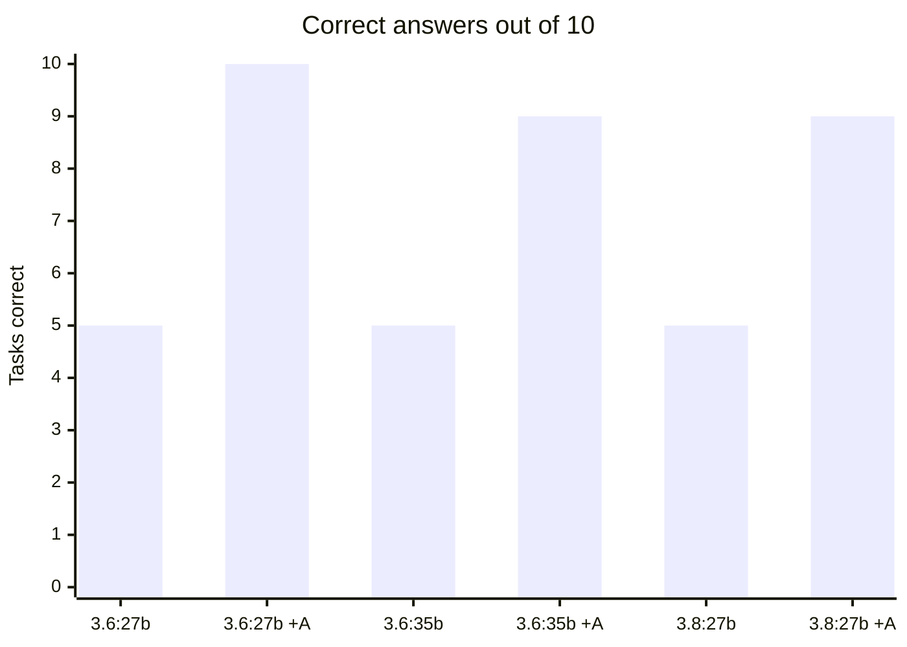
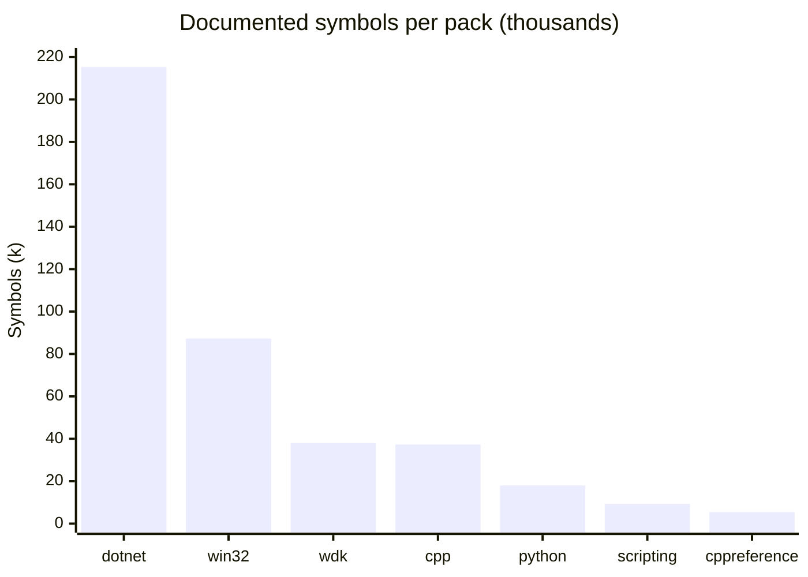
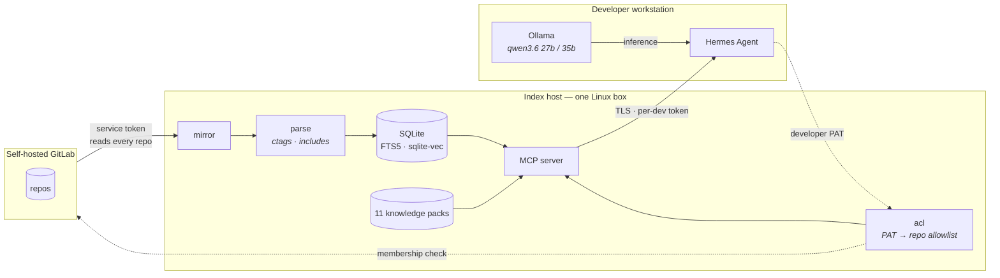

# Argus

**Your local LLM already knows how to code. It does not know your codebase, and it invents API facts with total confidence. Argus fixes both — on your own hardware, with nothing leaving your network.**

Argus is a self-hosted code index and documentation server for [Hermes Agent](https://github.com/NousResearch/hermes-agent) + [Ollama](https://ollama.com). It mirrors every repository from your GitLab, extracts a symbol and dependency graph, serves twelve documentation packs, and enforces each developer's real GitLab permissions in SQL.

---

## The measurement that matters

Ten task families — test development, code review, performance, coding style, SDK, WDK, win32, scripting, security review, code safety — one question each, graded by substring match on facts verified against the corpus before any model ran.



| model | alone | with Argus | change |
|---|---|---|---|
| `qwen3.6:27b` (dense, 27.8B) | 5 / 10 | **10 / 10** | **+100%** |
| `qwen3.6:35b` (MoE, 36.0B) | 5 / 10 | **9 / 10** | **+80%** |
| `qwen3.8:27b` (dense, 27.3B) | 5 / 9 | **9 / 10** | **+80%** |

**All three models failed the same five tasks alone** — not similar scores, the *same five*, task for task. An 8-billion-parameter gap, a different architecture, and a newer generation all changed nothing. Full three-way breakdown in [docs/model-comparison.md](docs/model-comparison.md).

`qwen3.6:27b` is the reference model here, chosen on behaviour rather than size. It is the *smallest* of the three, scores identically closed book, and pulls ahead only once tools exist: **26 tool calls to 35b's 19**, winning the one task that separated them by checking instead of recalling. 35b answered that one in 2.2 s with **zero tool calls** — confidently, and wrongly. For an agent, willingness to verify is worth more than parameter count. The margin is one task in ten, so the honest claim is "checks more reliably", not "better at everything".

All three handled amortized complexity and MSVC flag syntax fine. All three missed driver IRQLs and the documented header for `CreateFileW` — which is `fileapi.h`, not the `windows.h` that memory reaches for. Those are **recall** failures on facts too specialised to sit in any local model's weights.

> **Scale does not fix this. Retrieval does.**

And it gets *faster*: `35b`'s median response fell from **5.5 s to 2.4 s** with retrieval enabled. A looked-up fact is shorter to produce than a reasoned-out one.

---

## Quick start

```bash
git clone https://github.com/aliGhadyani/hermes-argus && cd hermes-argus
cp .env.example .env && $EDITOR .env      # GitLab URL + service token
./deploy/bootstrap.sh                      # build, start, index, verify
```

Then prove it works before you tell anyone about it:

```bash
python deploy/smoke_test.py --url https://argus.example/mcp --token <developer-PAT>
```

```
  [PASS] healthz                         3.1 ms  HTTP 200
  [PASS] auth rejects bad token        434.1 ms  denied
  [PASS] mcp handshake                1454.2 ms  protocol 2025-11-25
  [PASS] server instructions                     1803 chars
  [PASS] tools registered               20.3 ms  16 tools
  [PASS] packs answer                   47.3 ms  FltRegisterFilter -> APC_LEVEL
  [PASS] private index                  86.2 ms  12 repo(s) visible to this token

  7/7 checks passed
```

Full walkthrough: **[docs/production.md](docs/production.md)**.

---

## Deploying it — read this part

Every item below cost someone an hour. They are in the order they bite.

### Before you start

| requirement | why, and what happens without it |
|---|---|
| **NVMe for model weights** | The engine `mmap`s the GGUF. On NVMe a 93 GB model serves at ~21 tok/s; on a 7200rpm SATA disk it is unusable, not merely slow. |
| **`nvidia-container-toolkit`** | `docker-compose.yml` reserves `driver: nvidia`. Without it every GPU service fails with `could not select device driver`. Not in Ubuntu 26.04's repos — install from NVIDIA's. |
| **Your user in the `docker` group** | And **log out and back in**. Group membership is fixed at login: `sudo usermod -aG docker $USER` does nothing for shells that are already open, which is a confusing 20 minutes. |
| **A stable mount for the checkout** | See "The reboot trap" below. |

### Deploy

```bash
git clone <this repo> && cd <repo>/llm-stack
./scripts/setup.sh                  # interactive; --defaults to accept everything
sudo ./scripts/setup-hosts.sh       # REQUIRED for curl/SDKs, see below
./scripts/up.sh
```

### The traps

**`*.localhost` resolves in browsers but not in curl.** Browsers resolve any
`*.localhost` to 127.0.0.1 by specification; curl, Python and every SDK do not,
and nothing but Traefik publishes a port. Run `scripts/setup-hosts.sh` or every
command-line call fails with a DNS error that looks like the stack is down.

**The reboot trap.** If the checkout lives on a removable or automounted volume,
Docker's `restart: unless-stopped` will start the stack *before* the volume
mounts, **create empty directories at the mountpoint**, and run against them —
four containers dead, the rest serving nothing, everything reporting healthy.
The stubs then block the real volume from mounting there. Traefik's config
mounts use `create_host_path: false` so it refuses to start instead, but the
durable fix is `/etc/fstab`:

```
UUID=<uuid>  /mnt/data  ntfs3  defaults,nofail,x-systemd.before=docker.service,uid=1000,gid=1000  0 0
```

`x-systemd.before=docker.service` is the load-bearing part.

**Google's registries may be unreachable.** `gcr.io` and `registry.k8s.io`
return 403 from some networks while Docker Hub and ghcr.io are fine. Compose
aborts the *entire* parallel pull when one image fails, so one blocked sidecar
leaves every other image unpulled and `up` then fails with `No such image`
fourteen times. cadvisor is behind its own profile for this reason; enable it
with `COMPOSE_PROFILES=...,cadvisor` only if `gcr.io` works for you.

**Set `BIND_ADDRESS`.** It defaults to `0.0.0.0`, which serves the whole stack —
chat, gateway, Grafana, admin panel — to your LAN behind a self-signed
certificate. `BIND_ADDRESS=127.0.0.1` binds to loopback.

### Tuning the engine — the three that matter

**`-t` must be your PHYSICAL core count, never logical.** Measured twice on
different machines. On a 13700K (16 physical / 24 logical):

| `-t` | decode |
|---|---|
| 24 (all logical) | 10.16 tok/s |
| **16 (all physical)** | **21.65 tok/s** |
| 8 (P-cores only) | 17.94 tok/s |

**2.13x**, and prefill moves 1.7% across that whole range — the extra threads buy
nothing and halve generation. `nproc` reports 24 here, which is exactly the trap.
Every physical core helps, including E-cores; it is the hyperthread siblings that
hurt. `lscpu -p=CORE | sort -u | wc -l` gives the right number.

**`-ub` drives a hidden VRAM cost.** Raising the context scales a CUDA compute
buffer by `context × ubatch`, and it is invisible in any weights+KV calculation.
At `-c 262144 -ub 4096` it asked for **15,166 MiB in one allocation** and died
with `failed to allocate compute buffers` — on a card where the KV cache was only
3.4 GB. `-ub 1024` cut it to 3.7 GB and the same model loaded with room spare.
**On a startup CUDA OOM, lower `-ub` before lowering the context.**

**CPU ceilings must sum UNDER your core count.** A ceiling that can be exceeded
in aggregate is not a ceiling. `llamacpp 16 + postgres 3 + ollama 2 = 21` of 24
(88%). An earlier set summing to 26 of 24 took the package to **94°C** twice. For
a bulk index build, stop the engine and raise `OLLAMA_CPUS` for the duration
rather than oversubscribing both.

### Things that look broken but are not

**Empty replies from the model.** Qwen3.8-Flash-Next returns its reasoning in a
separate `reasoning_content` field. With a small `max_tokens` it spends the whole
budget reasoning and returns `finish_reason: length` with **empty content** —
indistinguishable from a broken model. Give it 300+ tokens.

**Node clients failing TLS while curl works.** Node ships its own root bundle and
ignores the system trust store. Set `NODE_EXTRA_CA_CERTS=<repo>/llm-stack/config/traefik/certs/ca.crt`.
If `curl --cacert` works and your Node tool does not, this is why.

**Low GPU utilisation during generation.** Expected. The experts run on CPU, so
the card idles between attention layers.

**Grafana panels empty after a permissions change.** Prometheus runs as uid
65534 and must *traverse* `config/prometheus/secrets`. At `0700` it cannot, the
scrape fails with `unable to read`, and every container still reports healthy.
That directory must be `711`.

**Authelia ignoring config changes.** Mount the *directory*, not individual
files. A single-file bind mount is pinned to the inode it resolved at container
start; `gen-auth` and the admin panel both replace these files atomically, which
makes a new inode, and Authelia reads the old one forever. Symptom: a user
created in the admin panel cannot log in, with a password that verifies fine.

### If you enable pgvector

Three settings, none optional, each of which silently degrades the index:

- **`hnsw.ef_search`** defaults to 40 and `LIMIT k` does not raise it. Left alone,
  recall pins at 61% and does not move from k=128 to k=2048.
- **`hnsw.iterative_scan`** — without it a filtered search examines `ef_search`
  nodes and only *then* discards what the ACL rejects.
- **`SET`, not `SET LOCAL`** — autocommit gives every statement its own
  transaction, so `LOCAL` expires before the query that needed it.

Argus's semantic layer also needs an embedding provider. Ollama is in the compose
file under the `embed` profile; without it there is nowhere for vectors to come
from, whichever database stores them.

## What your agent gets

**Your private code**, access-controlled per developer:

| Tool | Answers |
|---|---|
| `find_symbol` | Exact definitions across every repo |
| `find_references` | Every mention, product-wide, cross-repo |
| `search_code` | Lexical search over millions of lines |
| `semantic_search` | *"Where do we handle retry backoff for uploads?"* — when the question has no identifier in it |
| `which_repo` | *"Which repo do I change for X?"* — from a description, a symbol, a stack trace, or a diff |
| `repo_map` · `impact_of` | *"What breaks if I change this?"* — from resolved `#include` edges |
| `code_contracts` | Every in-house symbol a file references, with its definition |
| `get_file` · `index_status` | Access-checked fetch; per-repo freshness |

**Public documentation**, no access control because there is nothing to gate:

| Tool | Answers |
|---|---|
| `docs_lookup` | Exact API name → the page that *defines* it |
| `docs_find` | *"Which cmdlet writes objects to CSV?"* — by description |
| `docs_search` · `docs_get` | Concepts, then the whole page |
| `docs_contracts` | Paste a file → header, library, DLL and IRQL of every API it calls |
| `docs_verify` | Check a draft you already wrote; reports only contradictions |

---

## Twelve knowledge packs, 1.80 GB, zero unresolved symbols



| pack | Documents | Chunks | Symbols | Size |
|---|---|---|---|---|
| `win32` — Windows SDK + samples | 71,663 | 530,559 | 87,297 | 786.2 MB |
| `wdk` — driver DDI + samples | 28,176 | 245,727 | 38,041 | 358.6 MB |
| `cpp` — MSVC, CRT, STL | 9,746 | 123,212 | 37,305 | 174.7 MB |
| `cppreference` — C++ standard library | 6,640 | 68,891 | 5,406 | 124.9 MB |
| `dotnet` — .NET BCL + MS NuGet packages | 11,013 | 140,661 | **215,269** | 236.4 MB |
| `scripting` — PowerShell, cmd, Unix | 9,302 | 46,027 | 9,302 | 70.2 MB |
| `python` — 3.13 | 516 | 13,164 | 18,027 | 28.5 MB |
| `debugger` — WinDbg + how-to | 2,138 | 14,259 | 1,511 | 24.8 MB |
| `sqlite` — SQL, pragmas, FTS5 | 837 | 8,987 | 36 | 18.3 MB |
| `react` — react.dev | 222 | 4,755 | 125 | 9.1 MB |
| `algorithms` — TheAlgorithms/C++ | 371 | 2,001 | 370 | 4.3 MB |
| `system-design` — the Primer | 9 | 442 | 8 | 1.3 MB |
| **total** | **139,895** | **1,180,766** | **394,545** | **1.80 GB** |

A pack is **one SQLite file** — prose, API symbols and embeddings. Build once, publish, install everywhere:

```bash
argus pack install https://your-host/wdk.arguspack --sha256 <digest>
```

A digest mismatch is refused and leaves **zero files behind**. All twelve answer correctly through the real `hermes -z` CLI — the whole chain, not a reimplementation.

---

## Why not just embed everything?

The obvious approach — chunk every file, embed it all, throw it in a vector DB — fails on large C/C++ codebases in a way that is easy to miss until you have already built it.

Headers are enormous, repetitive, and semantically near-identical. Embedding them floods the space with near-duplicates that crowd out real answers. Meanwhile the questions developers actually ask — *where is `Parse` defined*, *who calls this*, *what breaks if I change this struct* — are **exact lookups**, which a symbol table answers better than any embedding. Ask a pure-RAG system about `Init()` in a codebase with forty of them and it will confidently return the wrong one.

Argus inverts the priority:

| Layer | Answers | Cost |
|---|---|---|
| **Symbol graph** (ctags + `#include`) | Exact definitions, references, ownership | Cheap, seconds |
| **Lexical** (FTS5) | Exact strings over millions of lines | Cheap, instant |
| **Semantic** (embeddings) | Vague conceptual queries only | Expensive — applied *selectively* |

Embeddings cover **public symbol signatures, scope and path — never function bodies.** A C++ body embeds mostly to "generic control flow"; its signature plus its path is what carries intent. That is ~70–90k vectors instead of ~600k.

And in C/C++ the `#include` graph **is** the cross-repo dependency graph — recoverable with no build system, no `compile_commands.json`, and no compiler.

---

## Architecture



**Two tokens, and their separation is the entire security model.** A privileged *service token* mirrors every repository, so the index is complete. Each developer's *own* token is exchanged at query time for their project membership, and every query is filtered to that allowlist **in SQL, before results leave the process** — never by asking the model nicely.

Telling an LLM "only answer about repos X and Y" is not access control; it is a suggestion, and a comment inside indexed source can override it.

The enforcement is structural:

```python
# Every public function in store/queries.py — no exceptions.
def find_symbol(allowed_repo_ids, conn, name, kind=None, limit=50): ...
#              ^^^^^^^^^^^^^^^^^ first positional, no default
```

A reflection test walks the module and fails on any function that does not take it first with no default. **It fails on code that does not exist yet** — which is the point. Security bugs of this class come from a new code path six months later that simply never called the check. Encoding it in the signature turns a runtime vulnerability into an import-time error.

---

## Measured

Everything here is measured on real corpora, not estimated. Full detail in [docs/pack-measurements.md](docs/pack-measurements.md), [docs/index-measurements.md](docs/index-measurements.md), [docs/kpis.md](docs/kpis.md).

### Latency

| | |
|---|---|
| `docs_lookup` | **2.1 ms** median |
| `which_repo` p95 (10,212 files) | **1.92 ms** |
| `docs_search`, 17.9k chunks | **88.6 ms** |
| `docs_search`, 364.8k chunks | **460 ms** |
| **query embedding (CPU Ollama)** | **2,254 ms** |

5.2× cost for 20.4× the corpus — sublinear. **The embedder sets the latency users feel, not the index.** A GPU is the single biggest improvement available.

### Scale

| | 1,026 files | 10,212 files |
|---|---|---|
| `which_repo` p95 | 1.58 ms | **1.92 ms** |
| ambiguous include rate | 1.28% | **0.09%** |
| MB per 1k files | 28.4 | 21.9 |

Suffix matching gets *better* with scale. `which_repo` stayed flat only because an indexed `basename` column replaced a full scan — before that, p95 was 15.5 ms and rising linearly.

### Engineering

| | |
|---|---|
| tests | **741 passing**, 0 skipped |
| hollow tests found by targeted revert | **9** |
| bugs whose failure mode was a *plausible success* | **6** |

A *hollow test* passes while the behaviour it names is broken. Each was caught by breaking the code deliberately and confirming the test noticed.

The six worst bugs shared one signature: **they produced a plausible success rather than an error.** A client logged "registered 19 tools" and the agent never saw them. A clone succeeded and the build blamed the path it had just written. A YAML parser returned a dict and silently omitted a key — which would have shipped a pack with zero symbols that built, installed and listed without complaint. None is caught by "does it crash"; each needs a check on the *content* of the success.

That discipline extends to the benchmarks. The model comparison above found **three defects in its own harness** before its numbers were trusted — a 401 that read as 0/10, a grading rule that fired on a correct answer, and a re-grade that manufactured a failure from a truncated record. All three are written up rather than quietly fixed, because each would have published as a finding.

---

## Status

| Phase | | |
|---|---|---|
| 1 — Indexer | ctags, includes, SQLite | ✅ |
| 2 — MCP server | ACL, 8 private tools | ✅ |
| 3 — Cross-repo | include resolution, `repo_map`, `which_repo` | ✅ |
| 4 — Semantic layer | selective embeddings, `semantic_search` | ✅ |
| 5 — Knowledge packs | 11 packs, 6 doc tools, `argus pack` | ✅ |

**741 tests**, passing locally, 0 skipped.

- **[docs/production.md](docs/production.md)** — deploy, verify, operate
- **[docs/deployment.md](docs/deployment.md)** — wiring Hermes, and the failure modes
- **[docs/knowledge-packs.md](docs/knowledge-packs.md)** — building and publishing packs
- **[docs/pgvector-backend.md](docs/pgvector-backend.md)** — the optional Postgres backend for symbol embeddings, and what it measures
- **[evals/](evals/)** — every benchmark in this README, reproducible

---

## Licence

Argus is **GPL v3** — see [LICENSE](LICENSE).

Knowledge packs carry their own upstream licences, which are *not* GPL and vary per pack: CC-BY-4.0 for the Microsoft documentation, CC-BY-SA-3.0 for cppreference, PSF-2.0 for Python, MIT for the algorithms corpus, public domain for SQLite. `argus pack info <name>` prints each in full, and that output is how you meet the redistribution obligation.
