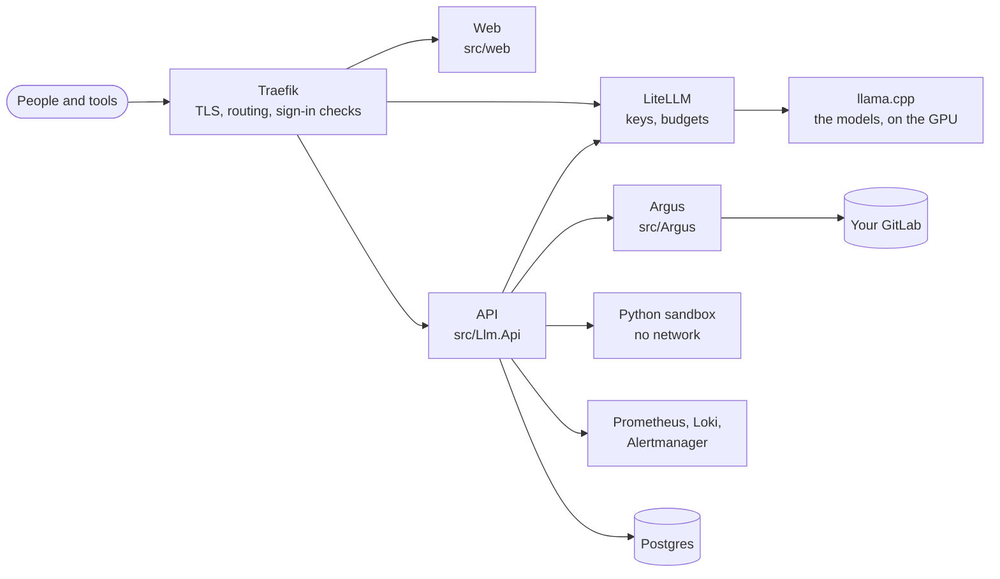

# LLM Service, with Argus

**A private LLM platform for a team, on your own hardware: a chat with tools,
an API with a key and a budget per person, and Argus, a code index that gives
the model your codebase and real documentation, within each person's GitLab
permissions. Nothing leaves your network.**

## What you get

- **A chat** for everyone: the models you run, thinking levels, branches and
  edits, files and Office documents, and tools that run on the server: Argus
  (your code and documentation), Python in a sandbox with no network, the web
  (sites you allow), image generation, a calculator and dates. Tools ask before
  they run when you want them to.
- **An API** for editors, agents and scripts: OpenAI-compatible, a key per
  person, spend and budgets per person, and fair use when the GPU is shared.
- **Sign-in** for the whole stack: accounts, LDAP or Active Directory, two-factor,
  single sign-on for the services that have their own login, groups that decide
  who may use which model and tool.
- **Administration**: people and groups, models loaded and unloaded at runtime,
  every setting in one place, the audit log, the code index and knowledge packs.
- **Observability** in the app: ten dashboards, every service's logs, and the
  alerts, what fires now and what fired before.
- **Argus**, the code index: it mirrors your GitLab, extracts symbols and
  dependencies, serves eleven knowledge packs of API documentation, and answers
  over MCP. Each developer sees exactly the repositories their GitLab account can
  read, enforced in SQL.

## Why Argus

Ten task families, one question each, graded on facts checked against the corpus
before any model ran:

| model | alone | with Argus |
|---|---|---|
| `qwen3.6:27b` (dense, 27.8B) | 5 / 10 | **10 / 10** |
| `qwen3.6:35b` (MoE, 36.0B) | 5 / 10 | **9 / 10** |
| `qwen3.8:27b` (dense, 27.3B) | 5 / 9 | **9 / 10** |

All three models failed the *same five* tasks alone: facts too specialised to
sit in any local model's weights (a driver's IRQL, the header `CreateFileW` is
really declared in). Scale did not fix it; retrieval did, and answers got faster
(5.5 s to 2.4 s median). The details are in
[docs/measurements/model-comparison.md](docs/measurements/model-comparison.md).

## Architecture



Every service, network and failure mode is in
[docs/architecture.md](docs/architecture.md).

## Quick start

On a Linux host with Docker and an NVIDIA GPU:

```bash
git clone https://github.com/Binchitects/argus && cd argus/deploy
cp env-samples/qwen3.8-flash-next.rtx5090.env .env   # the sample for your model and card
# fill the secrets it lists (each says how: openssl rand -hex 32), then:
make up                                              # preflight, then docker compose up -d
```

Open `https://llm.localhost` and sign in as `admin` with the password from
`.env`. The full walkthrough, including a host with no network, is
[docs/deployment.md](docs/deployment.md).

**Argus alone**, without the platform (its own small app, no sign-in service or
observability): [deploy/argus-standalone/](deploy/argus-standalone/README.md).

## Repository

| path | what it is |
|---|---|
| [`src/`](src/) | `Llm.Api` and `Llm.Core` (the platform's .NET API), `Argus` (the code index service), `web` (the platform's React app), `argus-web` (Argus's own app) |
| [`tests/`](tests/) | `Llm.Tests` and `Argus.Tests` (xUnit), `deploy` (the deployment tooling) |
| [`deploy/`](deploy/) | the platform's deployment: compose, config, env samples, scripts; `argus-standalone/` |
| [`tools/`](tools/) | development and operations tools: `dn`, the test GitLab, pack builds |
| [`clients/`](clients/) | MCP configurations for Claude Code, Qwen Code, Continue, DeepSeek Harness and others |
| [`docs/`](docs/README.md) | the documentation |
| [`evals/`](evals/) | the evaluation question sets and results |

## Documentation

Start at [docs/README.md](docs/README.md). The most used:

- [Deployment](docs/deployment.md) and [configuration](docs/configuration.md)
- [Administration](docs/admin.md), [settings](docs/settings.md) and the [chat](docs/chat.md)
- [Authentication](docs/authentication.md)
- [Argus](docs/argus/README.md) and [what it does](docs/argus/overview.md)
- [Development](docs/development.md) and [testing](docs/testing.md)
- [The plan](docs/plan.md): the phases, what each delivered, and what is next

## Contributing and security

See [CONTRIBUTING.md](CONTRIBUTING.md) for how to build, test and propose a
change, and [SECURITY.md](SECURITY.md) for reporting a vulnerability.

## Licence

GPL v3, see [LICENSE](LICENSE). Knowledge packs carry their own upstream
licences, which are not GPL and vary per pack (CC-BY-4.0 for the Microsoft
documentation, CC-BY-SA-3.0 for cppreference, PSF-2.0 for Python, public domain
for SQLite); `argus pack info <name>` prints each in full.
