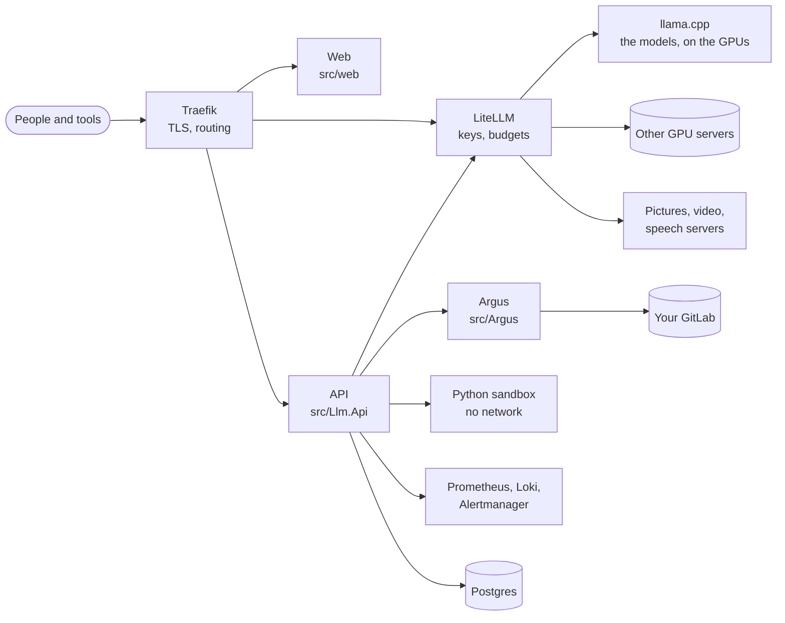

# Argus Arena

**A private LLM platform for a team, on your own hardware: a chat with tools,
an API with a key and a budget per person, and Argus, a code index that gives
the model your codebase and real documentation, within each person's GitLab
permissions. Nothing leaves your network.**

## What you get

- **A chat** for everyone: the models you run, thinking levels, branches and
  edits, files and Office documents, and tools that run on the server: Argus
  (your code and documentation), Python in a sandbox with no network (data,
  image, map and chart libraries), the web (sites you allow), pictures, video,
  speech, a calculator and dates. **Sound and video in and out**: voice messages
  and attached sound or video go to a model that hears and sees (Qwen3-Omni) or
  as a transcript and frames to one that does not; answers are read aloud. Tools ask before they run when you want them to.
  Pages, pictures, diagrams and React components the model writes run live in
  a sandboxed preview.
- **An API** for editors, agents and scripts: OpenAI-compatible (and Anthropic's
  and OpenAI's Responses API), a key per person, spend and budgets per person,
  and fair use when the GPU is shared. **Connect your tools** walks each person
  through Claude Code, Codex, Qwen Code, OpenCode, Aider, Hermes, OpenClaw,
  DeepSeek Harness, Continue, Cline and more, and offers
  [Code Arena](docs/code-arena.md), our own coding agent and an IDE in the
  browser around it (files, editor, search, terminals, the agent's chat): one
  file, nothing to install, every Arena tool as you. `tools/package-code-arena.sh`
  packs it for Linux, macOS and Windows.
- **Sign-in** for the whole stack: accounts, LDAP or Active Directory, two-factor,
  single sign-on for the services that have their own login, groups that decide
  who may use which model and tool.
- **Administration**: people and groups; models read for what they are, several
  loaded at once (kept loaded, or loaded on request), each on the GPUs chosen
  for it, and models on other GPU servers behind the same gateway; picture,
  video and speech models with the same controls; every
  setting in one place, the audit log, the code index and knowledge packs.
- **Observability** in the app: ten dashboards, every service's logs, and the
  alerts, what fires now and what fired before.
- **Argus**, the code index: it mirrors your GitLab, extracts symbols and
  dependencies, serves twelve knowledge packs of API documentation, and answers
  over MCP. Each developer sees exactly the repositories their GitLab account can
  read, enforced in SQL.

## Why Argus

Ten task families, one question each, graded on facts checked against the corpus
before any model ran:

| model | alone | with Argus |
|---|---|---|
| `qwen3.6:27b` (dense, 27.8B) | 5 / 10 | **10 / 10** |
| `qwen3.6:35b` (MoE, 36.0B) | 5 / 10 | **9 / 10** |
| `qwen3.8:27b` (dense, 27.3B) | 5 / 9 | **9 / 10** |

All three models failed the *same five* tasks alone: facts too specialised to
sit in any local model's weights (a driver's IRQL, the header `CreateFileW` is
really declared in). Scale did not fix it; retrieval did, and answers got faster
(5.5 s to 2.4 s median). The details are in
[docs/measurements/model-comparison.md](docs/measurements/model-comparison.md).

## Architecture


```mermaid
flowchart LR
  person([People and tools]) --> traefik[Traefik<br/>TLS, routing]
  traefik --> web[Web<br/>src/web]
  traefik --> api[API<br/>src/Llm.Api]
  traefik --> gateway[LiteLLM<br/>keys, budgets]
  api --> gateway --> engine[llama.cpp<br/>the models, on the GPUs]
  gateway --> remote[(Other GPU servers)]
  api --> argus[Argus<br/>src/Argus]
  api --> sandbox[Python sandbox<br/>no network]
  gateway --> media[Pictures, video,<br/>speech servers]
  api --> obs[Prometheus, Loki,<br/>Alertmanager]
  argus --> gitlab[(Your GitLab)]
  api --> pg[(Postgres)]
```

Every service, network and failure mode is in
[docs/architecture.md](docs/architecture.md).

## Quick start

On a Linux host with Docker (or rootless Podman) and an NVIDIA GPU:

```bash
git clone https://github.com/Binchitects/argus && cd argus/deploy
cp .env.example .env      # the domain, the models folder, the first model, six secrets
docker compose up -d
```

Open `https://llm.localhost` and sign in as `admin` with the password from
`.env`. The app fetches the first model and the picture, video and speech
models by itself. Every module runs; one is left out in a line. The full
walkthrough, Podman and upgrading from v3 are in [docs/deployment.md](docs/deployment.md).

**Argus alone**, without the platform (its own small app, no sign-in service or
observability): [deploy/argus-standalone/](deploy/argus-standalone/README.md).

## Repository

| path | what it is |
|---|---|
| [`src/`](src/) | `Llm.Api` and `Llm.Core` (the platform's .NET API), `Argus` (the code index service), `CodeArena` (the coding agent and its IDE), `web` (the platform's React app, and Code Arena's page), `argus-web` (Argus's own app) |
| [`tests/`](tests/) | `Llm.Tests`, `Argus.Tests` and `CodeArena.Tests` (xUnit), `deploy` (the deployment tooling) |
| [`deploy/`](deploy/) | the platform's deployment: compose (and Podman's override), config, scripts; `argus-standalone/` |
| [`tools/`](tools/) | development and operations tools: `dn`, the test GitLab, pack builds, Code Arena's builds and packages (`publish-code-arena.sh`, `package-code-arena.sh`) |
| [`clients/`](clients/) | MCP configurations for Claude Code, Qwen Code, Continue, DeepSeek Harness and others (the app's **Connect your tools** page has each tool's full setup); the `arena` CLI and a GitLab CI template that reviews merge requests ([docs/ci.md](docs/ci.md)) |
| [`docs/`](docs/README.md) | the documentation |
| [`evals/`](evals/) | the evaluation question sets and results |

## Documentation

Start at [docs/README.md](docs/README.md). The most used:

- [Deployment](docs/deployment.md) and [configuration](docs/configuration.md)
- [Administration](docs/admin.md), [settings](docs/settings.md) and the [chat](docs/chat.md)
- [Authentication](docs/authentication.md)
- [Argus](docs/argus/README.md) and [what it does](docs/argus/overview.md)
- [Development](docs/development.md) and [testing](docs/testing.md)
- [The plan](docs/plan.md): the phases, what each delivered, and what is next

## Contributing and security

See [CONTRIBUTING.md](CONTRIBUTING.md) for how to build, test and propose a
change, and [SECURITY.md](SECURITY.md) for reporting a vulnerability.

## Licence

Dual-licensed: the **GNU AGPL v3** ([LICENSE.md](LICENSE.md)), with additional
terms on attribution and the product names, or a **commercial license** from
Binchitects for any use that does not meet the AGPL's conditions (a hosted or
closed-source offering without releasing your source, embedding it in
proprietary software). [LICENSING.md](LICENSING.md) says which you need.
Knowledge packs carry their own upstream
licences, which are not GPL and vary per pack (CC-BY-4.0 for the Microsoft
documentation, CC-BY-SA-3.0 for cppreference, PSF-2.0 for Python, public domain
for SQLite, GFDL-1.3 for Qt); `argus pack info <name>` prints each in full.
