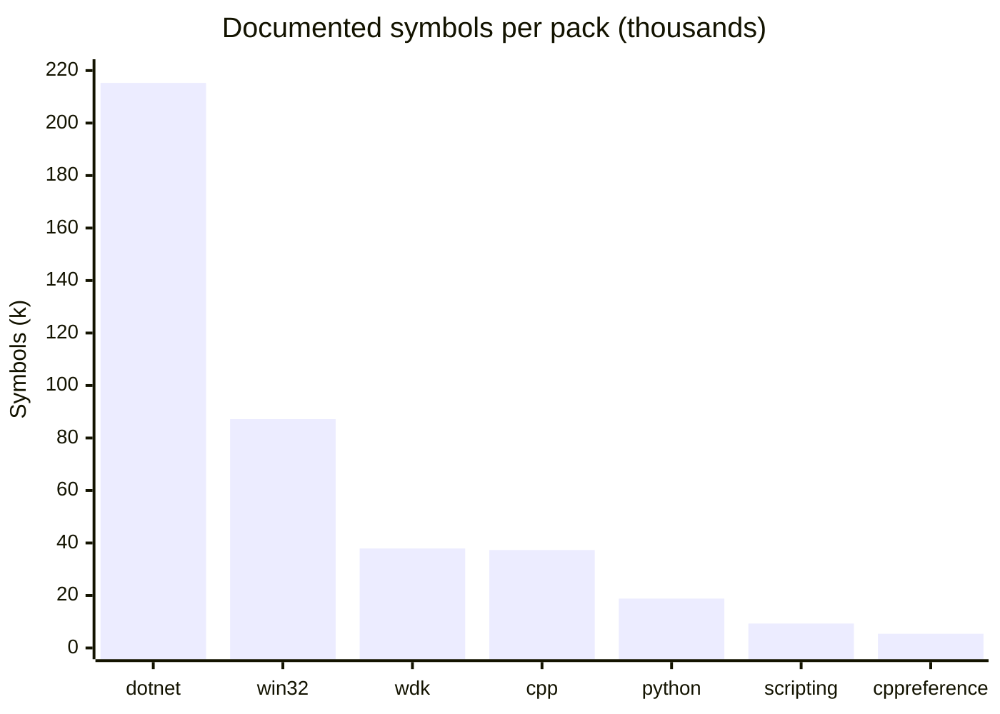
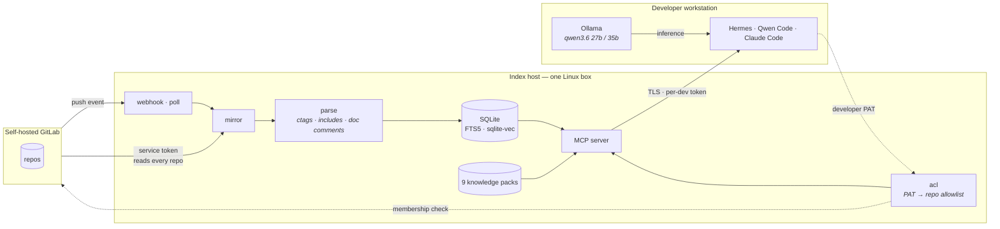

# Argus: what it does

> Argus is the code index and documentation server behind the chat's code
> tools and behind MCP clients. This page was written for its first, Python
> implementation; the .NET port in `src/Argus` answers identically (a
> conformance run compared every index table, tool call and pack build). File
> names in the examples (`store/queries.py` and the like) are the Python
> originals.

Argus is the code index and documentation server. It mirrors your GitLab, extracts
a symbol and dependency graph, serves knowledge packs, and enforces each
developer's real GitLab permissions in SQL. It is GPL v3 and runs standalone
(`pip install ".[dev]"`) or as part of the stack.

## What your agent gets

**Your private code**, access-controlled per developer — 11 tools:

| Tool | Answers |
|---|---|
| `find_symbol` | Exact definitions across every repo |
| `find_references` | Every mention, product-wide, cross-repo |
| `search_code` | Lexical search over millions of lines |
| `semantic_search` | *"Where do we handle retry backoff for uploads?"* — when the question has no identifier in it |
| `which_repo` | *"Which repo do I change for X?"* — from a description, a symbol, a stack trace, or a diff |
| `repo_map` · `impact_of` | *"What breaks if I change this?"* — from resolved `#include` edges |
| `code_contracts` | Every in-house symbol a file references, with its definition |
| `get_file` · `index_status` | Access-checked fetch; per-repo freshness, one row per branch |
| `overview` | *"What is this repository?"* — its README, its layout, its key symbols. The one to call first in a codebase you have never seen |

**Public documentation**, no access control because there is nothing to gate — 6 tools:

| Tool | Answers |
|---|---|
| `docs_lookup` | Exact API name → the page that *defines* it |
| `docs_find` | *"Which cmdlet writes objects to CSV?"* — by description |
| `docs_search` · `docs_get` | Concepts, then the whole page |
| `docs_contracts` | Paste a file → header, library, DLL and IRQL of every API it calls |
| `docs_verify` | Check a draft you already wrote; reports only contradictions |

**17 tools in total**, and every one of them is contract-tested against a live
server — see [Checking it](#checking-it).

## Keeping the index current

Three things keep the index fresh, and the first two are independent:

- **A poll.** The serve process runs a periodic pass, and the engine exports
  `argus_index_age_seconds` per repository. An `ArgusIndexStale` alert fires when
  a repository goes stale, and **Admin → Overview** shows the same
  numbers, so "the agent cannot find it" and "it is not in the index" stop
  looking alike.
- **A push webhook.** `POST /hook/gitlab` takes a GitLab push event and indexes
  the repository that changed, gated by its own `ARGUS_WEBHOOK_TOKEN` (unset =
  the route does not exist). A push during a pass is queued rather than dropped
  and drained one repository per pass; an overfull queue collapses into one full
  pass. Events it has no use for are acknowledged rather than refused, because
  GitLab disables a webhook that keeps failing. The poll stays on as the floor.
- **`argus index`** by hand, from the CLI or **Admin → Indexing**.

**Indexing is embedding now.** `argus index` embeds as it goes, so the poller and
the webhook produce code that `semantic_search` can actually see. Before that they
did not, and nothing said so.

### More than one branch

A repository often has long-lived release branches alongside the trunk — `main`
plus `v1`, `v2`, `v3`. Argus indexes the refs you name, and a developer who asks
without naming one gets trunk; naming a branch gets that branch. An unindexed
branch is refused **by name, listing the branches that are indexed**, rather than
answered from the wrong ref.

There is a trap here worth knowing, because it was silent: indexing a second
branch puts a shared header in the index once per ref, and the include resolver
used to see two identical paths, refuse to choose, and record `ambiguous` — which
emptied the cross-repo graph for the **whole estate**, 2 edges to 0, with nothing
reporting a problem. Resolution now prefers the branch the include came from, as a
preference and not a filter. The cold fixture lifecycle indexes trunk *and* a
release branch and asserts the graph survived.

Configuration and behaviour: [docs/argus/branches.md](branches.md).

### Reading what the code does

The doc comment above every definition is now extracted, stored, and led into the
embedded text. It was always available — `files.content` holds the whole file and
`symbols.line` locates the symbol inside it — and had never been read, which is
why a capability question could return a plausible wrong answer:

> *"what reclaims keys whose time to live has elapsed"*

Ranking on names alone returns `expire_slave_keys`. Ranking with the doc comment
returns `active_expire_cycle`, which is the answer. The mirror question flips the
same way. Symbols with no doc comment score identically either way, so this is
the comment doing the work rather than a shifted baseline.

### Checking a draft before the agent finishes

`docs_verify` was an MCP tool, and that was the problem: every client can run a
shell command when the model finishes and block on its exit code; almost none can
be made to call a *tool* at that moment. `argus verify` is the same check with an
exit code:

| exit | meaning |
|---|---|
| `0` | clean |
| **`2`** | **contradicted — blocking** |
| `6` | could not check — deliberately **not** blocking |

Everything except a contradiction fails open, because a deployment without packs
would otherwise become an agent that cannot finish a sentence.
[`clients/claude-code/verify-after.sh`](../../clients/claude-code/verify-after.sh) wires
it into a Claude Code `Stop` hook.

## Eleven knowledge packs, 1.87 GB, zero unresolved symbols



| pack | Documents | Chunks | Symbols | Size | Licence |
|---|---|---|---|---|---|
| [`win32`](https://huggingface.co/buckets/Binchitects/argus-packs/resolve/win32.arguspack) — Windows SDK API reference | 65,906 | 478,788 | 118,242 | 726.1 MB | CC-BY-4.0 |
| `wdk` — driver DDI reference | 25,903 | 205,848 | 37,938 | 292.5 MB | CC-BY-4.0 |
| `dotnet` — .NET BCL + MS NuGet packages | 11,013 | 140,661 | **215,269** | 236.4 MB | CC-BY-4.0 |
| `cpp` — MSVC, CRT, STL | 9,746 | 123,212 | 37,325 | 180.0 MB | CC-BY-4.0 |
| `win32-samples` — Microsoft desktop samples | 5,801 | 67,714 | 139 | 136.2 MB | MIT |
| `cppreference` — C++ standard library | 6,640 | 68,891 | 5,406 | 125.6 MB | CC-BY-SA-3.0 |
| `wdk-samples` — Microsoft driver samples | 2,273 | 39,879 | 104 | 76.8 MB | MS-PL |
| `scripting` — PowerShell, cmd, Unix | 9,310 | 46,052 | 9,310 | 70.9 MB | CC-BY-4.0 |
| `python` — 3.13 | 540 | 13,751 | 18,778 | 31.8 MB | PSF-2.0 |
| `debugger` — WinDbg + how-to | 2,138 | 14,259 | 1,511 | 25.0 MB | CC-BY-4.0 |
| `sqlite` — SQL, pragmas, FTS5 | 837 | 8,987 | 36 | 18.4 MB | public domain |
| **total** | **140,107** | **1,208,042** | **444,058** | **1.87 GB** | |

### Downloading a pack

The Windows packs are published to a public Hugging Face bucket —
**[`Binchitects/argus-packs`](https://huggingface.co/buckets/Binchitects/argus-packs)**.
Install one straight from it, with the digest so a truncated download is
refused rather than installed:

```bash
argus pack install \
  https://huggingface.co/buckets/Binchitects/argus-packs/resolve/win32.arguspack \
  --sha256 9d81767392f46b4239efd18aaed41de8043167b68a2150743a023d6bb25988d8
```

| pack | published | size | sha256 |
|---|---|---|---|
| [`win32`](https://huggingface.co/buckets/Binchitects/argus-packs/resolve/win32.arguspack) | ✅ | 761,376,768 B | `9d81767392f46b4239efd18aaed41de8043167b68a2150743a023d6bb25988d8` |
| [`wdk`](https://huggingface.co/buckets/Binchitects/argus-packs/resolve/wdk.arguspack) | ✅ | 306,757,632 B | `691c20c8df242fe4b06f2683afe84456c66e3dd2537ec0c8ffdf336f9ebdbf4d` |
| [`win32-samples`](https://huggingface.co/buckets/Binchitects/argus-packs/resolve/win32-samples.arguspack) | ✅ | 142,811,136 B | `e7a80a83d0d918fefdea1725707ce1076afbc39cd06130a766274b8741ba0b17` |
| [`wdk-samples`](https://huggingface.co/buckets/Binchitects/argus-packs/resolve/wdk-samples.arguspack) | ✅ | 80,523,264 B | `786c4a8b38091715cb1c4ec22c87ab1f7784d6c01fe60c7a9cfeca6d3ef063c1` |

The other seven are built and served locally but **not published yet** — there
is no link for them, and the table above is the whole published set rather than
a subset of a larger one. A bucket is not versioned, so re-uploading a pack
replaces it in place with no history to roll back to.

The same digest list, generated from the built files rather than typed, is in
`packs/README.md` (written by a local pack build) — copy that one if you are publishing a
mirror.

The two `-samples` packs are the other half of a question the reference half
answers badly. `win32` and `wdk` say what an API *does*; the samples say what
calling it looks like in a working program. They are separate files rather
than folded into the references so that a deployment can install either half.

**Scope a search to reach them.** Unscoped, a query like *"sample that creates
a device object"* returns reference pages — the reference matches the question's
wording better than code does. With `lang="wdk-samples"` the same query returns
`general/SimpleMediaSource - Device.c`, `bluetooth/bthecho` and `usb/umdf2_fx2`,
which is what was asked for. The tool description names the installed sources
for exactly this reason.

### Which Windows an API needs

Both Microsoft packs carry the OS each API arrived in, taken from the front
matter Microsoft ships on every one of their pages, and it leads the contract
that `docs_lookup` and `docs_search` return:

```
Minimum client: Windows XP [desktop apps only]
Minimum server: Windows Server 2003 [desktop apps only]
Header: fileapi.h
Library: Kernel32.lib
DLL: Kernel32.dll
```

**97,175 of the win32 pack's 118,242 symbols** carry one, running from Windows
2000 Professional to Windows 11 24H2 and Server 2025:

| the oldest OS it runs on | symbols |
|---|---|
| Windows 2000 | 22,463 |
| Windows XP | 20,461 |
| Windows Vista | 25,890 |
| Windows 7 | 9,215 |
| Windows 8 | 7,362 |
| Windows 10 | 4,602 |
| Windows 11 | 271 |
| none supported | 6,911 |

**Measured, not asserted.** A grounded question set —
[`evals/questions-windows-versions.json`](../../evals/questions-windows-versions.json),
52 questions whose answers are read out of Microsoft's own front matter — goes
from **7/52 to 51/52** against a rebuild of the same pages. The
`control-header` arm, which never needed the version field, is 6/6 in *both*
arms, so the added line cost the existing answers nothing. Reproduce with
`python evals/run_windows_versions.py --ablate <sdk-api checkout>`.

The six question types are chosen to be wrong-answerable rather than merely
hard: the sequel traps alone catch `CreateFile3` (Windows 11 24H2) against
`ICEnroll2` (Windows XP), where the number in the name says the opposite of
the floor in both directions.

That run also found a defect the version work did not cause but did expose.
**45% of the reference is COM methods**, titled `IFoo::Bar (header.h)` — a
qualified name with no kind word after it, which the title regex required. The
UID spells the same entity with a dot, so only the dot form was ever indexed
and `docs_lookup("IFoo::Bar")` answered *nothing* — 29,557 symbols unreachable
by the name Microsoft documents and every compiler error quotes. Silence is
the worst shape a miss can take here, because the server's instructions read
it as "undocumented" and forbid answering from memory. The documented spelling
is now indexed alongside the UID's, which is why the pack went from 87,206
symbols to 118,242.

This is the one requirement a header name cannot imply. `fileapi.h` says where
a function is declared, not whether the machine it has to run on exports it —
and that is usually the first thing worth knowing about a Windows API. It was
in the source all along; the adapter parsed those keys and dropped them, so
every pack built before this knew an API's `.lib` and not its floor. Asked
`docs_search` for *"minimum supported client Windows 11"*, the pack now answers
with `wldp.h`, `windows.graphics.display.interop.h` and `appxpackaging.h`.

The driver pack gets the same treatment **18,880 of 37,938 symbols (50%)**,
skewed the other way — drivers target current Windows, so Windows 10 is its
commonest floor at 4,585 and Windows 11 at 1,713. It also carries the two
framework versions, which are the version axis that actually matters to a WDF
driver: **1,770 symbols state a KMDF or UMDF release and no OS at all**, which
is the only floor pages like `WdfDriverCreate` give you. The remaining pages
have no version metadata upstream — 12,779 of them are ordinary function,
struct and enum pages Microsoft never filled the fields in for.

Three more are built and parked in `packs/disabled/` (`algorithms`, `react`,
`system-design`) — small corpora that were not worth the shelf space. Every pack
reports **0 unresolved symbols**, which is the cheapest quality signal in the
build: a pack that builds, installs and lists without complaint can still contain
nothing.

A pack is **one SQLite file** — prose, API symbols and embeddings. Build once,
publish, install everywhere:

```bash
argus pack install https://your-host/wdk.arguspack --sha256 <digest>
```

A digest mismatch is refused and leaves **zero files behind**. All of them answer
correctly through the real `hermes -z` CLI — the whole chain, not a
reimplementation.

**Installing them is a separate step from having them.** A fresh deployment has
no packs, so the six `docs_*` tools have nothing to answer from until you install
some; the contract suite reports exactly that as `NOT COVERED` rather than
counting it as passing.

## Why not just embed everything?

The obvious approach — chunk every file, embed it all, throw it in a vector DB — fails on large C/C++ codebases in a way that is easy to miss until you have already built it.

Headers are enormous, repetitive, and semantically near-identical. Embedding them floods the space with near-duplicates that crowd out real answers. Meanwhile the questions developers actually ask — *where is `Parse` defined*, *who calls this*, *what breaks if I change this struct* — are **exact lookups**, which a symbol table answers better than any embedding. Ask a pure-RAG system about `Init()` in a codebase with forty of them and it will confidently return the wrong one.

Argus inverts the priority:

| Layer | Answers | Cost |
|---|---|---|
| **Symbol graph** (ctags + `#include`) | Exact definitions, references, ownership | Cheap, seconds |
| **Lexical** (FTS5) | Exact strings over millions of lines | Cheap, instant |
| **Semantic** (embeddings) | Vague conceptual queries only | Expensive — applied *selectively* |

Queries to the lexical layer are **prose, not FTS5 expressions.** Every term is quoted as a phrase before it reaches FTS5, so `what is a mutex?` and `std::atomic_exchange` both work — a question mark and a `:` used to be syntax errors. The trade is that FTS5 operators (`AND`, `star*`, `NEAR`) are searched for as literal words. That is the right default for a tool whose caller is a language model.

Embeddings cover **public symbol signatures, scope, path and doc comment — never function bodies.** A C++ body embeds mostly to "generic control flow"; its signature plus its path is what carries intent. That is ~70–90k vectors instead of ~600k.

And in C/C++ the `#include` graph **is** the cross-repo dependency graph — recoverable with no build system, no `compile_commands.json`, and no compiler.

## Architecture



**Two tokens, and their separation is the entire security model.** A privileged *service token* mirrors every repository, so the index is complete. Each developer's *own* token is exchanged at query time for their project membership, and every query is filtered to that allowlist **in SQL, before results leave the process** — never by asking the model nicely.

Telling an LLM "only answer about repos X and Y" is not access control; it is a suggestion, and a comment inside indexed source can override it.

The enforcement is structural:

```python
# Every public function in store/queries.py — no exceptions.
def find_symbol(allowed_repo_ids, conn, name, kind=None, limit=50): ...
#              ^^^^^^^^^^^^^^^^^ first positional, no default
```

A reflection test walks the module and fails on any function that does not take it first with no default. **It fails on code that does not exist yet** — which is the point. Security bugs of this class come from a new code path six months later that simply never called the check. Encoding it in the signature turns a runtime vulnerability into an import-time error.

The index-explorer queries are the deliberate exception: they are unfiltered by
design, so they live in `store/explore.py` apart from the access-scoped ones, with
a test asserting no MCP tool module imports them.

## Measured

Everything here is measured on real corpora, not estimated. Full detail in [docs/argus/pack-measurements.md](../measurements/pack-measurements.md), [docs/argus/index-measurements.md](../measurements/index-measurements.md), [docs/argus/kpis.md](../measurements/kpis.md).

### Latency

| | |
|---|---|
| `docs_lookup` | **2.1 ms** median |
| `which_repo` p95 (10,212 files) | **1.92 ms** |
| `docs_search`, 17.9k chunks | **88.6 ms** |
| `docs_search`, 364.8k chunks | **460 ms** |
| **query embedding (CPU Ollama)** | **2,254 ms** |
| **query embedding (GPU Ollama)** | **5 ms** median, 18× |

5.2× cost for 20.4× the corpus — sublinear. **The embedder sets the latency users feel, not the index** — which is why it now runs on the GPU, and why that was the single biggest improvement available.

### Scale

| | 1,026 files | 10,212 files |
|---|---|---|
| `which_repo` p95 | 1.58 ms | **1.92 ms** |
| ambiguous include rate | 1.28% | **0.09%** |
| MB per 1k files | 28.4 | 21.9 |

Suffix matching gets *better* with scale. `which_repo` stayed flat only because an indexed `basename` column replaced a full scan — before that, p95 was 15.5 ms and rising linearly.

The same discipline applies to an estate run: **47 repositories, 55,603 files,
1,491,167 symbols, 37.8 minutes, zero failures or timeouts.**

### Engineering

| | |
|---|---|
| tests | **1,091 passing**, 1 skipped |
| MCP tools, contract-tested against a live server | **17** |
| hollow tests found by targeted revert | **9** |
| bugs whose failure mode was a *plausible success* | **6** |

A *hollow test* passes while the behaviour it names is broken. Each was caught by breaking the code deliberately and confirming the test noticed.

The six worst bugs shared one signature: **they produced a plausible success rather than an error.** A client logged "registered 19 tools" and the agent never saw them. A clone succeeded and the build blamed the path it had just written. A YAML parser returned a dict and silently omitted a key — which would have shipped a pack with zero symbols that built, installed and listed without complaint. None is caught by "does it crash"; each needs a check on the *content* of the success.

That discipline extends to the benchmarks. The model comparison above found **three defects in its own harness** before its numbers were trusted — a 401 that read as 0/10, a grading rule that fired on a correct answer, and a re-grade that manufactured a failure from a truncated record. All three are written up rather than quietly fixed, because each would have published as a finding.

## Checking it

The suite runs without Docker:

```bash
pytest                                     # 1,091 tests
```

Two checks need a live server, and both are worth more than the unit suite for
the failures they catch:

```bash
python tools/smoke_test.py --url https://argus.llm.localhost/mcp --token <PAT>
```

```bash
./tools/test-gitlab/run.sh               # up, seed, verify, tear down
```

`run.sh` boots a throwaway GitLab, seeds three private projects plus a release
branch and two developers with disjoint access, and proves the whole chain: that
the service token sees every project, that each developer's allowlist is exactly
their own, that the project nobody is a member of appears in no answer, that the
cross-repo graph survives a second branch, and that unqualified questions answer
from trunk. **18/18** on the ACL and index checks, then **52/52** tool-contract
checks. It tears the fixture down afterwards — including when it fails, because
the run that leaves it up is precisely the one nobody comes back to.

The contract suite takes the tool list **from the server** rather than a hardcoded
count, calls every tool over StreamableHTTP with real GitLab tokens, checks each
result's declared shape, and asserts no structured field names a repository the
caller cannot read. Tools the fixture cannot exercise — the six `docs_*` tools,
because installing a pack needs a real documentation checkout — print as
**NOT COVERED** rather than counting as passing.
