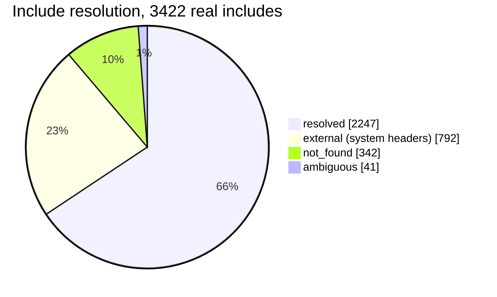
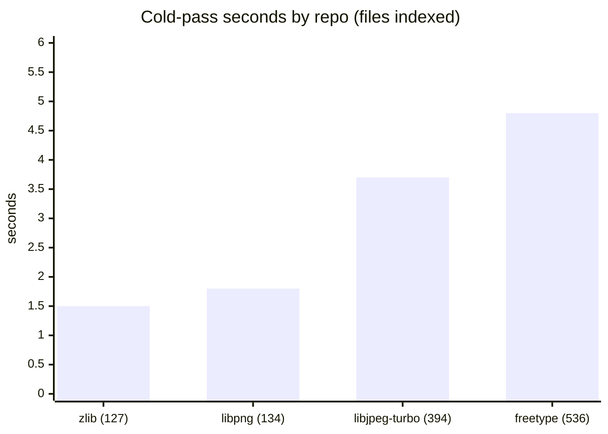
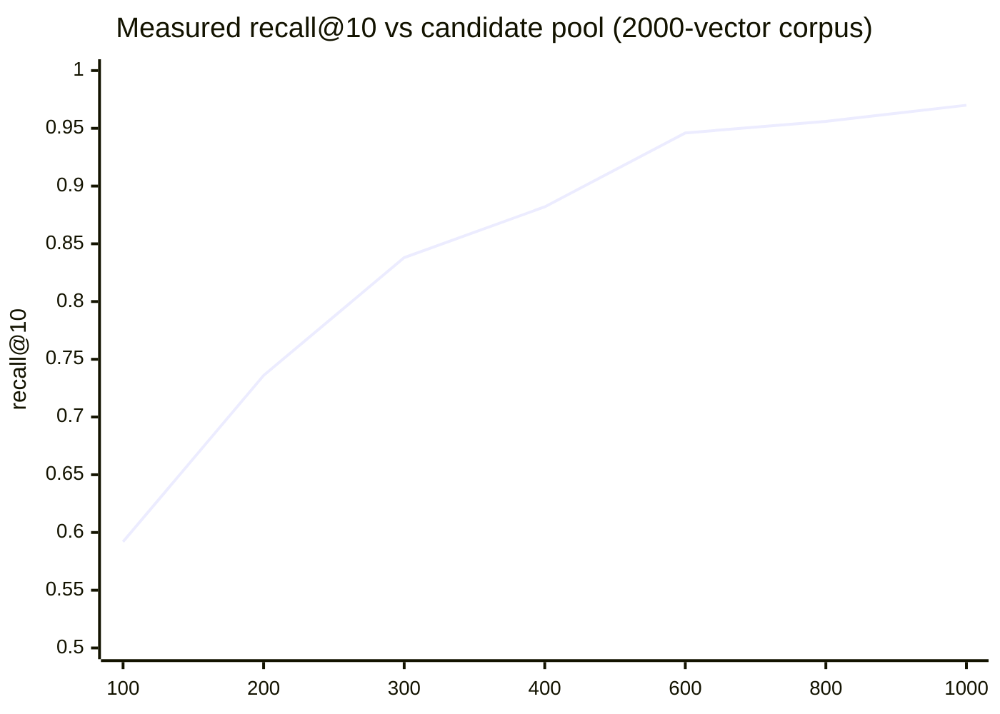
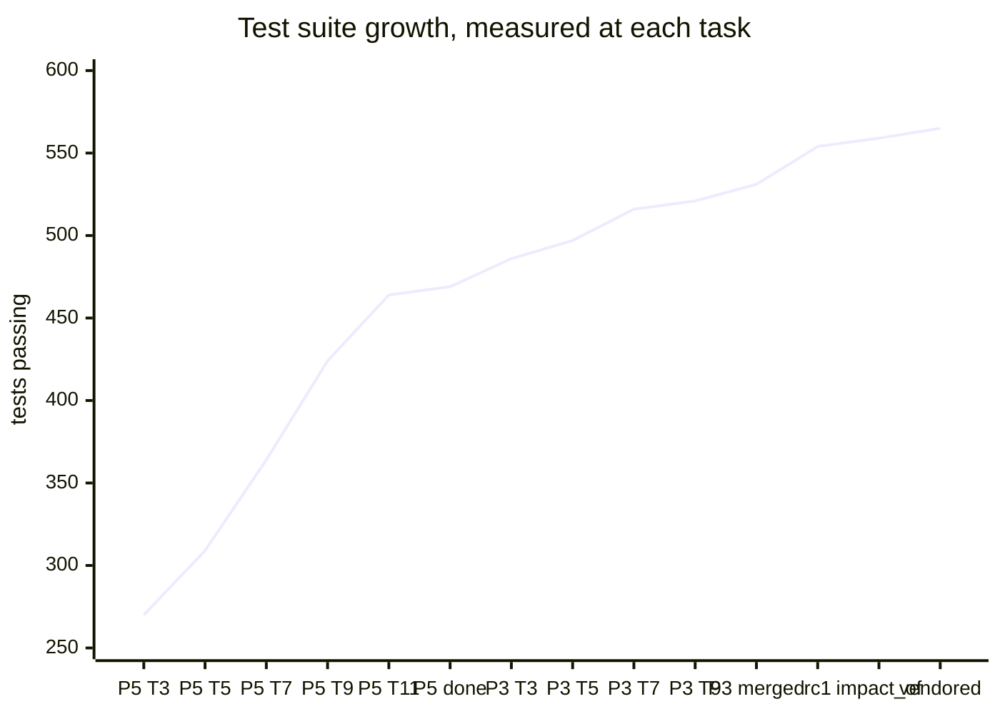
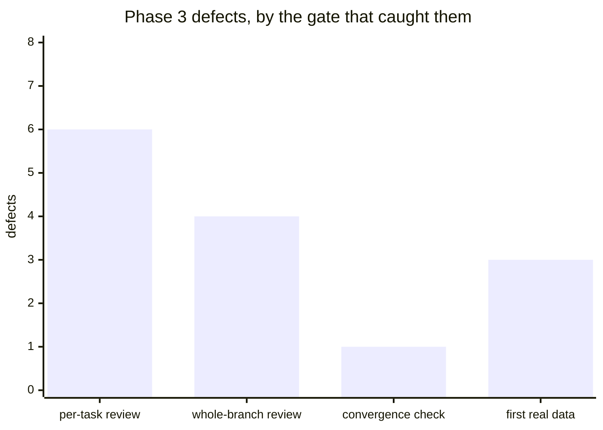

# KPIs

Chosen on one rule: **every indicator here would have caught a defect this
project actually shipped.** A metric that only ever goes up is decoration. The
useful ones are the ones that would have gone visibly wrong while everything
else looked fine.

Every number on this page was measured, not estimated. Where a figure comes
from a small or synthetic corpus, it says so — those are shapes, not targets.

```bash
argus kpi --config /etc/argus/config.yaml
argus kpi --config /etc/argus/config.yaml --json >> /var/log/argus-kpi.jsonl
```

Append the JSON weekly. **A KPI looked at once is a number; the same KPI
looked at weekly is the only thing that catches slow decay.**

---

## Tier 1 — Automatic, from the index

### Baseline, 2026-08-07

Measured against the test GitLab seeded with four real public C projects
(zlib, libpng, freetype, libjpeg-turbo), since production GitLab is not
reachable. Production numbers will differ by orders of magnitude.

| Indicator | Baseline | Direction | Why it exists |
|---|---|---|---|
| `repos_indexed` / `repos` | 7 / 7 | ↑ | Coverage gap means enumeration or mirroring is failing |
| `repos_never_indexed` | 0 | ↓ | Has no age, so cannot appear in staleness — invisible without its own counter |
| `repos_unhealthy` | 0 | ↓ | Errored, timed out, or symbol extraction failed |
| `median_repo_age_hours` | 1.5 | ↓ | Is the refresher running? |
| `stalest_repo_hours` | 1.5 | ↓ | **An average hides one repo that stopped updating three weeks ago** |
| `symbols_per_1k_files` | 27,608 | ↑ | **The ctags canary** |
| `resolved_include_rate` | 0.657 | ↑ | Graph completeness |
| `ambiguous_include_rate` | 0.012 | ↓ | Leading indicator for `which_repo` quality |
| `cross_repo_edges` | 5 | ↑ | The dependency graph emptying out |
| `index_mb` / `mb_per_1k_files` | 30.9 / 25.8 | ↓ | Cost, and the input to the Postgres question |

### Where includes actually land

Measured: 3,422 includes across the four projects.



**The 1.2% ambiguous share is the finding.** The design's stated worry was that
many repos shipping headers with the same basename would defeat suffix
matching. Across four real C projects it does not. A move past ~10% means the
`-I` layout has changed in a way no tool tuning fixes.

`not_found` at 10% is dominated by **generated headers** — zlib's `zconf.h` is
built at compile time and simply is not in the source tree. That single
absence caused a false dependency edge before it was fixed.

### Indexing cost, per repo

Measured on a cold full pass: 1,199 files in 14.8 s total, zero errors.



Roughly linear in files indexed, which is what makes a full-pass estimate for
a real estate possible **once you have measured one**. Do not extrapolate from
1,199 files to 3M lines.

---

## Tier 2 — Hand-checked, quarterly

These matter most, and **no machine can compute them.** An automatic proxy for
answer quality produces a number that rises while the answers get worse.

| Indicator | Baseline | Method |
|---|---|---|
| `which_repo` top-1 accuracy | **9 / 10** | One question per input shape: prose, symbol, stack trace, diff |
| `docs_search` usefulness | **6 good / 2 partial / 2 wrong** | Ten real documentation questions |
| `docs_lookup` exactness | 8 / 8 | Known API names resolve to the defining page |

`which_repo` was **7/10** before vendored-copy evidence was down-weighted and
**8/10** before bundled copies were detected by filename cluster. Both moves
came from fixing a root cause, not from adjusting a weight. The one remaining
miss is recorded with its cause in `docs/index-measurements.md` rather than
tuned away.

**The sequence is the point.** 7 → 8 → 9 came from two different mechanisms
that both looked like "vendoring" from a distance. A weight tuned at 7/10
would have papered over the first and hidden the second entirely.

**Do not tune constants against this set.** Ten questions is a smoke test, not
a training set — fitting to it is how you fit to ten questions.

### Retrieval latency, measured

| Operation | Median | Note |
|---|---|---|
| `which_repo` | **0.5 ms** | Sub-millisecond on a 7-repo index |
| `docs_lookup` | **2.1 ms** | Both packs open, 17,919 chunks |
| `docs_search` | **88.6 ms** | Excludes query embedding |
| query embedding | **2,254 ms** | CPU Ollama — ~25× the entire search |

**The embedder, not the index, sets the latency a developer feels.** That is a
property of the hardware and will change the day a GPU appears, which is why
it is reported but not tracked.

### The measurement that sized the pack format

Recall@10 against an exact float32 baseline, by how many candidates the
binary coarse pass keeps before int8 rescoring:



The plan's provisional pool of 300 measured **0.838 — below the 0.85 the
design assumed.** The default is 600 (0.946). The shortfall was the coarse
cut, not the quantization: end-to-end recall sits within 0.002 of the ceiling
set by which candidates survive the Hamming pass, at every pool size.

This is a synthetic corpus. It validates the mechanism, not the product.

---

## Tier 3 — Engineering health



| Indicator | Current | Direction |
|---|---|---|
| Tests passing | 565 | ↑ |
| Tests skipped | 0 | ↓ — a skip is coverage that silently stopped running |
| Container suite green | yes (at 531) | — |

### Where defects were found — the most useful metric here



This says which gate is doing the work. In Phase 3 the **whole-branch review
found 1 Critical and 3 Important that nine per-task reviews all missed** —
cross-module seams are structurally invisible to task-scoped review.

**First contact with real data has found 3** that no fixture would have
produced: a vendored copy of zlib inside libjpeg-turbo, a header generated at
build time, and freetype's bundled zlib under `src/gzip/` — a directory named
after neither repository, which nobody writing a fixture would think to
construct.

The pattern to watch: **if per-task review starts finding everything and the
whole-branch review finds nothing, the whole-branch review has stopped
working** — not the code getting better.

### Hollow tests found: 9

A hollow test passes while the behaviour it names is broken. Several came from
the implementation plan itself. Each was caught by a *targeted revert*:
breaking the code deliberately and confirming the test notices.

**Two of the nine were written for the vendored-copy feature**, in the same
session that shipped it, and both passed for the wrong reason:

| the test claimed to guard | what actually made it pass |
|---|---|
| the depth rule that tells a copy from the original | the separate "a repo root is never a copy" guard — the original was at the root |
| the 60% share threshold | the file-count floor, hit first: only 2 names overlapped |

Neither would have failed if its guard were deleted. Both now sit in
configurations where the named guard is the only thing standing.

**This is the argument for the practice in one table.** The tests were written
deliberately, by someone who knew the failure mode, immediately after
measuring the bug on real data — and were still hollow. A suite without
targeted reverts has the same hollow tests and no number.

### Known flake

On 2026-08-07 a suite run reported `3 failed, 551 passed`; three subsequent
full runs and one targeted re-run were all clean at 554, and the failing test
names were not captured. Unreproduced and undiagnosed. Recorded because a
suite that gates a release cannot have transient failures, and the first step
to fixing one is admitting it happened.

---

## What is deliberately not measured

- **Usage counts.** The `audit` table records every tool call and could
  support them, but a rising call count says nothing about whether the answers
  were right, and is easy to mistake for success.
- **Embedding latency as a tracked series** — hardware, not code.
- **Per-query latency over time**, until the index grows two orders of
  magnitude. Tracking sub-millisecond numbers is watching noise.
